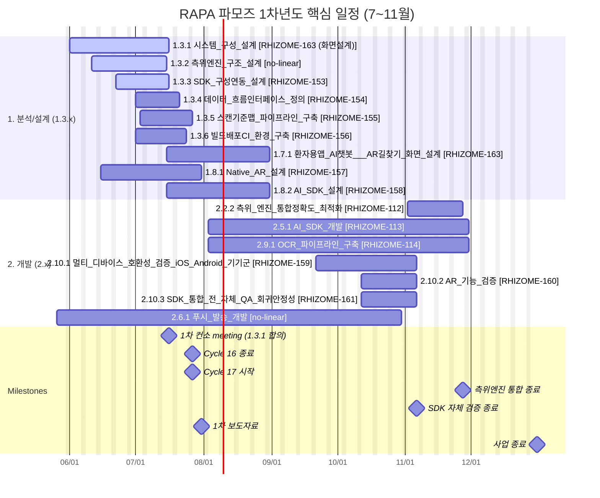
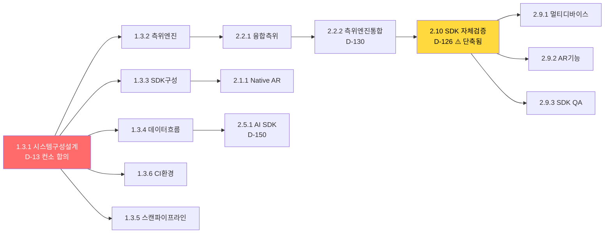

# RAPA 스마트병원 동행 AI앱 — Timeline Dashboard

> WBS v0.7 (2026-07-03 17:02) + Linear 이슈 통합

> 생성: 2026-07-03 18:10 | Mermaid Gantt 형식

## 📊 Timeline (Gantt)

**색상**: 🟢 진행중 / 🟠 임박(D-14) / 🔴 긴급(D-7) / ⚪ 기본

**태그**: ✅ Linear 동기화됨 / ❌ Linear 미생성 / ⚠️  잘못 매핑

## 📋 핵심 Task 목록 (Linear 동기화 상태)

| WBS | 작업명 | 시작 | 종료 | D-day | Linear |
|---|---|---|---|---|---|
| 1.3.1 | 시스템 구성 설계 | 2026-06-01 | 2026-07-16 | 🟠 D-13 | RHIZOME-163 (화면설계) |
| 1.3.2 | 측위엔진 구조 설계 | 2026-06-11 | 2026-07-15 | 🟠 D-12 | ❌ 없음 |
| 1.3.3 | SDK 구성·연동 설계 | 2026-06-22 | 2026-07-16 | 🟠 D-13 | RHIZOME-153 |
| 1.3.4 | 데이터 흐름·인터페이스 정의 | 2026-07-01 | 2026-07-21 | D-18 | RHIZOME-154 |
| 1.3.5 | 스캔·기준맵 파이프라인 구축 | 2026-07-03 | 2026-07-27 | D-24 | RHIZOME-155 |
| 1.3.6 | 빌드·배포(CI) 환경 구축 | 2026-07-01 | 2026-07-24 | D-21 | RHIZOME-156 |
| 1.7.1 | 환자용앱 AI챗봇 / AR길찾기 화면 설계 | 2026-07-15 | 2026-08-31 | D-59 | RHIZOME-163 |
| 1.8.1 | Native AR 설계 | 2026-06-15 | 2026-07-31 | D-28 | RHIZOME-157 |
| 1.8.2 | AI SDK 설계 | 2026-07-15 | 2026-08-31 | D-59 | RHIZOME-158 |
| 2.2.2 | 측위 엔진 통합·정확도 최적화 | 2026-11-02 | 2026-11-27 | D-147 | RHIZOME-112 |
| 2.5.1 | AI SDK 개발 | 2026-08-03 | 2026-11-30 | D-150 | RHIZOME-113 |
| 2.9.1 | OCR 파이프라인 구축 | 2026-08-03 | 2026-11-30 | D-150 | RHIZOME-114 |
| 2.10.1 | 멀티 디바이스 호환성 검증 (iOS/Android 기기군) | 2026-09-21 | 2026-11-06 | D-126 | RHIZOME-159 |
| 2.10.2 | AR 기능 검증 | 2026-10-12 | 2026-11-06 | D-126 | RHIZOME-160 |
| 2.10.3 | SDK 통합 전 자체 QA (회귀·안정성) | 2026-10-12 | 2026-11-06 | D-126 | RHIZOME-161 |
| 2.6.1 | 푸시 발송 개발 | 2026-05-26 | 2026-10-30 | D-119 | ❌ 없음 |

## 🔗 의존성 그래프 (Flow)

**범례**: 🔴 임박/긴급 / 🟡 주의 (의존성 모순) / ⬜ 일반

## ⚠️ 주의 사항

- **2.10 SDK 자체 검증** (D-126) 이 **2.2.2 측위엔진 통합** (D-130) 보다 4일 먼저 끝남 → 의존성 모순. 컨소 재논의 필요
- **1.3.2 LiDAR** (Linear RHIZOME-104)는 WBS 1.3.1 시스템구성설계와 다른 작업. 잘못 매핑됨.

## 🔗 관련
## 🔗 관련
- [[README|Home / MOC]]
- [[Dashboards/Dashboard-Status|Status Dashboard]]
- [[WBS/WBS-july|7월 임박]]
- [[Linear-Issues|Linear 이슈 노트]]
- GitHub: https://github.com/JangHyun-bin/obsidian_vault_rapa_pamoz

## 🌐 외부 Timeline (실시간)

**OpenProject** (Gantt, Calendar, Work packages):
- 프로젝트: http://localhost:8082/projects/rapa-smart-hospital-pamoz
- Gantt view: http://localhost:8082/projects/rapa-smart-hospital-pamoz/work_packages?view=gantt
- 98 work packages (L1 4 + L2 25 + L3 69, startDate/dueDate 기반)
- OpenProject API v3 (Basic apikey auth)
- 동기화: `Scripts/sync_openproject.py` (cron 자동 갱신)

**Linear** (실시간 task 관리):
- 프로젝트: RAPA 스마트병원동행AI앱 (파모즈) (RHIZOME-153~163)
- 4.3.x 잘못 매핑된 이슈는 별도 정리 필요

**GanttProject** (인터랙티브 + PNG export):
- 위치: `Attachments/RAPA_파모즈_v0.7.gan`
