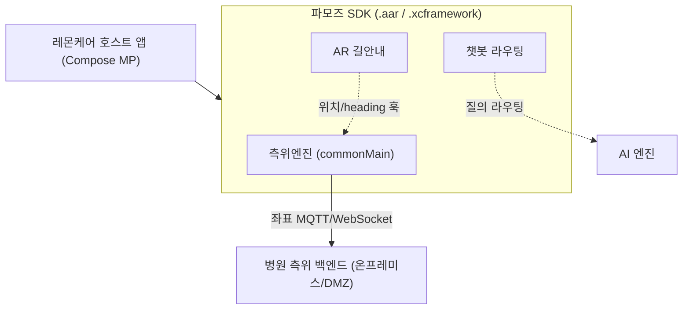

# 측위엔진 요구사항 정의서

| 항목 | 내용 |
|---|---|
| 문서명 | 측위엔진 요구사항 정의서 |
| 버전 | v1.0 |
| 작성일 | 2026-06-17 |
| 작성 | ㈜파모즈 - 장현빈 |
| 대상 | 스마트병원 동행 AI 앱 |

---

## 1. 문서 개요

### 1.1 목적

본 문서는 스마트병원 동행 AI 앱의 **실내 측위엔진**(이하 "측위엔진")이 충족해야 할 기능·비기능·센서·인터페이스 요건을 정의한다. 측위엔진은 레몬헬스케어 앱에 내부 SDK 형태로 통합된다.

### 1.2 범위

| 구분 | 포함 | 비포함 |
|---|---|---|
| 측위 (연속추적·절대보정·층판정·안전) | O | — |
| AR 길안내 연동 인터페이스 | 연동 훅 정의 | AR 네비게이션 UI/렌더링 상세 (별도 산출물) |
| AI 챗봇(RAG) | — | AI 엔진 소관 (§6.4) |
| SDK 패키징·배포·인증 상세 | — | 『인터페이스 계약서』·배포 산출물 참조 |

### 1.3 용어 정의

| 용어 | 정의 |
|---|---|
| **DR (Dead Reckoning)** | 추측항법. 본 엔진에서는 신경관성(neural-inertial) 모델로 상대 변위를 추정 |
| **신경관성** | IMU(가속도·자이로)를 입력으로 상대 변위를 예측하는 학습 모델 (EqNIO/RoNIN 계열) |
| **PF (Particle Filter)** | 파티클필터. 다수 입자로 위치 확률분포를 표현하는 융합 엔진 |
| **VPS** | Visual Positioning System. 카메라 1프레임을 사전 시각지도에 매칭해 절대 포즈를 산출 (콜드스타트·재획득용) |
| **콜드스타트** | 앱 첫 실행 등 사전 위치정보 없이 절대 위치를 처음 확정하는 과정 |
| **conformal gate** | 분포-무관 보정으로 추정 불확실성을 정량화해 GUIDE/HOLD/RE_ACQUIRE를 판정하는 안전 게이트 |
| **measurement-update** | PF가 절대신호(VPS·BLE·자기장)를 받아 입자 가중치를 갱신하는 단계 |
| **venue** | 측위 대상 공간 |
| **KMP** | Kotlin Multiplatform. 순수 Kotlin 코어를 iOS·Android가 공유하는 구조 |
| **B_z / B_xy** | 자기장 수직 성분 / 수평 성분 |

---

## 2. 시스템 컨텍스트

### 2.1 내부 SDK 통합 모델

- 통합 방식은 **내부 SDK**이며, 산출물은 **`.aar`(Android)와 `.xcframework`(iOS)**로 제공한다.
- 앱 owner는 레몬헬스케어, SDK provider는 ㈜파모즈다. 빌드·사이닝은 레몬헬스케어 Apple Developer 계정에서 수행한다.
- 구현 방식은 **Kotlin Multiplatform**을 채택한다. 측위 코어는 `commonMain`에서 순수 Kotlin으로 공유되어 iOS·Android가 동일 코드를 사용한다. 플랫폼 의존부는 인터페이스 주입으로 분리한다(`SensorSource`/`ModelRunner`/`VpsLocator`/`BleScanner`/`MapStore`).
- 측위엔진의 호스트 공개 진입점은 `PositioningSession`이며, `estimates: Flow<PositionEstimate>` 스트림과 `start()`/`stop()`/`seed()` 연산을 제공한다.

### 2.2 venue 프로필 — 신호 채널 구성

동일 코드에서 신호 채널을 venue 설정으로 on/off 한다. 1차년도 사전검증 환경과 본타겟 병원 환경의 채널 구성은 다음과 같다.

| 채널 | 사전검증 환경 | 병원 (실제 환경) |
|---|---|---|
| 신경관성 DR | ON (주력) | ON (주력) |
| VPS | optional (소형 맵) | ON (강구역 1차 보정) |
| BLE | ON | ON (앵커 + 층 라벨) |
| 자기장 | ON (B_z) | ON (저가중 fallback) |
| 기압 층판정 | ON | ON |
| 도면 제약 | ON (line-segment, 복도 hard-kill) | ON (BIM/navmesh, zone 인지) |

---

## 3. 기능 요건 (Functional Requirements)

### 3.1 연속추적 — 신경관성 DR

| ID | 요건 |
|---|---|
| **FR-1.1** | 엔진은 IMU(가속도·자이로)와 게임회전벡터 스트림을 입력으로 **상대 변위**를 산출하여 위치를 약 20Hz로 연속 추적한다. |
| **FR-1.2** | 연속추적은 카메라 OFF·저전력으로 동작하며, VPS는 콜드스타트·재획득·결정지점에서만 점화한다. |
| **FR-1.3** | 신경관성 모델은 온디바이스 추론으로 동작한다(EqNIO O(2)-등변 RoNIN-ResNet, ONNX 21MB, opset 17). 학습 모델과 온디바이스 추론 간 수치 패리티(1e-4)를 보장한다. |
| **FR-1.4** | 변위는 입자별 heading θ로 회전한 후 입자별 보폭 스케일 K를 곱해 적용하며, θ·K는 랜덤워크로 온라인 갱신한다(상태 (x,y,θ,K) 증강 PF). |

### 3.2 절대보정 — VPS / BLE / 자기장 (PF measurement-update)

**핵심 원리:** 모든 절대신호는 하나의 메커니즘(PF measurement-update, σ-가중 가우시안 우도)으로 통합한다. 신호별 신뢰도는 σ로 인코딩한다(VPS 작게, BLE 크게, 자기장 가장 크게).

| ID | 요건 |
|---|---|
| **FR-2.1** | 절대 위치 픽스를 `w ∝ exp(−‖p−z‖²/2σ²)` 우도로 PF에 반영한다(VPS·BLE 공통 경로). |
| **FR-2.2** | VPS 픽스 시 위치 우도와 절대 방위로 PF의 θ를 리셋하여 DR yaw 드리프트를 제거한다. |
| **FR-2.3** | 오측 픽스가 수렴한 필터를 끌어내지 못하도록, 정규화 잔차가 gate σ를 넘는 픽스는 기각한다(safe-update). |
| **FR-2.4** | BLE는 RSSI 근접 기반의 거친 위치·층 라벨을 제공하며 PF의 위치 우도(고 σ)로 반영한다(병원 전용). |
| **FR-2.5** | VPS는 카메라 1프레임을 사전 시각지도에 매칭·PnP하여 절대 포즈를 산출한다(연속 동작이 아닌 콜드스타트·재획득 시 on-demand 동작). 자체구축 파이프라인(hloc/COLMAP + XFeat + LightGlue + FAISS + PnP)으로 구성한다. |
| **FR-2.6** | 자기장은 **저가중 fallback**으로 사용한다. 세션간 안정성이 높은 **B_z만 신뢰**하고, 안정성이 낮은 \|B_xy\|는 채널 σ를 매우 크게 설정하여 사실상 비활성화한다. |
| **FR-2.7** | 자기장 맵은 GP 격자맵(μ,σ)과 양선형보간으로 질의하며, 회전불변 기저는 game-rotation(자북 무관)을 사용한다. |

### 3.3 콜드스타트 캐스케이드

| ID | 요건 |
|---|---|
| **FR-3.1** | 강구역이며 카메라가 가용한 경우, VPS "둘러보기"로 정밀 절대 픽스와 절대 방위를 획득한다. |
| **FR-3.2** | 카메라 불가(저성능 단말 / 권한 거부) 시 BLE 근접 거친 시작 → 짧은 보행 수렴 → 수동 시드 순으로 폴백한다. |
| **FR-3.3** | warm-start(GPS handoff / NFC 태그)가 있으면 소프트웨어만으로 수렴할 수 있다. deep-cold·대칭 layout 환경에서는 입구 NFC 태그를 보조 앵커로 활용한다. |

### 3.4 층판정

| ID | 요건 |
|---|---|
| **FR-4.1** | 기압계로 상대 층 변화를 검출한다. |
| **FR-4.2** | BLE 층 라벨로 절대 층을 확정하고, 해당 층의 시각지도·자기장맵으로 전환한다. |

### 3.5 안전 HOLD

| ID | 요건 |
|---|---|
| **FR-5.1** | conformal 보정 불확실성이 임계를 넘으면 안내(GUIDE) 대신 **보류(HOLD)**로, 드리프트 과다 시 **재획득(RE_ACQUIRE)**으로 판정한다. |
| **FR-5.2** | 게이트는 분포-무관 커버리지(≥1−α)를 보장하는 분할 conformal 분위수로 보정한다. |
| **FR-5.3** | 엔진 내부의 비치명 예외는 onError 콜백으로 표면화하며, 크래시하지 않는다. |

### 3.6 도면 제약 (map-constrained PF)

| ID | 요건 |
|---|---|
| **FR-6.1** | predict 단계에서 이동 선분이 벽을 넘는 입자를 zone 모드에 따라 처리한다: **HARD**=가중 0(검증 복도), **SOFT**=감쇠(반개방), **OFF**=해제(개방·로비). |
| **FR-6.2** | 벽 교차 판정은 line-segment 외적(strict) 교차검사로 수행하며, 끝점 접촉은 교차로 보지 않는다(경계 플리커 방지). |
| **FR-6.3** | 벽 제약으로 입자가 고갈되면 흡수 리샘플로 보충한다(전멸 안전판 및 Neff 붕괴 시 생존자 리샘플). |
| **FR-6.4** | 도면 표현은 1차년도 line-segment, 2차년도 navmesh(recast4j)를 사용한다. occupancy grid는 채택하지 않는다. |

**기대 효과:** map-constrained PF의 정확도 이득은 공간 topology에 크게 좌우된다(복도형 구역에서 큰 개선, 개방형 구역에서는 제한적). 병원 면적가중 기대이득은 약 **20–25%** 수준으로 보수적으로 산정한다. 도면 정합성 검증을 위해 map-corruption ablation을 수행한다.

### 3.7 AR 연동 훅

| ID | 요건 |
|---|---|
| **FR-7.1** | 측위엔진은 AR 길안내 모듈이 소비할 수 있도록 위치·heading·불확실성을 `PositionEstimate` 스트림으로 노출한다. |
| **FR-7.2** | AR 길안내(ARKit/ARCore SLAM 기반, 바닥 화살표·POI·TTS·QR 앵커)는 본 측위엔진 위에서 동작하며, 측위엔진이 제공하는 위치·heading 스트림을 입력으로 활용한다. AR 네비게이션 UI/렌더링 상세는 별도 산출물로 정의한다. |

**협의 항목:** AR 라이브러리 정책(ARKit/ARCore vs Unity, 3D 자산 관리주체)은 호스트 앱과 협의하여 확정한다.

---

## 4. 비기능 요건 (Non-Functional Requirements)

### 4.1 정확도 KPI

| ID | 요건 | 목표 값 |
|---|---|---|
| **NFR-1.1** | 측위 정확도 (1차년도) | **±2.5m** (iOS·Android 분리 측정) |
| **NFR-1.2** | 측위 정확도 (2차년도, 공인) | **±1.5m** |

정확도 KPI는 1차년도 ±2.5m, 2차년도 공인 ±1.5m를 목표로 한다. 측정은 iOS·Android를 분리하여 수행하며, 단위·통합·온디바이스 테스트와 현장 실측을 통해 단계적으로 검증한다.

### 4.2 추론·연산 지연

| ID | 요건 | 목표 값 |
|---|---|---|
| **NFR-2.1** | 신경관성 추론 지연 | **<50ms/step** |
| **NFR-2.2** | PF×자기장(GP) 우도 루프 | **≤50ms** 또는 지속 CPU ≤30% |
| **NFR-2.3** | 연속추적 출력 주기 | 약 20Hz |
| **NFR-2.4** | 기본 입자 수 | 2000 (구성 가능) |

정상추적(수백~수천 입자)은 구형 단말에서도 가볍게 동작하도록 설계한다. 콜드스타트 글로벌 스윕(다수 입자)의 연산 부담은 NFC·GPS handoff 또는 서버 오프로드로 우회한다.

### 4.3 배터리·메모리

| ID | 요건 | 목표 값 |
|---|---|---|
| **NFR-3.1** | full-stack 연속 소모 | ≤350 mW (60분 연속 기준) |
| **NFR-3.2** | 신경 모델 메모리 풋프린트 | ONNX 21MB |
| **NFR-3.3** | 저전력 연속추적 | 카메라 OFF 상태로 연속추적, VPS는 트리거 시에만 점화 |

### 4.4 가용성·오프라인 동작

| ID | 요건 |
|---|---|
| **NFR-4.1** | 정상추적 PF는 온디바이스에서 동작하며, 서버 없이도 단말 단독으로 측위한다(graceful degradation). |
| **NFR-4.2** | 자기장 맵·시각지도는 on-device bundle로 우선 탑재한다. |
| **NFR-4.3** | 신호 부재 시 해당 채널을 off 하고 잔여 채널로 동작한다(비콘 없음→BLE off, 맵 없음→VPS off, 자기장 교란→가중 하향). |

---

## 5. 센서·하드웨어 요건

핵심 원리는 정상추적이 가볍게 동작하여 구형 단말도 지원 가능하며, 연산 부담이 큰 콜드스타트 스윕은 NFC·서버로 우회한다는 점이다.

### 5.1 센서 의존성

| 하드웨어 | 역할 | 없을 때 영향 | 비고 |
|---|---|---|---|
| **자력계** | 측위 코어(필수) | 측위 불가 | 모든 스마트폰 보유. 품질 편차 큼 → 일회성 하드웨어 보정(왜곡행렬+오프셋) 필수 |
| **IMU**(가속도·자이로) | 신경관성/PDR(필수) | 측위 불가 | 모든 스마트폰 보유. Android raw 200Hz native, iOS 100Hz |
| **기압계** | 층 검출 | 절대 층판정에 GPS-입구/NFC 의존 | 일부 저가·구형 Android 미탑재 |
| **NPU**(Neural Engine 등) | 신경관성 추론 가속 | GPU/CPU fallback(저속·전력 증가) | iPhone A11+; Android 파편화 |
| **NFC** | cold-start 입구 앵커 | cold-start 즉시성 저하 | 대부분 보유 |
| **GPS/GNSS** | 입구 handoff seed | cold-start seed 약화 | 대부분 보유 |
| 카메라+ARCore/ARKit | VPS 콜드스타트·재획득, AR | VPS 불가→BLE/수동 폴백 | — |
| BLE | 근접·층 라벨 | 병원 폴백 약화 | 병원 전용 |

### 5.2 단말군별 지원 (요약)

| 단말군 | 정상추적 | cold-start(온디바이스) | cold-start(NFC/서버 보완) | 권장 |
|---|---|---|---|---|
| 최신 iPhone (12+/A14+) | O | O | — | 온디바이스 full |
| 중급 iPhone (XS–11) | O | △ | 서버/NFC 가속 | 온디바이스 + NFC |
| 구형 iPhone (<X) | O(CPU fallback) | X | 서버/NFC 의존 | NFC + 서버 가속 |
| 플래그십 Android | O | O | — | 온디바이스 full |
| 미드레인지 Android | O(자력계 양호 시) | △ | 서버/NFC | NFC 권장 + 보정 필수 |
| 저가/구형 Android | △(보정·자력계 의존) | X | 서버/NFC 의존 | NFC + 서버 + 하드웨어 보정 |

> 범례: O 가능/지원 · △ 조건부 · X 불가/미지원 · — 해당없음

### 5.3 최소 지원 OS 컷오프

최소 iOS 버전, 최소 Android API, 기압계·NPU 미탑재 기기의 지원 정책은 호스트 앱과 협의하여 확정한다.

SDK는 minSdk 정렬에 따라 `HIGH_SAMPLING_RATE_SENSORS`(API 31) 등 상위 API에 대한 런타임 가드를 제공하여 하위 단말 호환성을 확보한다.

---

## 6. 제약·가정

### 6.1 인프라 정책 (자체 구축)

- 상용 측위 SDK(Pointr/IndoorAtlas/Mapxus 등)를 통합하지 않으며, 측위 시스템을 순수 자체 구축한다.
- Apple Indoor Maps Program·Google Indoor 등록에 의존하지 않으며, 플랫폼 제공 indoor boost를 전제하지 않는다(`CLLocation.floor` 항상 nil 가정).
- VPS는 자체구축 파이프라인(hloc/COLMAP + XFeat + LightGlue + FAISS + PnP, 벤더 무관)으로 구성한다.

### 6.2 카메라

- 연속추적은 카메라 OFF로 저전력 동작한다. 카메라는 VPS 콜드스타트·재획득과 AR에서만 사용한다.
- 카메라 불가 venue 또는 권한 거부 단말에서는 BLE·수동시드 폴백을 제공한다(FR-3.2).

### 6.3 portable 설계 — Wi-Fi 코어 배제

- 크로스플랫폼 portable을 우선하여 측위 코어에서 Wi-Fi를 배제한다(iOS Wi-Fi 측위 API 부재, venue ROI 부재).
- Wi-Fi RSSI fingerprinting은 Android 한정 보조 옵션으로만 검토 가능하며(인프라 설치 불필요), 측위 코어 의존 대상이 아니다.

### 6.4 챗봇 경계

AI 챗봇(RAG) 엔진은 컨소시엄 AI 엔진 담당기관 소관이다. 본 측위엔진은 챗봇 엔진 스펙을 다루지 않으며, SDK 라우팅 인터페이스 경계에서만 연결된다(상세는 별도 산출물).

### 6.5 전제 및 가정

| 가정 | 내용 |
|---|---|
| venue 채널 구성 | venue별 신호 채널 구성은 §2.2 프로필에 따른다(단층 환경은 기압 층판정 미적용) |
| 하드웨어 보정 | 자력계 품질 편차가 큰 단말은 일회성 하드웨어 보정을 전제로 한다 |
| iOS actual 구현 | iOS 플랫폼 의존부(CoreMotion·ONNX RT iOS/CoreML·ARKit)는 2차년도 일정에 따라 구현한다 |
| 병원 채널 | VPS/BLE/기압 층판정은 병원 본타겟 적용 채널이다 |

---

## 7. 인터페이스 요건 개요

상세 계약(데이터 타입·시그니처·에러 모델·인증·Rate Limit·SLA)은 『인터페이스 계약서』를 참조한다.

### 7.1 호스트 ↔ SDK (공개 API)

- 진입점 `PositioningSession`은 `estimates: Flow<PositionEstimate>`, `start()`, `stop()`, `seed(x,y,thetaRad)`를 제공한다.
- `PositionEstimate`는 (x, y, heading, positionStd, tNs)로 구성한다.

### 7.2 플랫폼 의존부 (주입 인터페이스)

| 인터페이스 | 역할 |
|---|---|
| `SensorSource` | IMU·자기장(raw+calibrated)·중력·게임/절대 회전 스트림 |
| `ModelRunner` | 신경관성 ONNX 추론 |
| `MapStore` | 자기장 맵 질의 (μ, σ) |
| `VpsLocator` | 카메라 프레임→절대 포즈 |
| `BleScanner` | BLE RSSI 관측 |

### 7.3 SDK ↔ 외부 시스템

| 통합 포인트 | 인터페이스 |
|---|---|
| 측위 좌표 ↔ 병원 측위 백엔드 | MQTT/WebSocket (1–5Hz) |
| SDK ↔ 레몬 인증서버 | OAuth2 SSO |
| 챗봇 질의 라우팅 ↔ AI 엔진 | 라우팅 인터페이스 |

데이터 처리 방침: 측위 좌표(raw)는 온디바이스에서 휘발하며 전송하지 않는다. 통계·재매핑용 집계 데이터는 서버에 저장한다(raw 휘발과 집계 저장을 구분). 환자식별자는 SDK에 일회용 토큰 또는 비식별 세션ID만 보유한다.

**협의 항목:** 권한 요청 주체(호스트 vs SDK), 환자ID 전달방식, 측위좌표 처리방침, API 인증(OAuth2/JWT)·Rate Limit·SLA는 호스트 앱과 협의하여 확정한다.

---

## 8. 검증·수용 기준

### 8.1 검증 방법론

측위엔진은 다음 계층의 테스트로 검증한다.

- **단위·통합 테스트:** PF·geo·quat·codec·replay·map 결정적 테스트. 위치 수렴, θ 리셋, conformal 커버리지, 도면 제약(HARD 누수 차단·고갈 건강성·OFF·SOFT), map-corruption ablation을 포함한다.
- **온디바이스 테스트:** 신경관성 추론 패리티 및 replay 기반 회귀 검증.
- **현장 실측:** 정확도 KPI는 현장 실측으로 검증하며, 병원 venue 실증을 2차년도에 수행한다.

결정적 단위·통합 테스트는 알고리즘 정합성을 입증하고, 현장 정확도(KPI)는 온디바이스 테스트와 현장 실측으로 검증한다.

### 8.2 feasibility 게이트 (주요 항목)

본격 구현 진입 전 feasibility 게이트를 통과하여 핵심 성능 지표를 확인한다.

| Gate | 항목 | 통과 기준 |
|---|---|---|
| 1 | EqNIO @100Hz ATE | ≤ 3.0m/분 |
| 2 | PF×GP @50Hz 지연 | loop ≤50ms 또는 CPU ≤30% |
| 6 | full-stack 배터리 60분 | ≤350 mW |
| 9 | 콜드스타트/글로벌 측위 시간 | 입구 ≤5초 / deep-cold ≤90초 수렴 또는 폴백 UI / 재시작 ≤3초 (대칭 layout venue 포함) |

### 8.3 융합 검증 게이트

발산 없는 ATE 개선, **벽 통과 입자 0**, map-corruption 내성 곡선을 검증 게이트로 적용한다.

---

## 9. 리스크 관리

### 9.1 기술 리스크 (watch list)

| 리스크 | 영향 | 완화 |
|---|---|---|
| 콜드스타트·글로벌 측위 (대칭 layout deep-cold) | 첫 fix 지연·수렴 실패 | 캐스케이드 + 입구 NFC 앵커 + 게이트 9 실측 |
| EqNIO @100Hz·배터리·PF 지연 | 정확도 commitment 영향 | feasibility 게이트 우선 측정, 미달 시 대응 chain 적용 |
| 단일 기기·단일 venue 실측의 일반화 | 일반화 검증 필요 | 병원 venue 실증 + 다기기 field test |
| iOS actual 구현 | iOS 일정 리스크 | Mac/Xcode 확보 후 착수, 신경추론 하드웨어 전이 재검증 |
| phantom 벽 + hard-kill | 일시 위치 스파이크 | 회복 관측(자기장·VPS) + 검증 복도 반자동 벡터화 |
| 자력계 품질 편차(저가폰) | 저변동 venue 비수렴 | 일회성 하드웨어 보정 + NFC 보완 |

---

관련 산출물: 『인터페이스 계약서』, 『현장 인프라 구축 계획서』, 『검증·시험 계획서』, AR 길안내 설계서(별도).
