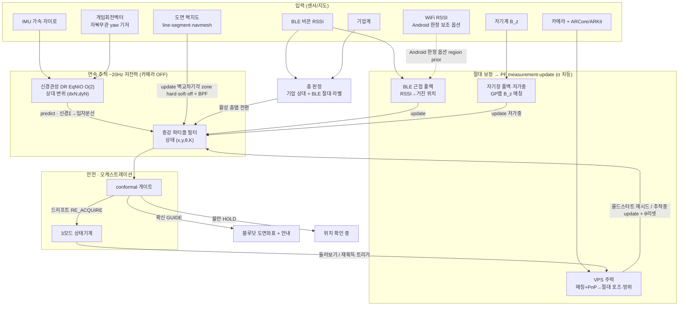
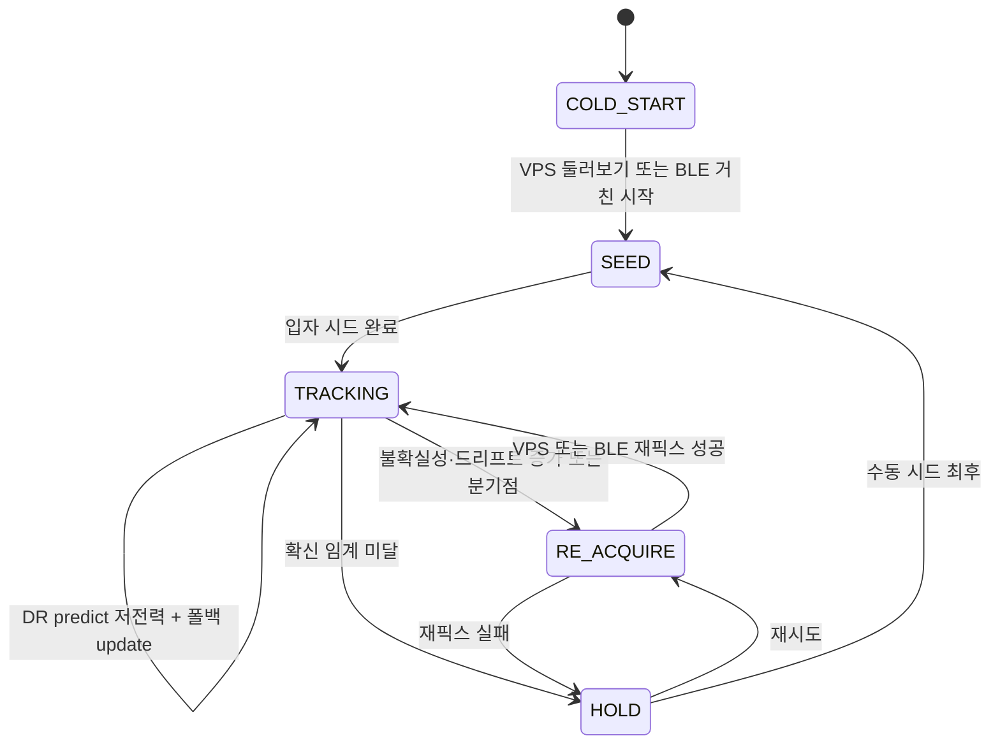

# 측위엔진 아키텍처 문서

| 항목 | 내용 |
|---|---|
| 문서명 | 측위엔진 아키텍처 문서 |
| 버전 | v1.0 |
| 작성일 | 2026-06-17 |
| 작성 | ㈜파모즈 - 장현빈 |
| 대상 | 스마트병원 동행 AI 앱 |

---

## 1. 개요

측위엔진은 다음 요소로 구성된 온디바이스 우선 실내측위 코어다.

- **연속 추적** = 신경관성 추측항법(DR)
- **절대 보정** = VPS(주력) + BLE + 자기장(폴백)을 파티클 필터의 측정 업데이트(σ 차등)로 통일
- **도면 제약** = 벽 교차 기각 + 백트래킹 PF
- **융합** = 증강 파티클 필터(x, y, θ, K)
- **안전** = conformal HOLD
- **다층** = 기압계 + BLE
- **오케스트레이션** = 3모드 상태기계

핵심 설계 원칙은 세 가지다.

- **단일 융합 메커니즘** — 모든 절대 신호는 새 융합기 없이 파티클 필터의 measurement-update 하나로 들어온다. 신호별 차이는 σ(신뢰도)뿐이다.
- **portable 코어** — 측위 알고리즘 전체가 Kotlin Multiplatform `commonMain`(순수 Kotlin)에 있어 iOS·Android가 동일 코드를 공유한다. 플랫폼 차이는 인터페이스 주입으로만 흡수한다(§12).
- **온디바이스 우선, 서버는 accelerator** — 정상 추적은 폰 단독으로 동작하며, 서버는 지도 빌드·콜드스타트 가속·drift 보정에만 관여한다(hard dependency 아님).

---

## 2. 전체 아키텍처

입력 → 연속추적 → 절대보정 → 안전/상태기계 → 출력의 데이터 흐름으로 동작한다.



측위 엔진의 라이브 코어인 `PositioningEngine`은 IMU와 게임회전 스트림을 받아 위치 추정(`PositionEstimate`) 콜백을 ~20Hz로 방출한다.

---

## 3. 연속 추적 — 신경관성 DR 상세

연속 추적은 카메라 없이 IMU + 게임회전만으로 상대 변위를 추정하는 신경관성 추측항법이다. 저전력으로 ~20Hz 동작하며, 카메라(VPS)는 콜드스타트·재획득·분기점에서만 켠다.

### 3.1 모델 — EqNIO O(2) 등변 RoNIN-ResNet

- **모델 구조:** O(2) 등변(equivariant) 신경관성 오도메트리인 **EqNIO**를 채택한다. 공개 RoNIN 데이터의 50%로 사전학습한다.
- **온디바이스 런타임:** ONNX 형식, 21MB, opset 17. Python 참조 구현과 온디바이스 추론의 출력은 1e-4 패리티로 정렬한다.
- **추론 추상화:** `ModelRunner` 인터페이스(`commonMain`)로 추상화하여, Android는 ONNX Runtime, iOS는 ONNX RT iOS·CoreML로 actual을 주입한다(§12).

### 3.2 전처리 파이프라인 — `EqO2Preprocess` + 중력정렬 리샘플

스트리밍 파이프라인은 다음과 같다.

```
IMU + 게임회전 → GravityAlignedResampler(중력정렬 리샘플)
  → 200 윈도 / 10 스트라이드 슬라이딩
  → EqO2Preprocess (O(2) 기저 전처리)
  → ModelRunner (ONNX 추론)
  → chirality flip (dy = −vel[1])
  → 변위 (dxN, dyN) = vel × 0.05s
```

- **윈도/스트라이드:** WINDOW=200, STEP=10, STEP_DT_S=0.05s. 윈도 [s, s+200)는 인덱스 s+200 샘플이 도착한 시점에 방출하며, 방출 시각은 `ts[s+200]`로 Python 참조 관행과 동일하다.
- **중력정렬 리샘플:** `GravityAlignedResampler`가 IMU와 게임회전을 받아 중력정렬 ENU(vertical LAST) 프레임으로 리샘플한다.
- **EqO2 기저 전처리:** Python `eqnio_replay._preprocess_eq_o2_frame`의 1:1 포팅으로, 입력 `window[200][6] = [gx,gy,gz_up, ax,ay,az_up]`을 받아 세 텐서를 평탄 row-major float32로 출력한다.
  - `vector (1,200,2,3)` = 1200원소 — xy 성분 × {a, v1, v2} 벡터
  - `scalar (1,200,9)` = 1800원소 — [a_z, v1_z, v2_z, |a_xy|, |v1_xy|, |v2_xy|, a·v1, v1·v2, a·v2]
  - `orig (1,200,3)` = 600원소 — [a_z, v1_z, v2_z]
- **O(2) 등변 기저 구성:** 중력 g의 xy 성분으로 `gyro_flip = (−gy, gx, 0)`를 만들고 외적으로 v1, v2 기저를 생성한 뒤 g 노름으로 스케일한다. 이 기저가 회전불변성을 부여한다.
- **chirality flip:** `dy = −vel[1]`로 ARCore (x, z) 융합 프레임 규약에 맞춘다.

### 3.3 입력 정합 가드 (frame sanity)

첫 200샘플의 평균 수직가속(|mean feat[5]|)이 5.0~11.6 m/s²(전형 ~9.8) 밖이면 예외를 던져 정렬·회전 입력 오류를 추론 전에 잡는다. 이는 Python 참조와 동일한 정책으로, 잘못된 회전 정렬 입력이 조용히 측위를 오염시키는 것을 막는다.

> **회전 기저 = game-rotation** — 신경 출력은 게임회전 월드 프레임(자이로 적분, yaw 영점이 세션마다 임의)에 산다. 따라서 자북에 의존하지 않으며, heading은 PF가 추정한다. 자북 오염 문제는 §6에서 자기장 기저와 함께 다룬다.

---

## 4. 융합 — 증강 파티클 필터 (x, y, θ, K)

융합 코어는 상태 `(x, y, θ, K)`의 2D 부트스트랩 파티클 필터다. K는 보폭·신경프레임 스케일로, 입자별 상태로 온라인 추정한다. 기본 입자 수는 2000이다.

### 4.1 predict — `predictNeural` (신경 변위 → 입자 전이)

`predictNeural(dxN, dyN)`은 신경관성 상대변위를 각 입자의 θ로 회전하고 입자별 K로 스케일한 뒤, θ·K에 랜덤워크를 더한다.

```
dxMap = K·(cosθ·dxN − sinθ·dyN)
dyMap = K·(sinθ·dxN + cosθ·dyN)
x' = x + dxMap + N(0, motionSigma);  y' = y + dyMap + N(0, motionSigma)
θ' = θ + N(0, headingSigma)
```

- **신경 Σ → 입자 분산:** 신경 DR 공분산 Σ를 measurement R이 아니라 **predict spread로 역배선**하여, 불확실한 step일수록 입자를 넓게 살포한다. 결합 인터페이스(`scaleKSigma`/`headingSigma`/`motionSigma` 랜덤워크)는 Σ 직접 주입을 받아들이도록 준비되어 있으며, 모델이 Σ를 출력하는 시점에 활성화된다.
- **K 온라인 수렴:** 잘못된 K의 입자는 지도 우도에서 자연히 down-weight되어 리샘플에서 도태되므로 K가 온라인 수렴한다. 추정 스케일은 `estimateScale()`로 읽는다.

### 4.2 update — σ 가중 가우시안 우도

자기장 특징 update(`update(z)`)는 채널 수 무관(`z.size`)으로 GP 우도를 곱한다.

```
logl = Σ_k −0.5·((z[k] − μ[k]) / (σ_map[k] + σ_meas[k]))²
w[i] *= exp(logl)
```

- **채널별 σ:** `measSigmaPerCh[k]`가 지정되면 채널 k에 단일 스칼라 `measSigma` 대신 해당 값을 쓴다. 이것이 §6 B_z 선택의 구현 레버다.
- **절대 위치 픽스 update:** VPS·BLE 근접 등 위치 관측은 `updatePosition(zx, zy, σ)`로 `w ∝ exp(−‖p − z‖²/2σ²)`를 곱한다. 자기장 특징맵 update와 별개 경로이며 σ가 신뢰도다.

### 4.3 신경 Σ → spread / resample / BPF

- **systematic resample:** 유효표본수 `Neff < 0.5N`에서 systematic resampling을 수행한다. `neff()`는 `1/Σw²`다.
- **BPF-lite 고갈 흡수:** 벽 제약(§7)으로 입자가 전멸하면 균일 복구, Neff 붕괴 시 생존자 리샘플로 흡수한다(`absorbDepletion`). 합이 0이 되는 전멸은 안전판으로 균일 복구한다.
- **outlier 게이팅:** `updatePositionSafe(zx, zy, σ, gateSigma)`는 정규화 잔차 `d = ‖est − z‖ / sqrt(std² + σ²)`가 gateSigma를 넘으면 픽스를 기각하여, 오측 VPS·BLE가 수렴한 필터를 yank하는 것을 막는다.

---

## 5. 절대 보정 — VPS(주력) / BLE / 자기장(저가중)

모든 절대 신호는 하나의 메커니즘 — PF measurement-update — 으로 통일된다. 새 융합기는 없다. 신호 간 차이는 σ뿐이며, VPS는 작게(강) → BLE는 크게(거침) → 자기장은 더 크게(저가중) 둔다.

| 신호 | σ(신뢰도) | 역할 | PF 진입점 |
|---|---|---|---|
| **VPS** | 작음(강) | **주력** — 강구역 콜드스타트/재획득 정밀 픽스 + 절대 방위 | `onVpsFix` → `updatePosition` + `resetHeading` |
| **BLE** | 큼(거침) | 병원 폴백 — RSSI 근접으로 거친 위치 + 층 라벨 | `onAbsolutePosition` → `updatePosition` |
| **자기장** | 더 큼(저가중) | fallback — GP맵 B_z 매칭 | `update(z)` (특징맵 우도) |

- **VPS 통합 원리:** `onVpsFix(fix)`는 위치 우도(`updatePosition(fix.x, fix.y, fix.sigmaM)`)와 절대 방위 θ 리셋(`resetHeading`)을 함께 적용한다. 맵 프레임 facing은 PF 프레임 θ = `fix.thetaRad − lastYawG`로 변환한다(현재 디바이스 yaw 보상). VpsFix 데이터 계약은 정의되어 있으며, VPS 매칭 파이프라인은 hloc/COLMAP + XFeat + LightGlue + FAISS + PnP로 구성한다.
- **heading 리셋:** VPS 절대 방위로 PF θ를 thetaRad ± spreadRad(기본 5°) 균일 재배치하여 DR yaw 드리프트를 제거한다.
- **BLE:** `BleScanner` 인터페이스와 `BleObservation(beaconId, rssi, tNs)` 데이터 계약으로 RSSI 근접 → 거친 위치·층 라벨을 제공한다. 병원 venue 전용으로, 비콘 설치가 전제된다.
- **자기장:** §6.

---

## 6. 자기장 서브시스템

### 6.1 GP 격자맵 (μ, σ) + 양선형 보간

`GpMagneticMap`은 격자 (μ, σ) 자기장 지도다. `query(x, y)`가 4-이웃 양선형 보간으로 채널별 (μ, σ)를 반환하며, 격자 밖은 σ=1e6f로 likelihood를 평탄화한다. 채널 수는 맵 데이터가 정한다(`d.mu.size`) — 즉 **채널 수 변경 = 맵 재생성**이지 코드 변경이 아니다. 학습 도구는 sklearn GP(RBF+White) 기반이며, GP 맵 산출물은 ~36KB로 가볍다.

### 6.2 B_z 채널 선택 — `measSigmaPerCh`로 |B_xy| off

자기장 특징은 **B_z 중심**으로 보수화한다.

| 채널 | 판정 | 근거 |
|---|---|---|
| `|B|` (전체 크기) | 의심 | uncalibrated raw에 기기별 hard/soft-iron이 한 스칼라로 접힘 → 크로스기기 함정 |
| `|B_xy|` | **기각(off)** | 동일 지점 map 42.4µT vs 측정 16.4µT, corr 0.463 → 세션간 불안정 |
| `B_z` | **신뢰(사용)** | corr 0.845, 세션간 안정 |

런타임은 `measSigmaPerCh = [1e6, 4.0]`으로 |B_xy|를 (σ=1e6로) 사실상 끄고 안정적 B_z(σ=4.0)만 쓴다. 엔진은 일반적으로 설계되어(`GpMagneticMap.query()` 채널 수 데이터주도 + `ParticleFilter.update()` 채널별 σ), **특징 변경은 GP 학습 플래그 + measSigmaPerCh 변경**으로 처리하며 재서베이를 요구하지 않는다.

### 6.3 game-rotation 기저 (자북무관)

자기장 회전불변 기저는 **game-rotation**(자북무관)을 쓴다. 서베이는 game-rotation `Rg[9]`를 함께 기록하여 yaw-불변 특징을 절대회전(자북) 오염으로부터 분리한다. 상세 서베이 스키마·커버리지는 『자기장 서베이·특징 결정 권고』를 참조한다.

> **자기장의 위치 — 저가중 폴백:** 자기-only ATE는 4~5.5m 수준으로, 절대 정확도의 주 예산은 EqNIO + BLE + VPS가 진다. 채널 선택은 상대 안정성 문제이며, 자기장은 저가중 fallback으로 자리매김한다.

---

## 7. 도면 제약 (map-constrained PF)

도면 제약은 σ-update와 **별개 경로**의 구조적 hard-kill/soft 제약이다.

### 7.1 wall-collision rejection — HARD / SOFT / OFF

`predictNeural`에서 입자 이동 선분(prev→new)이 벽을 넘으면 zone 모드대로 처리한다.

| zone 모드 | 처리 | 적용 구역 |
|---|---|---|
| **HARD** | 벽 교차 입자 가중 0 (hard-kill) | 검증 복도 |
| **SOFT** | 가중 × softWallFactor(기본 0.1) 감쇠 | 미검증·반개방 |
| **OFF** | 제약 해제(폴백 의존) | 개방·로비 |

- **벽 교차 판정:** `WallMap.crosses`가 외적(orientation) 기반 선분 교차로 판정하며(O(N입자 × N벽)), 끝점 접촉(collinear/touch)은 경계 플리커 방지를 위해 교차로 보지 않는다.
- **BPF-lite 고갈 흡수:** hard-kill로 입자가 고갈되면 §4.3의 `absorbDepletion`(BPF, 3~5 step 흡수 리샘플)으로 보충한다.

### 7.2 navmesh & 지도 표현

- **표현:** PoC는 **line-segment**(`commonMain` 순수 Kotlin, 교차검사 O(N입자 × N벽)), 양산은 **navmesh**(recast4j, JVM·Android 직임포트, iOS는 네이티브 Recast 바인딩)로 표현한다. occupancy grid는 사용하지 않는다(미검증맵 soft 폴백에만 적용).
- **navmesh containment:** predict 보조로 삼각형 containment(O(1)/입자)를 얹어 명백히 불가능한 입자를 사전 차단한다. Nurminen식 predict-proposal(4D 격자)은 모바일 비실용으로 채택하지 않는다.
- **벽 벡터화:** PoC는 수기(1개 층 1~2h, phantom wall 위험과 툴 세팅을 회피), 대규모는 BIM 우선·없으면 자동 분할 + 사람 위상 검수(반자동)로 처리한다. **완전 자동 분할 + hard-kill 결합은 금지**한다.

### 7.3 topology = 마스터 변수, ~20~25% 이득

위상이 마스터 변수다 — 복도형에서 큰 이득(복도 58%↓), 개방 공간에서 무용(0%)이다. 병원의 면적가중 기대이득은 ≈ 20~25%로 설계 목표를 둔다. 문헌의 "40~90%"는 테스트베드 편향으로 보고 보수적으로 배제한다.

---

## 8. 안전 게이트 + 3모드 상태기계

### 8.1 conformal 안전 게이트

`ConformalGate`는 분할 conformal 위치 게이트다.

- 비정합 점수 `s = error/std`를 홀드아웃에서 보정해 분위수 q를 얻고(rank = ceil((n+1)(1−alpha)), 유한표본 커버리지 보장), 런타임엔 보정 반경 `r(t) = q·std(t)`로 판정한다.
- 분류: `r ≥ reacquireRadius → RE_ACQUIRE`, `r ≥ holdRadius → HOLD`, else `GUIDE`.
- 정규화 conformal이라 PF 불확실성이 커지면(개방존·콜드스타트) 반경이 자동 확대돼 분포-무관 커버리지 ≥ 1−alpha를 보장한다. 보정 반경이 곧 절대측정 R = (q·std)²·I의 근거로, 절대 픽스 σ 설정과 정합한다. 즉 conformal로 보정된 불확실성이 임계를 넘으면 GUIDE 대신 HOLD한다.

### 8.2 3모드 상태기계

`COLD_START → TRACKING → RE_ACQUIRE / HOLD`의 오케스트레이션으로 모드를 전이한다. 게이트 enum(GUIDE/HOLD/RE_ACQUIRE)과 상위 모드 오케스트레이터가 측위 세션의 수명주기를 관리한다.



배터리·UX 방어: 연속 구간은 DR + 폴백만 사용하고(카메라 OFF), VPS는 콜드스타트·재획득·분기점에서만 켠다.

---

## 9. 콜드스타트 캐스케이드

시작 시 위치·방향을 자동 초기화하는 캐스케이드로, 첫 성공에서 정지한다.

| 조건 | 방법 | 비고 |
|---|---|---|
| 강구역 + 카메라 OK | **VPS "둘러보기"** → 정밀 절대 픽스 + 절대 방위 | 위치+방향 한 프레임 동시 fix(유일) |
| 카메라 불가 (Tier C·권한 거부) | **BLE 근접** 거친 시작 → **짧은 보행** 수렴 → 최후 **수동 시드** | RF는 위치만, 방향 못 줌 |
| warm-start (GPS·last-known) | SW만으로 수렴 가능 | last-known < 120s |
| deep-cold / 대칭 layout | 입구 NFC 태그 사실상 필수 | 정보이론적 비수렴 꼬리 제거 |

- **방향(θ0)은 측정이 아니라 관측:** 콜드 순간 즉각 절대방향원이 없다(game-rot yaw 0점이 세션마다 임의). 회전 포함 ~10~15m 보행이 필요하며, 첫 몇 초간 ~180° 틀릴 위험이 있다. 확정 전에는 방향 화살표를 표시하지 않는다("방향 보정 중").
- **수렴 목표는 10~15m / 12~18초**(조밀 복도형 한정)다. 희소·개방 구역은 수렴이 어려우므로 **stall 가드(~25~30m 후 마진 없으면 수동 2탭 폴백)** 를 둔다.
- **자기 단독 콜드 글로벌 측위는 구조적으로 약하므로**(단일샘플 alias), BLE/WiFi region prior로 가설을 좁힌 뒤 자기 시퀀스가 region 내부를 disambiguate하는 2단 구조를 둔다. 멀티가설 시드 API(`initRegion`/`initMultiHypothesis`)가 region 시작을 지원한다.

콜드스타트의 주 보정자는 VPS이며, BLE 근접과 수동 시드가 폴백 경로를 구성한다.

---

## 10. 층 판정

다층은 **기압계(상대) + BLE(절대 라벨)** 로 판정한다.

- **기압계:** 상대 층 변화를 감지한다.
- **BLE:** 층 라벨로 절대 층을 확정하여 활성 층의 시각지도·자기장맵으로 전환한다.
- 사무실 PoC는 단층이라 층 판정을 OFF로 둔다(§13).

---

## 11. 측위 백엔드 4-컴포넌트

측위 백엔드는 4-컴포넌트로 구성한다.

| # | 컴포넌트 | 역할 |
|---|---|---|
| ① | 센서 수신 게이트웨이 | 센서 스트림 수신·윈도 버퍼링 |
| ② | 측위 엔진 | EKF·핑거프린팅 추론 |
| ③ | 핑거프린팅·맵 DB | 핑거프린트, 비콘 좌표, 실내지도, POI |
| ④ | 실시간 위치 푸시 | Pub/Sub (MQTT/WebSocket) |

- **배치:** 병원 **온프레미스/DMZ**에 배치한다. 측위 인프라(BLE 비콘, 핑거프린팅 맵)는 병원 건물 자산이며 본질적으로 병원 종속적이고, 환자 위치는 의료기록 결합 시 PHI에 준한다.
- **실시간:** 1~5Hz, MQTT/WebSocket. 통합 포인트는 "측위 좌표 ↔ 병원 측위 백엔드 = MQTT/WebSocket"이다.
- **연산 배치:** **온디바이스 우선 + 서버 accelerator** 구조를 채택한다. 정상 추적 정확도는 GPU-bound가 아니라 센서 정보량·지도 해상도·IMU drift가 결정하므로, 서버는 ① 자기장 GP 지도 빌드·place-recognition 학습 ② 콜드스타트 글로벌-loc 가속(구형폰) ③ 대형모델 refine·drift 감지에 한정한다. **철칙: 서버 없이도 폰 단독 측위가 동작한다(graceful degradation).** raw 센서·위치 상시 스트리밍이 불필요해 PHI 표면이 축소된다.
- **PHI/데이터:** 측위 좌표(raw)는 온디바이스 휘발·미전송을 원칙으로 하되, 통계·재매핑용 **집계·통계 서버저장**은 별도로 기술한다(raw 휘발 ≠ 집계 저장).

---

## 12. KMP 모듈 매핑

측위 코어 전체가 `commonMain`(순수 Kotlin, Android import 0)에 있어 iOS·Android가 공유한다. 플랫폼 차이는 plain interface 주입으로 흡수하며(`expect/actual` 미사용 — Koin DI 친화), 플랫폼 actual은 각 타깃 소스셋에서 주입한다.

| 레이어 | 내용 |
|---|---|
| **`commonMain` (공유)** | 신경관성 DR(`NeuralOdometry`/`EqO2Preprocess`) · 증강 PF(`ParticleFilter`) · 융합 · 도면 제약(`WallMap`·BPF·zone) · GP맵(`GpMagneticMap`) · conformal(`ConformalGate`) · `PositioningEngine`(위치 추정 콜백) · 인터페이스 `SensorSource`/`ModelRunner`/`VpsLocator`/`BleScanner`/`MapStore` |
| **`androidMain` (actual)** | SensorManager · ONNX Runtime · ARCore · BLE 스캔 |
| **`iosMain` (actual)** | CoreMotion · ONNX RT iOS·CoreML · ARKit · BLE 스캔 |
| **`vps` 모듈** | hloc/COLMAP + XFeat + LightGlue + FAISS + PnP + 시각지도 |

- **venue별 on/off:** 신호가 전부 measurement-update라 없는 신호는 그냥 끈다 — 비콘 없으면 BLE OFF, 지도 없으면 VPS OFF, 자기 교란이 심하면 자기장 저가중을 낮춘다.
- 인터페이스 계약(`SensorSource`/`MapStore`/`ModelRunner`/`VpsLocator`/`BleScanner`)의 상세는 『인터페이스 계약서』를 참조한다.

---

## 13. venue 프로파일 — 사무실 PoC vs 병원

같은 코드에 venue 설정으로 신호 on/off를 구성한다.

| 신호 | 사무실 PoC (사전검증) | 병원 (본 타겟) |
|---|---|---|
| DR (신경관성) | ON (주력) | ON (주력) |
| VPS | optional (소규모 지도) | ON (강구역 주력 보정) |
| BLE | **OFF** (비콘 없음) | ON (앵커 + 층 라벨) |
| 자기장 (B_z) | ON | ON (폴백 저가중) |
| WiFi | Android 한정 보조 옵션 (§15) | 미사용 |
| 기압 층 | — (단층) | ON |
| 도면 제약 | ON (수기 line-segment, 복도 hard-kill) | ON (BIM/navmesh, zone-aware) |

사무실 PoC는 비콘이 없어 BLE OFF, 단층이라 층 판정 OFF다. 병원은 비콘·다층·BIM 도면이 추가된다.

---

## 14. 결정 로그 (16결정 요약)

| # | 결정 | 요지 |
|---|---|---|
| 1 | PF 상태 | **(x, y, θ, K) 증강** |
| 2 | VPS↔PF | 콜드스타트 재시드 + 추적중 update **둘 다** |
| 3 | VPS 트리거 | 불확실성·드리프트 기반 on-demand (zone 라벨은 P2) |
| 4 | heading | VPS 절대 방위로 **θ 리셋** |
| 5 | 다층 | **기압 + BLE** |
| 6 | 절대보정 | **VPS(주력) + BLE + 자기장(폴백)** |
| 7 | VPS | **자체구축**(hloc/COLMAP + XFeat + LightGlue + FAISS, 무벤더) |
| 8 | BLE | **RSSI 근접**(레인징 아님) |
| 9 | 카메라 불가 콜드스타트 | BLE 거친 → 보행 수렴 → 수동 시드 |
| 10 | 지도 배치 | **온디바이스 번들 우선** |
| 11 | 융합 | 모든 절대신호 **PF measurement-update로 통일**(σ 차등). 단 도면 제약은 별도 경로 |
| 12 | 함의 | BLE = 비콘 설치(인프라), 병원만. 사무실 BLE OFF |
| 13 | 도면 제약 | update 단계 **wall-rejection(복도 hard-kill) + BPF(3~5 step)**. Nurminen 4D 배제 |
| 14 | 지도 표현 | PoC line-segment / 양산 navmesh(recast4j). occupancy grid 배제 |
| 15 | 벽 벡터화 | PoC 수기 / 대규모 BIM·반자동. **완전자동+hard-kill 결합 금지** |
| 16 | 제약 강도 | zone-aware + map-confidence 변조. 신경 Σ→predict spread. topology 마스터, **면적가중 ~20~25%** |

---

## 15. WiFi/BLE 처리 (WBS 부제 대응)

WBS 부제 "신경관성, 파티클필터, **BLE/WiFi**, 지자기"의 각 항목에 대한 처리 방침을 정리한다.

| WBS 항목 | 처리 방침 |
|---|---|
| **신경관성** | EqNIO O(2) DR, ONNX 21MB, 1e-4 패리티. §3 |
| **파티클필터** | 증강 PF (x,y,θ,K), σ가중 우도, BPF-lite, conformal. §4·§8 |
| **지자기** | GP 격자맵, B_z 단독(|B_xy| off), game-rotation 기저, 저가중 fallback. §6 |
| **BLE** | RSSI 근접 → 거친 위치·층 라벨. 인터페이스·데이터 계약 정의. **병원 venue 전용**(비콘 설치 필요). §5·§10 |
| **WiFi** | **크로스플랫폼 포터블 코어 의존에서 제외, Android 한정 보조 옵션** (§15.1) |

### 15.1 WiFi — 크로스플랫폼 코어 의존에서 제외 (Android-only 보조 옵션)

크로스플랫폼 포터블 코어는 지자기·신경관성·VPS·BLE를 사용하며, WiFi는 코어 의존에 포함하지 않는다. WiFi는 Android 한정 보조 옵션으로 둔다.

**설계 결정 근거:**
- **iOS 구조적 제약:** iOS는 multi-AP WiFi 스캔이 제한된다(NEHotspotHelper entitlement는 의료 앱 승인이 사실상 불가). 한 플랫폼에서만 동작하는 신호는 크로스플랫폼 코어에 비대칭을 만든다.
- **포터블 설계 원칙:** 측위 코어가 iOS·Android 동일 `commonMain`을 공유하려면, 한쪽에서만 동작하는 신호를 코어 의존에 넣지 않는다. 따라서 포터블 코어의 절대원은 카메라(VPS, `commonMain`)와 BLE(병원 비콘)로 구성하며, WiFi 없이도 코어 KPI(±2.5m) 설계 목표에 영향이 없다.

**Android 한정 보조 옵션으로 두는 이유:**
- WiFi RSSI는 사무실의 무선 절대신호(Android 전용)로, 방 단위 region prior(±3~8m)에 활용할 수 있다. 단 RF는 위치만 제공하며 방향은 제공하지 않는다.
- 따라서 WiFi는 **Android-office 콜드스타트 보조 region prior**로, STAGE 0 측정 게이트(top-3 적중률)를 통과한 경우에 한해 제품화한다. WiFi `startScan`은 포그라운드 2분당 ~4회 스로틀이 있어 첫픽스 UX·서베이 밀도에 상한을 둔다.
- iOS는 WiFi 경로를 두지 않으며, iOS 사무실 콜드스타트는 VPS·비콘으로 처리한다.

> **요약:** 크로스플랫폼 포터블 코어는 지자기·신경관성·VPS·BLE를 사용한다. WiFi는 코어 의존에 포함하지 않고(iOS 구조적 제약 + 크로스플랫폼 대칭 유지), Android 사무실 콜드스타트의 측정-게이트형 보조 region prior 옵션으로 둔다.

---

## 16. 검증 계획 및 로드맵

### 16.1 정확도 목표

- **정확도 KPI:** 1차년도 **±2.5m**, 2차년도 **±1.5m(공인)** 를 설계 목표로 둔다. 실내 무선·자기 측위의 현실적 천장은 1.5~3m 범위로 본다.
- **자기장 특성:** 자기-only ATE는 4~5.5m 수준으로, 자기장은 절대 정확도의 주 예산이 아닌 저가중 폴백으로 설계한다(§6).
- **위상 의존성:** 도면 제약 이득은 위상에 강하게 의존하며(복도형 큰 이득, 개방 공간 무용), 병원 면적가중 기대이득 ≈ 20~25%를 목표로 한다.

### 16.2 검증 게이트 (마일스톤)

| 게이트 | 검증 내용 | 통과 기준 |
|---|---|---|
| **P0 — 코어 융합 검증** | 증강 PF + conformal + safe-update + 도면 제약을 리플레이 하네스로 측정 | 발산 없이 ATE 개선, 벽 통과 0 |
| **VPS 타당성 spike** | 자체 VPS 매칭 파이프라인 빌드 + RF region-prior 측정(STAGE 0) | 게이트 통과한 경로에 한해 본 빌드 커밋 |
| **iOS actual 착수** | `iosMain` SensorSource/ModelRunner부터 플랫폼 actual 구현 | 코어 KPI 크로스플랫폼 정합 |
| **P1 — 병원 강구역 MVP** | 자체 VPS 매핑·콜드스타트 실측 + 기압 층 + BLE 앵커 + venue 도면·zone 태깅 | IRB 선행, 강구역 KPI 달성 |

### 16.3 리스크 요약

| 리스크 | 영향 | 완화 |
|---|---|---|
| 크로스플랫폼 actual 정합 | KPI 일관성 | `commonMain` 코어 공유 + iosMain actual 우선 착수 |
| VPS 파이프라인 복잡도 | 콜드/재획득 주 보정자 | VPS 타당성 spike + 수동 시드 폴백 유지 |
| venue 전이 | 사무실 → 병원 일반화 | P1 병원 강구역 MVP 실측(IRB 선행) |
| WiFi 스로틀·iOS 제약 | 콜드 region prior 약화 | Android-office 한정 옵션 + 측정 게이트 |
| 시간 비정상성(병원 카트·MRI) | 자기장 노후·포화 | 큰 σ 셀 + 고자기장 zone 마킹 + 재서베이 예산 |

---

관련 산출물: 『측위엔진 요구사항 정의서』, 『SDK 구성 설계서』, 『스캔·기준맵 파이프라인』, AR 길안내 설계서(별도).
