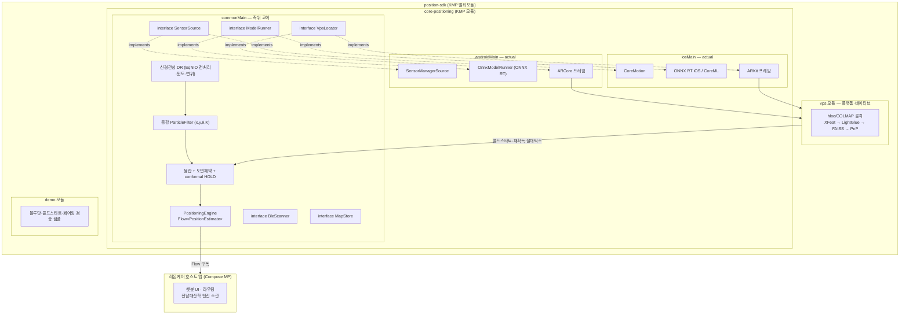
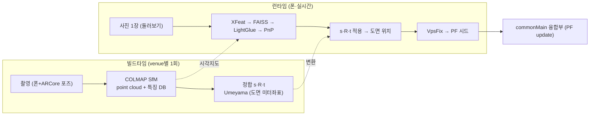
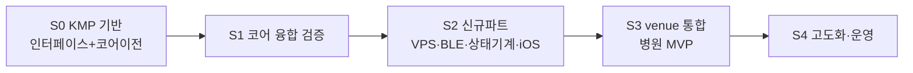

# SDK 구성 설계서

| 항목 | 내용 |
|---|---|
| 문서명 | SDK 구성 설계서 |
| 버전 | v1.0 |
| 작성일 | 2026-06-17 |
| 작성 | ㈜파모즈 - 장현빈 |
| 대상 | 스마트병원 동행 AI 앱 |

> 본 문서는 측위 SDK의 **물리적 구성(모듈·빌드·패키징)** 을 규범적으로 기술한다. 측위 알고리즘 내부는 『측위 엔진 설계서』, 호스트와의 API 시그니처는 『인터페이스 계약서』를 참조한다.

---

## 1. 개요 (구성 범위)

본 SDK는 standalone 앱이 아니라 **레몬케어(Compose Multiplatform 상용앱)에 의존성으로 통합되는 측위 라이브러리**다. 인도물 플랫폼은 **iOS + Android 둘 다**이며, 구현 방식은 **Kotlin Multiplatform(KMP)** 으로 측위 코어를 `commonMain`에서 양 플랫폼이 공유한다.

본 설계서가 다루는 **구성 범위**:

| 영역 | 포함 여부 |
|---|---|
| 측위 코어 모듈 (`core-positioning` / `commonMain`) | 본 SDK 핵심 |
| 플랫폼 actual (센서·신경런타임·AR 프레임) | 포함 (Android / iOS) |
| VPS 파이프라인 (`vps` 모듈) | SDK 범위에 직접 포함 |
| demo 검증 샘플 (`demo` 모듈) | 포함 (검증 전용) |
| AR 길안내 UI·내비게이션 | 별도 산출물 (파모즈 1차책임) — 본 문서는 모듈 배치 관점만 |
| 챗봇 RAG 엔진 | 전남대 산학협력단 소관 — SDK는 패키징·라우팅 인터페이스만 |

> **챗봇 경계 명시** — AI 챗봇(RAG) 엔진 스펙은 **전남대 산학협력단 소관**이며 별도 수령한다. 본 SDK는 챗봇 UI·라우팅을 **SDK 경계(패키징/라우팅 인터페이스) 관점에서만** 언급하고, 엔진 내부 스펙은 다루지 않는다.

---

## 2. 모듈 구성도



> 점선(`-.implements.->`)은 **인터페이스 구현 관계**를 나타낸다. 플랫폼 클래스가 `commonMain`에 정의된 인터페이스를 구현해 의존성 주입(DI)으로 바인딩된다(상세 §5).

---

## 3. 모듈별 책임·산출

### 3-A. `core-positioning` 내부 (commonMain 패키지)

| 경로 | 내용 |
|---|---|
| `commonMain/.../neural/` | 신경관성 DR: `EqO2Preprocess`·`GravityAlignedResampler`·`NeuralOdometry`·`Quat`·`ModelRunner`(interface) |
| `commonMain/.../filter/` | 증강 PF `ParticleFilter` (x,y,θ,K, predictNeural·updatePosition·resetHeading·wall-rejection·고갈흡수) |
| `commonMain/.../map/` | `WallMap`(line-segment 도면제약) · `GpMagneticMap`(GP 격자맵) |
| `commonMain/.../safety/` | `ConformalGate` (GUIDE/HOLD/RE_ACQUIRE) |
| `commonMain/.../live/` | `PositioningEngine`(`Flow<PositionEstimate>` 공개 API) · `PositionEstimate` |
| `commonMain/.../api/` | `PositioningSession` 세션 진입점 |
| `commonMain/.../source/` | `SensorSource`·`MapStore` (interface) |
| `commonMain/.../vps/` | `VpsLocator`(interface)·`CameraImage`·`VpsFix` 데이터 타입 |
| `commonMain/.../ble/` | `BleScanner`(interface)·`BleObservation` |
| `commonMain/.../geo`,`io`,`model`,`eval/` | 좌표(`GeoReference`)·직렬화 레코드·샘플 타입·리플레이 하네스(`FusionReplay`·`ConformalReplay`·`MapCorruptionAblation`) |
| `commonTest/.../` | 결정적 단위 테스트 (PF·geo·quat·codec·replay·map·conformal) |

### 3-B. 플랫폼 actual + 보조 모듈

| 경로 | 내용 |
|---|---|
| `androidMain/.../neural/OnnxModelRunner.kt` | `ModelRunner` Android 구현, ONNX Runtime로 EqNIO 추론 |
| `androidMain/.../source/SensorManagerSource.kt` | `SensorSource` Android 구현, `SensorManager` 기반 (IMU·자력계·중력·게임회전·절대회전) |
| `androidMain` ARCore 프레임 | AR 프레임 소스(`VpsLocator` 입력) |
| `iosMain/kotlin/` | CoreMotion·ONNX RT iOS/CoreML·ARKit actual |
| `vps/` | 자체구축 시각측위 (hloc/COLMAP + XFeat+LightGlue+FAISS+PnP) |
| `demo/` | 블루닷·콜드스타트·페어링 검증 샘플 앱 |

> **검증 범위** — 코어 측위는 결정적 단위 테스트로 검증한다. 현 단계의 실측은 단일 venue(단층 사무실)·단일 기기(Galaxy S22) 기준의 PoC 수준이며, 정확도·안정성의 일반화는 병원 멀티플로어·다기기 통합(§9 로드맵 S3) 단계에서 확장 검증한다.

---

## 4. 빌드 구성

### 4-A. 플러그인·타깃

루트 `build.gradle.kts`는 KMP·Android Library·kotlinx-serialization 플러그인을 `apply false`로 선언하고, `core-positioning/build.gradle.kts`에서 실제 적용한다. 타깃 선언:

```kotlin
kotlin {
    androidTarget { compilerOptions { jvmTarget.set(JvmTarget.JVM_17) } }
    // iOS 타깃은 macOS 호스트에서 선언·컴파일한다.
    if (System.getProperty("os.name").lowercase().contains("mac")) {
        iosArm64(); iosX64(); iosSimulatorArm64()
    }
}
```

**iOS 타깃은 macOS 호스트 조건부로 선언**한다 — iOS 산출물의 컴파일·빌드는 macOS/Xcode 환경에서 수행한다.

소스셋 의존성:
- `commonMain`: `kotlinx-coroutines-core`, `kotlinx-serialization-json`
- `commonTest`: `kotlin("test")`
- `androidMain`: `onnxruntime-android`

### 4-B. 버전 정렬 (호스트 스택)

버전은 `gradle/libs.versions.toml`로 중앙 관리(version catalog)한다. SDK는 통합 대상인 **호스트(레몬케어) 스택에 맞춰 버전을 정렬**한다.

| 영역 | 정렬 기준 (호스트 스택) |
|---|---|
| Kotlin | 2.3.x |
| AGP | 9.x |
| compileSdk | 36 |
| minSdk | 24 |
| Compose MP | 1.10.x (호스트 측) |
| coroutines | 1.10.x |
| serialization | 1.10.x |
| onnxruntime | SDK 자체 임베드 (§7 협의 항목 참조) |

> **minSdk 24 가드** — 코어 측위는 `HIGH_SAMPLING_RATE_SENSORS`(API 31) 권한을 사용하는 고주파 IMU 샘플링을 활용한다. minSdk 24를 지원하기 위해 API 24~30 단말에서는 **샘플링레이트 폴백 런타임 가드**를 둔다. 권한 요청 주체는 협의 항목이다.

---

## 5. 플랫폼 추상화 전략

### 5-A. 인터페이스 주입 방식

플랫폼 의존부의 추상화는 **순수 Kotlin `interface`** 로 `commonMain`에 정의하고, 플랫폼별 클래스가 이를 구현해 DI로 주입한다. `commonMain`은 측위 코어(신경관성 DR + PF + 융합)를 두고, 플랫폼별 구현은 각 소스셋의 actual로 둔다.

| 추상화 인터페이스 | 정의 위치 | Android 구현 | iOS 구현 |
|---|---|---|---|
| `SensorSource` | `commonMain/.../source/Sensors.kt` | `SensorManagerSource : SensorSource` | CoreMotion |
| `ModelRunner` | `commonMain/.../neural/ModelRunner.kt` | `OnnxModelRunner : ModelRunner` | ONNX RT iOS/CoreML |
| `VpsLocator` | `commonMain/.../vps/VpsLocator.kt` | ARCore + 자체 VPS | ARKit + 자체 VPS |
| `BleScanner` | `commonMain/.../ble/BleScanner.kt` | Android BLE | iOS BLE |
| `MapStore` | `commonMain/.../source/Sensors.kt` | Android 구현 | iOS 구현 |

### 5-B. 인터페이스 주입 방식의 함의 (DI 친화)

- **장점** — 인터페이스 주입은 Koin(MP) DI에 그대로 들어맞는다. 호스트가 `SensorSource`/`ModelRunner` 구현을 모듈로 바인딩하고, 테스트에서는 fake 구현을 주입할 수 있다. 테스트·교체가 용이하다.
- **계약 동결** — iOS actual 작성 시 인터페이스 계약을 깨지 않도록 동결하고, DI 바인딩 체크리스트로 플랫폼별 구현 누락을 점검한다.
- **선택적 `expect/actual`** — 진짜 플랫폼 분기(예: 파일 I/O)가 필요한 지점은 그 지점만 선택적으로 `expect/actual`을 도입한다. 전면 전환은 불필요하다.

---

## 6. 패키징·배포

| 항목 | iOS | Android |
|---|---|---|
| 산출물 형식 | `.xcframework` | `.aar` |
| 산출 경로 | KMP `assembleXCFramework` 출력 | `core-positioning/build/outputs/aar/` |
| 배포 채널 | SPM (Swift Package Manager) | JitPack / Maven (사내 Maven 또는 GitHub Packages) |
| 버전 정책 | SemVer 엄격 | SemVer 엄격 |
| 빌드·사이닝 | 레몬 Apple Developer 계정 (파모즈 미관여) | 레몬 앱 빌드에 포함 |
| 사전 전달물 | Privacy Manifest(iOS 17+) + 권한 키 명세 | AndroidManifest 권한 + ProGuard rules 명세 |

SDK 사이즈 추정: 측위 ~3–8MB + 모델 ONNX 21MB + AR ~5–15MB + 3D ~10–30MB. **demo 모듈은 배포물에 포함하지 않는다**(검증 전용).

---

## 7. 의존성

### 7-A. 코어 의존성

| 의존성 | 소스셋 |
|---|---|
| `kotlinx-coroutines-core` | commonMain |
| `kotlinx-serialization-json` | commonMain |
| `onnxruntime-android` | androidMain |
| `kotlin("test")` | commonTest |

iOS 신경 런타임은 ONNX RT iOS 또는 CoreML 변환으로 `iosMain`에 둔다. EqNIO ONNX(21MB, opset 17)의 iOS 이식과 하드웨어 전이 재검증이 주요 R&D 항목이다.

### 7-B. 호스트 재사용 vs 자체 임베드 정책

호스트(레몬케어)는 coroutines·serialization·Koin·Ktor·SQLDelight 등을 이미 사용한다. coroutines/serialization 등 호스트와 공통인 라이브러리는 **호스트 버전에 맞춰 정렬(재사용)** 하고, ONNX Runtime처럼 호스트에 없는 라이브러리는 **SDK가 자체 임베드**한다.

> **협의 항목** — ONNX Runtime 등 SDK 고유 의존성의 임베드 주체(SDK 임베드 vs 호스트 제공) 및 호스트 현 dependency와의 충돌 검증 경계는 호스트와 협의해 확정한다.

---

## 8. AR/VPS 모듈 배치

VPS는 대부분 플랫폼·CV 의존이므로 `commonMain`이 아니라 **별도 `vps` 모듈(플랫폼·네이티브)** 에 둔다. `commonMain`에는 VPS 포즈를 받는 **인터페이스(`VpsLocator`)만** 둔다. 즉 `commonMain` = 신경관성 DR + PF + 융합 / `vps` = 시각측위 파이프라인이다.



- **구성** — hloc/COLMAP 골격 + **XFeat**(특징) + **LightGlue**(매칭) + **FAISS**(검색) + **PnP**(포즈). 상용 SDK 없이 관대 라이선스(Apache/BSD/MIT) 부품을 조립한다. 도면 정합은 `GeoReference`/`FloorPlanCalibration` + Umeyama를 재활용한다.
- **역할 한정** — 연속 추적이 아니라 **콜드스타트·재획득 on-demand 앵커**("잠깐 둘러봐 주세요") 역할을 맡는다. 연속 추적은 신경관성 DR이 담당한다. 이 한정 덕에 `commonMain` 융합부는 "앵커가 가끔 들어오는 PF update"로 단순하게 유지되고, 배터리·구축 범위가 작아진다.

> **협의 항목** — AR 라이브러리 정책(ARKit/ARCore vs Unity, 3D 자산 관리주체)은 호스트·컨소시엄과 협의해 확정하며, 이에 따라 `vps`/AR 모듈의 최종 의존성·패키징 형태를 정한다. AR 길안내 UI·내비게이션의 상세 설계는 별도 산출물 소관이다.

---

## 9. 이관·구현 로드맵

개발 단계(S0~S4)는 다음과 같이 계획한다.



| 단계 | 내용 |
|---|---|
| **S0** | KMP 기반 — 인터페이스 계약, `kotlin.multiplatform` 전환, 코어 이전, Android actual(ONNX·SensorManager), commonTest 이전 |
| **S1** | 코어 융합 검증 — 증강 PF(x,y,θ,K)·measurement-update·conformal 게이트·도면제약(wall-rejection+BPF-lite)·map-corruption ablation |
| **S2** | 신규 파트 — VPS 매핑/런타임, BLE, 상태기계, iOS actual(macOS/Xcode 환경) |
| **S3** | venue 통합 — 병원 강구역 VPS·기압 층·BLE 앵커·페어링 실측·venue 도면 + zone 태깅 |
| **S4** | 고도화·운영 — navmesh(recast4j) 전환·자동 벡터화·지도 버전관리·운영 대시보드 |


---

> **참조 산출물** — 측위 알고리즘 내부는 『측위 엔진 설계서』, 호스트↔SDK API 시그니처·좌표계·구독 모델은 『인터페이스 계약서』, 현장 인프라(LiDAR·QR·BLE)는 『현장 인프라 구축 계획서』를 참조한다.

---

관련 산출물: 『통합 SDK 인터페이스 요구사항 정의서』, 『측위엔진 아키텍처 문서』, 『데이터흐름·인터페이스 계약서』, 『빌드배포·CI 환경』.
