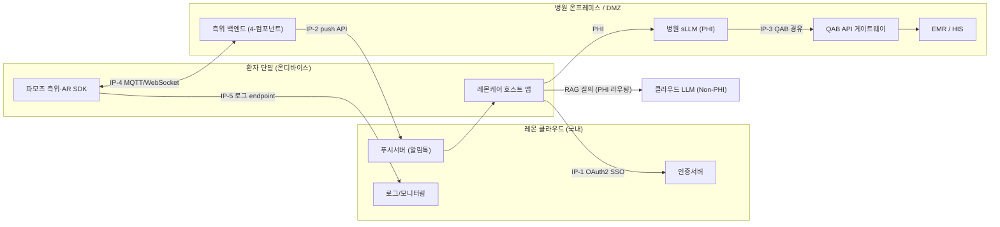
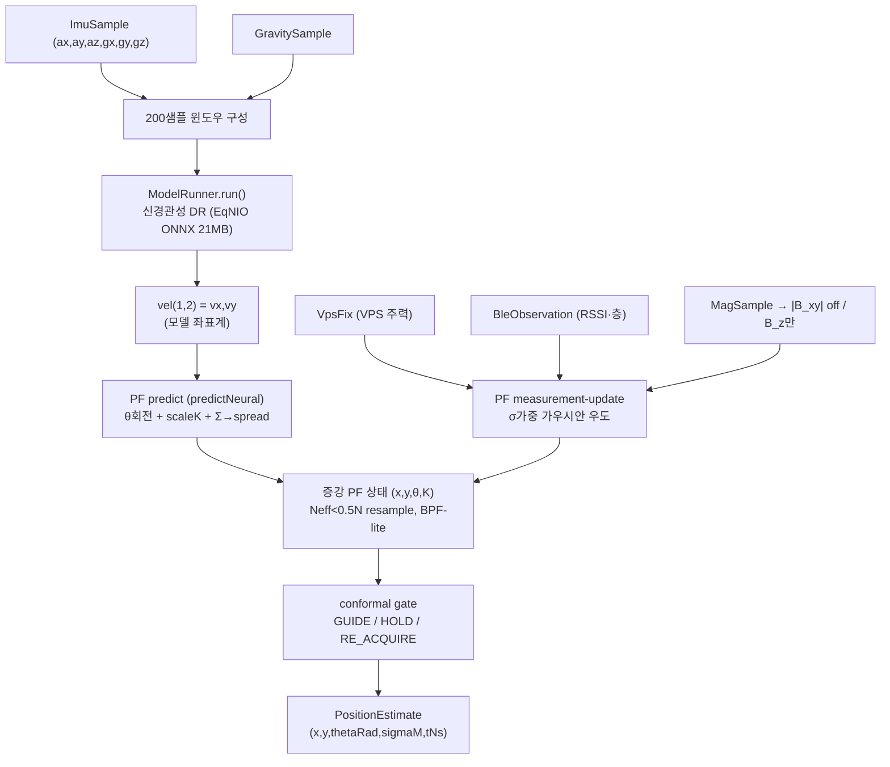
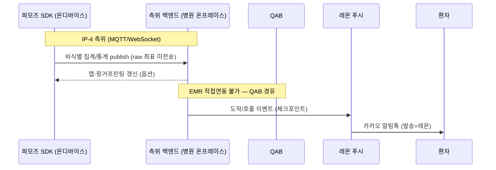
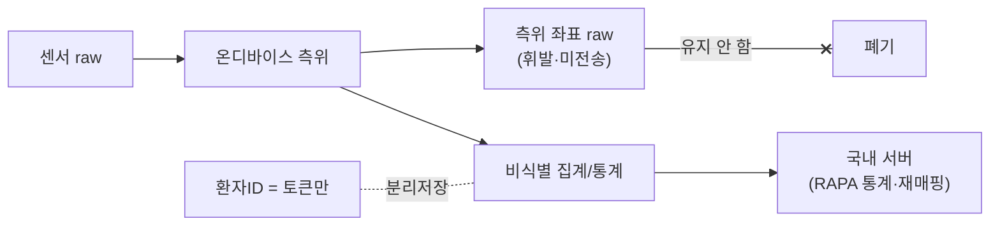

# 데이터 흐름·인터페이스 계약서

| 항목 | 내용 |
|---|---|
| 문서명 | 데이터 흐름·인터페이스 계약서 |
| 버전 | v1.0 |
| 작성일 | 2026-06-17 |
| 작성 | ㈜파모즈 - 장현빈 |
| 대상 | 스마트병원 동행 AI 앱 |

> 본 문서는 측위·AR SDK(㈜파모즈 산출물)의 **데이터 흐름과 인터페이스 계약**을 정의한다.

---

## 1. 개요 — 계약 범위

본 계약서가 규정하는 데이터 흐름은 **3개 경계(boundary)**로 구분한다.

| # | 경계 | 방향 | 비고 |
|---|---|---|---|
| ① | **SDK 내부 흐름** | 센서 → 융합 → 추정 | 측위 코어 사양 |
| ② | **SDK ↔ 호스트(레몬 앱)** | 양방향 API/콜백 | 측위 구독 + 협의 항목 |
| ③ | **SDK ↔ 백엔드(병원/레몬)** | 양방향 네트워크 | 시스템 통합 포인트 |

본 계약은 다음 원칙을 준수한다.

- 내부 데이터 흐름·스키마(①·④)는 SDK 사양으로 단정 기술한다.
- SDK↔호스트·백엔드 외부 계약(②·③) 중 인증·AR 진입·좌표계/층·Rate Limit/SLA 등 양측 정합이 필요한 항목은 본 문서 §10 **협의 항목** 표로 정리하며, 호스트 앱·백엔드와 협의하여 확정한다.

> 챗봇(RAG)은 **SDK 경계(패키징/라우팅 인터페이스)에서만** 기술한다. RAG 엔진 사양은 본 문서 범위 밖이며, 별도 산출물로 정의한다.

---

## 2. 시스템 통합 포인트 (5종)

레몬헬스케어 시스템 구성도에 정의된 **5개 통합 포인트**를 본 계약의 기준으로 한다. 각 포인트의 상세 API 명세·인증·SLA는 호스트 앱·백엔드와 협의하여 확정한다(§10).

| # | 통합 포인트 | 인터페이스 | 방향 |
|---|---|---|---|
| IP-1 | 파모즈 SDK ↔ 레몬 인증서버 | **OAuth2 SSO** | SDK→레몬 |
| IP-2 | AI Proactive 안내 ↔ 레몬 푸시서버 | **push-service API** (카카오 알림톡) | 백엔드→레몬→환자 |
| IP-3 | RAG → EMR 조회 ↔ QAB | **QAB 경유**(EMR 직접연동 불가) | RAG→QAB→병원 |
| IP-4 | 측위 좌표 ↔ 병원 측위 백엔드 | **MQTT / WebSocket** (1–5Hz 실시간) | 양방향 |
| IP-5 | 운영로그 ↔ 레몬 로그/모니터링 | **통합 로그 endpoint** | SDK→레몬 |



---

## 3. SDK 내부 데이터 흐름

측위 코어는 **증강 파티클필터**(상태 `(x, y, θ, K)`)를 중심으로, **연속추적(상대)**과 **절대보정(절대신호)**을 융합한다.

- **연속추적(predict)**: IMU(가속도·자이로 200샘플 윈도우) → 신경관성 DR(EqNIO ONNX) → 상대속도 `vel(vx,vy)` → PF predict(`predictNeural`: θ 회전 + scale K, 신경 Σ→입자 spread).
- **절대보정(update)**: VPS(주력) / BLE(층 라벨·근접) / 자기장(저가중 fallback) → 각각 PF measurement-update(σ가중 가우시안 우도, 채널별 σ).
- **출력**: PF 상태 → `PositionEstimate(x, y, thetaRad, sigmaM, tNs)`.
- **안전 게이트**: conformal gate(GUIDE / HOLD / RE_ACQUIRE). 상태기계 3모드 COLD_START → TRACKING → RE_ACQUIRE/HOLD.



내부 흐름 핵심 사양:

- **자기장**: `B_z`만 신뢰한다. `|B_xy|`는 세션간 불안정하므로 `measSigmaPerCh=[1e6, 4.0]`로 비활성화하고, `B_z`만 사용한다. 회전불변 기저는 game-rotation(자북무관)으로 한다.
- **WiFi는 portable 코어에서 배제한다.** 데이터 흐름에 WiFi 입력 채널을 두지 않는다.
- **신경관성 패리티**: Python↔온디바이스 **1e-4** 수준으로 검증한다.

---

## 4. 데이터 스키마 / 타입 계약

이 절의 타입은 **순수 Kotlin commonMain 공유**로 정의하며, iOS·Android에서 동일하다.

### 4.1 센서 입력 타입

| 타입 | 필드 | 단위 |
|---|---|---|
| `ImuSample` | `t: TimestampNs`, `ax,ay,az: Float`, `gx,gy,gz: Float` | 가속도 m/s², 자이로 rad/s, 보정 전 |
| `MagSample` | `t`, `mx,my,mz: Float` | µT, 보정 전 3축 |
| `GravitySample` | `t`, `gx,gy,gz: Float` | 중력 벡터 m/s² |
| `Pose2D` | `x,y: Double`, `theta: Double` | metric frame(m), heading rad |

> `TimestampNs = Long` — **단조 증가 타임스탬프(ns)**. 전 입력 공통 시간 기저로 한다.

### 4.2 측위 출력 타입

| 타입 | 필드 | 의미 |
|---|---|---|
| `PositionEstimate` | `x,y: Double`, `thetaRad: Double`, `sigmaM: Double`, `tNs: Long` | 실시간 추정 한 점. 맵 프레임(m). `thetaRad`=사용자 facing, `sigmaM`=위치 불확실성(m) |
| `VpsFix` | `x,y: Double`, `thetaRad: Double`, `sigmaM: Double`, `floor: Int?`, `tNs: Long` | VPS 절대 픽스. 도면 좌표(m). `floor`=층, `null`=미상 |
| `BleObservation` | `beaconId: String`, `rssi: Int`, `tNs: Long` | BLE 비콘 관측. `rssi`=dBm |
| `CameraImage` | `width,height: Int`, `pixels: ByteArray`, `fx,fy,cx,cy: Float`, `tNs: Long` | 카메라 1프레임(플랫폼 중립). intrinsics=fx,fy,cx,cy |

### 4.3 영속 레코드 타입 (서베이/재생)

| 타입 | 필드 | 용도 |
|---|---|---|
| `SurveyRecord` | `t,x,y` + `mx,my,mz`(raw) + `wmx,wmy,wmz`(world-frame calibrated) | 측량 한 점: metric 위치(ARCore GT) + 자기장 |
| `FusionRecord` | `t`, `gtx,gty` + `bxy,bz`(heading-불변 자기장 특징) + `dxN,dyN`(신경관성 상대변위, scale 적용 전) | 융합 재생 한 점 |

> 두 레코드는 **JSON Lines**(`kotlinx.serialization`)로 직렬화한다. `FusionRecordCodec`은 `ignoreUnknownKeys=true`로 전방호환을 보장한다.

### 4.4 ONNX 신경관성 텐서 계약

신경관성 모델 입출력은 **평탄 row-major float32** 계약을 준수한다.

| 텐서 | shape | 원소 수 | 의미 |
|---|---|---|---|
| 입력 `vector` | `(1, 200, 2, 3)` | **1200** | 2개 벡터 채널 × 3축 × 200샘플 윈도우 |
| 입력 `scalar` | `(1, 200, 9)` | **1800** | 9개 스칼라 특징 × 200샘플 |
| 입력 `orig` | `(1, 200, 3)` | **600** | 원본 3축 × 200샘플 |
| 출력 `vel` | `(1, 2)` | **2** | `[vx, vy]` (모델 좌표계, scale/chirality 미적용) |

```kotlin
interface ModelRunner : AutoCloseable {
    fun run(vector: FloatArray, scalar: FloatArray, orig: FloatArray): FloatArray
}
```

- 플랫폼 actual: Android=ONNX Runtime, iOS=ONNX RT iOS 또는 CoreML.
- 모델: EqNIO RoNIN-ResNet, **ONNX 21MB, opset 17**.
- 반환 `vel`은 **모델 좌표계의 raw 속도**이며 scale/chirality 미적용 상태이다. scaleK·θ 회전은 PF predict(`predictNeural`) 단계에서 적용한다(호출 측 책임).

### 4.5 플랫폼 주입 인터페이스 (계약 표면)

플랫폼 분리는 `expect/actual` 없이 **plain interface 주입**(Koin DI 친화)으로 처리한다.

| 인터페이스 | 계약 |
|---|---|
| `ModelRunner` | `run(vector, scalar, orig): FloatArray` |
| `VpsLocator` | `suspend fun locate(image: CameraImage): VpsFix?` — 매칭 성공 시 VpsFix, 실패 시 null |
| `BleScanner` | `start()` / `stop()` / `setObservationListener(cb)` |
| `SensorSource`, `MapStore` | 센서 입력·맵 저장소 주입 인터페이스 |

---

## 5. SDK ↔ 호스트 API 계약 (경계 ②)

호스트(레몬 앱) 측 정책·인증·좌표 체계가 정합되어야 하는 항목은 §10 협의 항목으로 정리하며, 호스트 앱과 협의하여 확정한다.

### 5.1 측위 구독

측위 결과는 **`Flow<PositionEstimate>`** 스트림으로 호스트에 제공한다. 호스트 스택이 `kotlinx.coroutines + Flow`이므로 자연 정합한다.

```kotlin
// 호스트가 구독하는 측위 스트림
interface PositioningSession {
    val estimates: Flow<PositionEstimate>   // 1–5Hz, sigmaM 포함
    fun start(); fun stop()
}
```

- 내부 `PositionEstimate` 타입은 SDK 사양으로 확정한다.
- 호스트 노출 API 표면(세션 수명주기·구독 시작/종료·에러 전파)의 상세 시그니처는 호스트 앱과 협의하여 확정한다(§10).
- 좌표계는 내부적으로 **맵 프레임(미터)**으로 한다. 호스트가 기대하는 좌표·층 표현은 §5.3·§10에 따른다.

### 5.2 AR 진입 파라미터·콜백

AR 길안내의 진입 파라미터(목적지 POI·경로·층)·완료/우회 콜백 시그니처는 AR 라이브러리 정책 및 3D 자산 관리주체와 정합하여 정의한다. 다음 항목은 호스트 앱과 협의하여 확정한다(§10).

| 항목 |
|---|
| AR 세션 진입 파라미터 (목적지·경로·층) |
| 경로 안내 시작/완료/우회 콜백 |
| AR 미지원 단말 폴백 UI 책임주체 |
| 진입점 모델 (풀스크린/임베디드/모달) |

### 5.3 좌표계·층 정보 계약

SDK 내부 표현은 다음과 같이 확정하며, 호스트 노출 매핑 규칙은 레몬 실내지도 좌표 기준(원점·축·층 코드)과 정합하여 §10에 따라 협의·확정한다.

| 항목 | SDK 내부 사양 | 호스트 노출 |
|---|---|---|
| 평면 좌표 | 맵 프레임 미터 `(x,y: Double)` | 호스트 좌표계 매핑 규칙(협의 확정) |
| heading | `thetaRad` (rad) | 단위·기준(자북/맵북)(협의 확정) |
| 층 | `VpsFix.floor: Int?` / BLE 층 라벨 | 호스트 층 코드 체계(협의 확정) |
| 불확실성 | `sigmaM` (m) | 호스트 노출 여부(협의 확정) |

### 5.4 인증 (OAuth2 SSO)

SDK↔호스트 인증은 **OAuth2 SSO**(IP-1)를 기준으로 한다. 토큰 방식·유효기간·인가범위·Rate Limit·SLA·장애 fallback은 호스트 앱·백엔드와 협의하여 확정한다(§10).

핵심 측위 기능은 네트워크 장애 시에도 동작하도록 **온디바이스 자체 처리(지자기·QR·BLE)** 를 설계 원칙으로 한다.

---

## 6. SDK ↔ 백엔드 인터페이스 (경계 ③)

백엔드 측위 시스템은 **병원 온프레미스/DMZ 4-컴포넌트**(① 센서 수신 게이트웨이 ② 측위 엔진(EKF·핑거프린팅) ③ 핑거프린팅·맵 DB ④ 실시간 위치 푸시)로 구성한다. 실시간 전송은 1–5Hz, MQTT/WebSocket으로 한다.

| 인터페이스 | 방향 | 프로토콜 |
|---|---|---|
| 측위 좌표/이벤트 스트림 (IP-4) | 양방향 | MQTT / WebSocket |
| RAG → EMR 조회 (IP-3) | RAG→QAB→EMR | QAB 경유 |
| Proactive 푸시 (IP-2) | 백엔드→레몬→환자 | push-service API (카카오 알림톡) |

IP-4의 토픽·페이로드·QoS·인증 스키마, IP-3의 QAB API 명세, IP-2의 push-service API는 백엔드·호스트와 협의하여 확정한다(§10).



---

## 7. 데이터 처리위치·보존 정책

**온디바이스 raw 휘발**과 **집계·통계 서버저장**을 명확히 구분한다.

| 데이터 종류 | 처리 위치 | 보존 정책 |
|---|---|---|
| 환자 식별자 | 레몬 백엔드 (SDK엔 토큰만) | **일회용 토큰 + 비식별 세션 ID** |
| 의료기관 정보 | 레몬 백엔드 → SDK 요청 | 캐시 **≤ 1시간** |
| **측위 좌표 (raw)** | **온디바이스만, 휘발** | **미전송** |
| 측위 통계·집계 (체류시간 등) | 비식별·집계 후 **국내 서버** | RAPA 평가/재매핑용 |
| AR 이벤트 (시작/완료/우회) | SDK 자체 또는 레몬 분석 | 비식별·집계 |
| 만족도 평가 | RAPA KPI 측정용 | 집계 (n≥200) |
| RAG 질의응답 | 내용 분기 (PHI 라우팅) | PHI 라우팅 정책 적용 |

> **raw 휘발 vs 통계 서버저장 구분**: 측위 좌표 **raw는 온디바이스에서 즉시 휘발·미전송**한다. 서버에 저장하는 것은 개인 좌표 raw가 아니라 **비식별·집계된 통계**로 한정한다. 통계 서버 저장의 보관기간·비식별화 시점·방식은 주관기관과 협의하여 확정한다(§10).



---

## 8. 보안·프라이버시·규제

### 8.1 PHI 이중 LLM 라우팅

RAG 질의는 성격에 따라 추론 위치를 분기한다. 본 SDK는 라우팅 **경계 인터페이스(패키징/라우팅)만** 담당한다.

| 질의 유형 | 추론 위치 | 가드레일 |
|---|---|---|
| Non-PHI (일반 안내·의료 상식) | **클라우드 중앙 LLM** | 1단 — 클라우드 입력(PII 필터·악성 프롬프트 차단) |
| PHI-touching (환자별 처방·EMR 조회) | **병원 내부 sLLM** | 2단 — 병원 입력(PHI 검증·의료 안전성) + 출력 가드레일(병원 내부) |

> **가드레일 2단 구조**: 라우팅 오분류(잘못 분류된 PHI) 케이스에도 안전망 역할을 한다.

### 8.2 위치정보(LBS) 규제 준수

본 사업은 환자별 맞춤 안내를 제공하므로 개인위치정보를 다룬다. 위치정보법상 위치정보사업·위치기반서비스사업 신고 등 규제 준수 사항은 주관기관과 협의하여 처리한다.

- 본 SDK의 **온디바이스 raw 휘발 구조**(§7)는 위치정보 보호조치 부담 감소에 기여한다.
- 위치정보 신고 주체·범위 및 공식 유권해석 확인은 주관기관과 협의하여 진행한다.

### 8.3 비식별화 정책

식별자 비식별화 방식·시점, 해시 함수·솔트 정책, 재식별 가능성 평가는 주관기관과 협의하여 확정한다(§10).

### 8.4 데이터 주권·국외 이전

- 측위/분석 데이터는 외부 분석 도구(국외 서버)에 저장하지 않으며, **온디바이스 + 국내 서버**를 원칙으로 한다.
- 개인정보 국외 이전 규제를 준수하며, PHI는 병원 내부 sLLM에서 처리한다.

---

## 9. 데이터 흐름 요약

| 경계 | 데이터 | 방향 | 처리 |
|---|---|---|---|
| ① SDK 내부 | 센서 → 융합 → 추정 | 온디바이스 | 증강 PF, raw 휘발 |
| ② SDK ↔ 호스트 | `Flow<PositionEstimate>` 구독, AR 진입/콜백 | 양방향 | 측위 사양 확정, 표면 협의 |
| ③ SDK ↔ 백엔드 | 비식별 집계/통계, 측위 이벤트 | 양방향 | 국내 서버 집계 저장 |

---

## 10. 협의 항목 (호스트 앱·백엔드와 협의하여 확정)

인터페이스 계약상 양측 정합이 필요한 다음 항목은 호스트 앱·백엔드와 협의하여 확정한다.

| 분류 | 협의 항목 | 관련 절 |
|---|---|---|
| 인증 | OAuth2 SSO 토큰 방식·유효기간·refresh·인가범위 | §5.4, IP-1 |
| 인증 | Rate Limit (동시 측위 부하 산정 포함) | §5.4, §6 |
| 인증 | SLA (응답속도·가용성·점검 공지) | §5.4 |
| 인증 | 장애 fallback (타임아웃·캐시·오프라인) | §5.4 |
| AR | AR 세션 진입 파라미터 (목적지·경로·층) | §5.2 |
| AR | 경로 안내 시작/완료/우회 콜백 시그니처 | §5.2 |
| AR | 진입점 모델 (풀스크린/임베디드/모달), 폴백 UI 책임주체 | §5.2 |
| 좌표·층 | 호스트 좌표계 매핑 규칙·heading 기준·층 코드 체계·불확실성 노출 | §5.3 |
| 좌표·층 | 레몬 실내지도 좌표 기준 (원점·축·층 코드) | §5.3 |
| 백엔드 | IP-4 MQTT/WebSocket 토픽·페이로드·QoS·인증 스키마 | §6 |
| 백엔드 | IP-3 QAB API 명세 | §6 |
| 백엔드 | IP-2 push-service API 명세 | §6 |
| 로그 | IP-5 로그 endpoint 저장위치·포맷 | §2, §7 |
| 데이터 | 환자 식별자 전달방식 (토큰/세션ID·유효기간) | §7 |
| 데이터 | 측위 좌표 처리방침 (전송/보관/비식별 시점) | §5.3, §7 |
| 프라이버시 | 통계 서버 저장 보관기간·비식별화 시점·방식 | §7, §8.3 |
| 규제 | 위치정보(LBS) 신고 주체·범위, 유권해석 확인 | §8.2 |

---


관련 산출물: 『통합 SDK 인터페이스 요구사항 정의서』, 『SDK 구성 설계서』, 『측위엔진 아키텍처 문서』.
