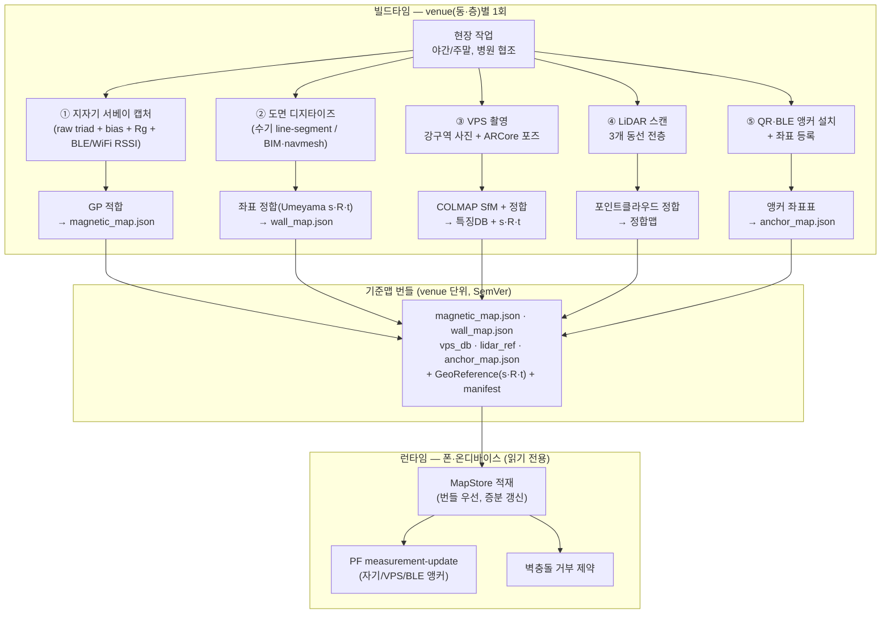
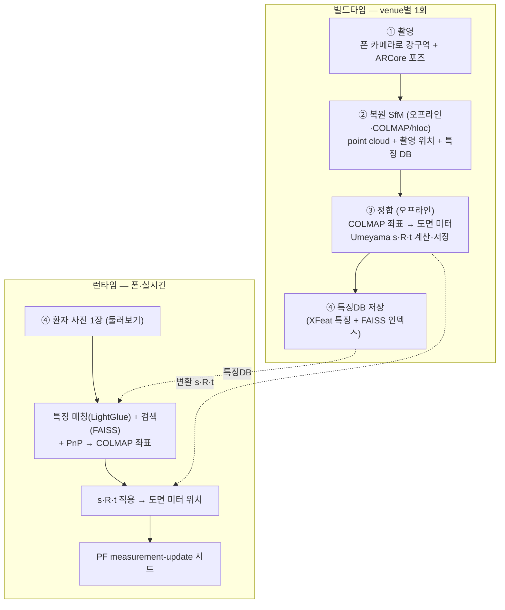

# 스캔·기준맵 파이프라인

| 항목 | 내용 |
|---|---|
| 문서명 | 스캔·기준맵 파이프라인 |
| 버전 | v1.0 |
| 작성일 | 2026-06-17 |
| 작성 | ㈜파모즈 - 장현빈 |
| 대상 | 스마트병원 동행 AI 앱 |

> 본 문서의 범위는 **기준맵(reference map) 생성·저장·운영** 파이프라인이다. 런타임 융합 알고리즘은 『측위엔진 아키텍처 문서』, SDK가 맵을 적재·소비하는 인터페이스는 『SDK 구성 설계서』·『인터페이스 계약서』를 참조한다.

---

## 1. 개요

측위 엔진은 단일 기준맵이 아니라 **5종의 기준맵 자산**을 venue(병원 동·층)별로 빌드해 사용한다. 각 자산은 측위 코어의 서로 다른 보정 채널 또는 제약에 대응한다.

| # | 기준맵 종류 | 측위 역할 | 빌드 방식 |
|---|---|---|---|
| ① | **지자기 핑거프린트 맵** | 저가중 fallback 보정 (`B_z` 중심) | 실측 서베이 → GP 격자맵 적합 |
| ② | **도면·벽맵** | 벽충돌 거부(wall-collision rejection) 제약 | line-segment 디지타이즈 / BIM·navmesh |
| ③ | **시각지도(VPS)** | 주력 절대보정 — 강구역 콜드스타트/재획득 | 촬영 → COLMAP SfM → 정합 |
| ④ | **LiDAR 정합맵** | 포인트클라우드 기반 측위 정합 기준 | 스캔 → 포인트클라우드 정합 |
| ⑤ | **QR·BLE 앵커 맵** | QR 절대 앵커 / BLE region prior·층 라벨 | 현장 설치 + 좌표 등록 |

지자기 맵과 도면·벽맵은 PoC 단계에서 빌드·검증된 파이프라인을 기준으로 규범적으로 기술하며, VPS·LiDAR·QR·BLE 파이프라인은 동일한 좌표 정합 골격 위에서 venue별로 구축한다. 본 문서의 수치(서베이 커버리지, 정합 배율, 셀 해상도 등)는 검증된 빌드 환경에서 도출한 값이며, 병원 다층·다구역 적용 시 1차년도 파일럿에서 실측 검증을 거쳐 일반화한다.

---

## 2. 전체 파이프라인 (빌드타임 venue별 1회 → 런타임)

기준맵 5종은 모두 **빌드타임에 venue별 1회 생성**되어 온디바이스 번들로 적재되고, 런타임에는 **읽기 전용**으로 소비된다. 핵심 원칙은 *raw substrate를 기록하고 특징은 후처리로 파생*한다는 것이다(자기장: 특징 변경 = GP 재적합, 재서베이 아님).



**좌표계 통일 원칙:** 모든 기준맵은 최종적으로 **동일한 도면 미터 좌표계**로 정합된다. 서로 다른 출처 좌표(ARCore 기준, COLMAP 임의 좌표, 도면 픽셀, LiDAR 스캐너 좌표)는 각각 닮음변환 `도면위치 = s·R·소스위치 + t`로 한 번 정합한 뒤 저장된다. 빌드 때 변환을 한 번 구하고 런타임엔 곱셈만 한다.

---

## 3. 지자기 핑거프린팅 파이프라인

### 3.1 역할

지자기는 측위 엔진에서 **저가중 fallback 보정자**다(주 보정자는 VPS, 보조는 BLE). 자기-only ATE는 4–5.5m 수준으로, 정확도 예산은 신경관성 DR + BLE + VPS가 진다. 따라서 지자기 맵의 가치는 "정확도 레버"가 아니라 *무특징 복도에서 드리프트를 느슨하게 잡아주는 상시 채널*에 있다. 본 파이프라인은 이 역할에 맞춰 **보수적**으로 설계한다.

### 3.2 서베이 캡처 — 권장 기록 규격

서베이 캡처는 *특징이 아니라 raw substrate를 기록*한다. 모든 후보 특징이 raw의 후처리 함수가 되어야, 특징을 바꿔도 GP 재적합만으로 끝나고 **재서베이를 강제하지 않는다.** 권장 기록 규격은 다음과 같다.

```
t(ns); x,y(ARCore 기준 위치); floor:Int;
ux,uy,uz   (uncalibrated raw triad µT  — TYPE_MAGNETIC_FIELD_UNCALIBRATED values[0..2]);
bx,by,bz   (hard-iron BIAS = values[3..5]);
cx,cy,cz   (calibrated triad — TYPE_MAGNETIC_FIELD);
gravx,gravy,gravz (gravity);
Rg[9]      (GAME-rotation 회전행렬 — 자북 무관, yaw-불변 기저);
Ra[9]      (ABSOLUTE-rotation — 자북 포함, 진단/heading 전용);
magAccuracy:Int; deviceId:String; poseLabel:String; surveyPassId:Int
```

기록 원칙:
- **uncal raw + bias + calibrated를 모두** 남긴다. bias(`values[3..5]`)가 있어야 calibrated 재구성과 b-frame 차분(기기별 additive bias 상쇄)이 가능하다.
- **회전 기저는 game-rotation(`Rg`)**을 쓴다. 자북 무관이라 yaw-불변 특징(`|B_xy|`, `B_z`)을 오염시키지 않는다. `Ra`(절대회전)는 진단·heading 진단용으로만 별도 기록한다.
- **시간정렬 BLE-RSSI(+ Android 한정 WiFi-RSSI)를 동시 기록**한다. 이를 통해 콜드스타트용 거친 region prior를 사후에 파생할 수 있다.
- floor / deviceId / poseLabel / surveyPassId를 행마다 붙여 층·기기·자세·패스를 사후 분리할 수 있게 한다.
- **스트림 decimate 금지** — CNN/시퀀스 매처 확장용 raw cadence(~30Hz)를 유지한다.

### 3.3 커버리지 권장

| 항목 | 권장값 | 근거 |
|---|---|---|
| 보행 속도 | 연속 walk ~0.5 m/s | 등속 샘플 밀도 |
| 랩(lap) 간격 | 0.5–1.0 m | 격자 해상도 정합 |
| 패스 수 | **영역당 ≥3패스(반대방향 포함)** | 방향 편향 상쇄 |
| 자세 다양성 | **in-hand / swing / pocket 전용 패스** | per-pose 분산 = 채널별 측정 σ 실측 근거 |
| 기기 | 멀티기기(최소 deviceId 기록) | 크로스기기 bias 분석 |
| 셀당 샘플 | **5–10 샘플** | 격자 해상도 0.25m 정합 |
| decimate | **금지** | raw cadence 유지 |

### 3.4 GP 적합

서베이 JSONL → GP 격자맵으로 적합한다. 커널은 **`C·RBF + WhiteKernel`**(RBF length_scale_bounds 0.2–10.0 m, White noise_level_bounds 1e-3–1e3, `normalize_y=True`, `n_restarts_optimizer=2`)을 사용한다.

특징(feature) 모드:
- **`gravinv`(권장)** — heading-불변 2채널 `{|B_xy| = hypot(wmx,wmy), B_z = wmz}`. world-frame ENU 필드를 자동 사용한다. **런타임 특징의 정본.**
- `axes` — 3축 독립 적합(진단용).

격자 해상도(`res`)는 0.25m, 맵 외곽 여유(`margin`)는 0.5m를 기본값으로 하며, denoise 옵션은 셀 내 샘플 평균으로 per-sample 노이즈를 ~√n 감소시킨다.

### 3.5 출력 JSON 포맷 (런타임 정본)

GP 적합 출력 = 런타임 격자맵이 그대로 적재하는 구조다.

```json
{ "x_min": <m>, "y_min": <m>, "res": 0.25,
  "nx": <int>, "ny": <int>,
  "mu":    [[...nx*ny...], [...]],   // 채널별 평균  (gravinv: ch0=|B_xy|, ch1=B_z)
  "sigma": [[...nx*ny...], [...]],   // 채널별 표준편차
  "n_points": <int> }
```

런타임 조회: `query(x,y)` → 격자 인덱스 `ix*ny+iy`, **양선형 보간**으로 채널별 `(μ, σ)` 반환. 격자 밖은 σ=1e6으로 likelihood를 평탄화(보정 약화)한다. 맵 한 장은 실측 기준 **약 36KB** 수준이다.

### 3.6 채널 선택 — `B_z` 중심

실측 검증에서 동일 지점 map 42.4µT vs 측정 16.4µT, **`|B_xy|` corr 0.463**(세션간 불안정) vs **`B_z` corr 0.845**(안정)를 확인했다. 따라서 런타임 PF는 **`measSigmaPerCh=[1e6, 4.0]`** 로 `|B_xy|`를 사실상 끄고 안정적인 `B_z`만 쓴다. 이 채널 선택은 맵을 다시 굽는 일이 아니라 **런타임 파라미터(적합 플래그 + `measSigmaPerCh`) 변경**이다 — 엔진의 격자맵 조회는 채널 수가 데이터주도이고 PF 업데이트는 채널별 σ를 받으므로 재서베이가 불필요하다.

### 3.7 빌드 검증

빌드한 GP 맵의 정보량을 빌드 단계에서 검증한다. test 서베이의 GT 위치에서 맵을 양선형 조회해 **예측 vs 측정 (`|B_xy|`,`B_z`)의 corr/RMS**를 보고하고(임계: corr>0.3이면 "위치 신호로 쓸만함"), 이를 venue 맵 배포 전 자동 게이트로 사용한다.

---

## 4. 도면·벽맵 파이프라인

### 4.1 표현 방식 — PoC vs 양산

| 단계 | 표현 | 도구 | 비용 |
|---|---|---|---|
| **PoC** | line-segment 벽 집합 | 수기 클릭 디지타이즈 | 1층당 **1–2h** |
| **양산** | BIM 추출 / navmesh(recast4j) | BIM import / navmesh 빌드 | venue당 수일 |

occupancy grid는 **배제**한다(메모리·표현력 대비 비효율). 양산 표현은 navmesh(recast4j)이며, line-segment는 검증용이다. 측위 효과의 마스터 변수는 **벽 topology**다(복도형 구역은 벽 제약으로 ATE가 크게 떨어지고, 개방형 홀은 이득 0). 병원 면적가중 기대 이득은 **약 20–25%** 수준으로 보수적으로 가정한다.

### 4.2 수기 디지타이즈

도면(`floorplan.png`)의 외곽선·벽을 클릭으로 따라 그려 line-segment 체인을 만든다. 좌클릭=꼭짓점 추가(연속=이어진 벽), 새 벽 체인 시작·취소·저장 단축키를 제공한다. 출력 `wall_map.json` = `{"segments":[{x1,y1,x2,y2}, ...]}`(미터 좌표).

### 4.3 도면 정합 (Umeyama s·R·t)

도면 픽셀과 측위 미터 좌표를 닮음변환으로 정합한다.

- **고정 배율 경로(PoC):** 도면 치수에서 `PPM`(px/m)을 직접 고정한다 — 예: 외벽 10.59m → **87.3 px/m**, 또는 도면 60'3"=18.36m ≈ 1500px → **82 px/m**. 측위 맵(자기/GT)과 동일 좌표계로 그려 별도 정합이 불필요한 케이스.
- **대응점 정합 경로:** **2개 대응점**(픽셀↔미터)으로 닮음변환(uniform scale + rotation + translation)을 닫힌형으로 계산한다(정·역변환 모두). 서베이 시작점·초기 방향을 도면 클릭과 짝지어 회전 `θ`+이동을 구하고 스케일은 도면 치수에서 고정한 뒤, 검증 PNG와 변환 JSON을 저장한다.
- **3D 확장(VPS·LiDAR용):** 점 쌍이 많을 때는 **Umeyama(SVD)**로 최적 `s·R·t`를 자동 계산한다. 코어가 이미 Umeyama를 신경관성-DR 궤적 정렬에 사용하므로, 2D 정합 도구(GeoReference + 2탭 재보정 UX)를 3D 점구름용으로 확장해 동일 골격을 재사용한다.

---

## 5. 시각지도(VPS) 파이프라인

### 5.1 역할 (주력 절대보정, 단 연속추적 아님)

VPS는 측위 엔진의 **주력 절대보정자**이되, 연속 추적이 아니라 **앱 실행 직후·재획득 시 "잠깐 둘러봐 주세요" on-demand 앵커**다. 연속 추적은 신경관성 DR이 맡고, VPS는 콜드스타트/재획득에서만 절대 위치를 한 번 잡아 PF를 시드한다. 이 역할 한정 덕에 배터리·구축 범위가 "연속 VPS"보다 크게 작다.

### 5.2 빌드타임 → 런타임 데이터 흐름



### 5.3 구축 방식 (자체구축, 무벤더)

상용 SDK 없이 **관대 라이선스(Apache/BSD/MIT) 부품 조립**으로 구축한다: `hloc`/`COLMAP` 골격 + **XFeat**(특징) + **LightGlue**(매칭) + **FAISS**(검색) + **PnP**(포즈). 빌드 4스텝(중력 정렬 → 배율 s → 기준점 2~3개 → Umeyama SVD)은 §4.3 도면 정합과 동일 골격이다. 배포 전 각 부품 라이선스를 최종 확인한다. **배치:** VPS는 플랫폼·CV 의존이라 `commonMain`이 아니라 플랫폼·네이티브 모듈에 두고, `commonMain`에는 VPS 포즈를 받는 `expect VpsLocator` 인터페이스만 둔다.

---

## 6. LiDAR 스캔 파이프라인

### 6.1 현장 작업

| 항목 | 내용 | 병원 협의 |
|---|---|---|
| 범위 | 파일럿 **3개 동선 전층** 스캔 | 진료행정과 + 보안팀 + 시설팀 |
| 시간대 | **야간/주말** 비운영 시간 | (환자 동선 회피) |
| 산출 | 측위 정합용 **포인트클라우드** | — |

### 6.2 파이프라인

`포인트클라우드 → 정합 → 측위 정합맵`. 스캐너 좌표를 도면 미터 좌표로 §4.3과 동일한 `s·R·t`(Umeyama) 정합한다. LiDAR 정합맵은 VPS 시각지도의 기하 backbone(또는 VPS 미적용 구역의 대체 정합 기준)으로 위치한다.

---

## 7. QR 앵커·BLE 5.1 AoA 설치

| 항목 | QR 앵커 | BLE 5.1 AoA |
|---|---|---|
| 수량 | **50–100개소** (주요 거점) | **10–20개소** (핵심 동선) |
| 측위 역할 | QR 스캔 시 **절대 앵커**(콜드스타트·앵커 보정) | RSSI proximity **region prior** + **층 절대 라벨** |
| 설치 | 시설관리팀 부착, **소독·청소 내구성 코팅** | **천장 부착형**, **PoE 전원** |
| 협의 | 진료행정과 + 시설관리팀 | 시설팀 + 전기설비팀 |

**앵커 맵 등록:** 설치 후 각 앵커의 도면 미터 좌표·식별자(QR payload / BLE MAC·층 라벨)를 `anchor_map.json`으로 등록해 번들에 포함한다. **BLE 사전 검증:** 병원 비콘 밀도·RSSI 안정성은 venue별로 달라지므로, 콜드스타트 region prior 효과를 파일럿에서 실측한다(서베이 시 BLE-RSSI 동시 기록 — §3.2 권장 규격이 이를 가능케 한다). WiFi region prior 타당성은 venue별 사전 프로브(leave-one-out 셀 분류 top-1/top-3, 중앙값 오차)로 평가할 수 있으나, portable 코어는 WiFi를 의도적으로 배제하므로 Android 한정 보조에 그친다.

---

## 8. 기준맵 저장·버전관리

| 정책 | 내용 |
|---|---|
| **번들 우선** | 기준맵 5종 + `GeoReference(s·R·t)` + manifest를 **venue 단위 온디바이스 번들**로 적재(`MapStore` 인터페이스). 런타임 네트워크 의존 최소화. |
| **버전관리** | venue 번들에 **SemVer** 부여(엔진 SemVer와 분리). manifest에 venue id·층·빌드일·맵별 해시·서베이 deviceId 기록. |
| **증분 재매핑** | 진료실 배치·동선 변경 시 **해당 영역만** 재서베이/재정합해 부분 갱신. 자기장은 *특징 변경 ≠ 재서베이*(§3.6)이지만 *물리 환경 변경 = 부분 재서베이* 필요. |
| **갱신 트리거** | 시간 비정상성(침대·휠체어·카트·엘리베이터 이동, MRI/대형장비 포화)으로 자기 맵은 노후가 빠르다 → 거친 smoothed 맵 + 큰 σ 셀 + **재서베이 예산**을 운영 정책에 포함. |
| **고자기장 zone** | MRI/대형장비 구역은 특징으로 보정 불가 → **마킹 + 공간 게이팅**(맵에 zone 플래그). |

> 맵 적재·배포 인터페이스의 정식 시그니처는 『SDK 구성 설계서』·『인터페이스 계약서』를 따른다. 번들 배포 채널(앱 내장 vs OTA)은 컨소시엄 협의로 확정한다.

---

## 9. 데이터 거버넌스

기준맵 데이터는 **두 흐름을 명확히 구분**한다.

| 데이터 | 처리 위치 | 보존 |
|---|---|---|
| **측위 좌표 raw**(런타임 위치 추정) | **온디바이스** | **휘발·미전송** |
| **집계·통계**(KPI, 동선 히트맵) | 서버 | **영구 저장**(비식별 집계) |
| **재매핑 입력**(맵 노후 검출용 통계) | 서버 | **영구 저장**(비식별, 공간 통계만) |
| **빌드타임 서베이 원본**(JSONL, GT 포함) | 사내/병원 빌드 환경 | 맵 빌드·검증용 보관 (비배포) |

핵심 규칙:
- **런타임 측위 raw 좌표는 온디바이스에서 휘발**하며 서버로 전송하지 않는다. SDK에는 환자식별자가 아니라 **일회용 토큰/비식별 세션ID**만 전달된다(환자식별자는 레몬 백엔드 보유).
- 서버 영구 저장(통계·재매핑)은 위 *raw 휘발* 원칙과 모순되지 않도록 **비식별 집계·공간 통계로 한정**한다. 즉 "raw 궤적 영구저장"이 아니라 "비식별 집계 영구저장"이다.
- 빌드타임 서베이 원본(GT 위치 포함)은 측위 정합용 내부 자산으로, 환자 데이터가 아니다(작업자 캡처). 배포 번들에는 포함하지 않는다.
- PHI 보호(병원 온프레미스/DMZ 배치)는 별도 ADR을 따른다. 환자ID 전달방식·측위좌표 처리방침·측위 이벤트로그 저장·단말 통계 정책은 컨소시엄 협의로 확정한다.

---

## 10. 리스크 및 다음 단계

### 10.1 리스크

| 리스크 | 등급 | 완화 |
|---|---|---|
| **다층 일반화** — 병원 다층 환경 적용 검증 | 높음 | 1차 파일럿 실측 검증, 멀티기기 deviceId 기록 |
| **VPS·LiDAR·QR·BLE 구축 범위** — 1차년도 신규 구축 | 높음 | 단계별 게이트, 동일 좌표 정합 골격 재사용 |
| **자기 시간 비정상성**(병원 카트·장비·재배치) | 중 | 큰 σ 셀 + 재서베이 예산 + zone 게이팅 |
| **BLE region prior 검증**(비콘 밀도·RSSI 안정성) | 중 | 서베이 시 BLE-RSSI 동시 기록 → 파일럿 사후 분석 |
| **고자기장(MRI) 포화 구역** | 중 | zone 마킹 + 공간 게이팅 |

### 10.2 다음 단계

1. 서베이 전 기록 규격 확정(§3.2 권장 규격 — bias·game-rotation+gravity·BLE/WiFi RSSI·floor/deviceId/poseLabel/passId 포함).
2. 병원 협조 일정 확정(야간/주말 LiDAR·서베이 windows) — 진료행정과/시설팀.
3. 1개 파일럿 층 end-to-end 빌드(① 지자기 + ② 도면)로 번들·검증 파이프라인 1회 통과.
4. ③ VPS·④ LiDAR·⑤ 앵커는 1차년도 신규 구축 — 별도 마일스톤(게이트별 호스트 앱 통합 테스트 포함).
5. 맵 번들 SemVer·증분 재매핑 운영 정책 확정.

---

관련 산출물: 『측위엔진 아키텍처 문서』, 『측위엔진 요구사항 정의서』, 『현장 인프라 구축 계획서』(별도).
