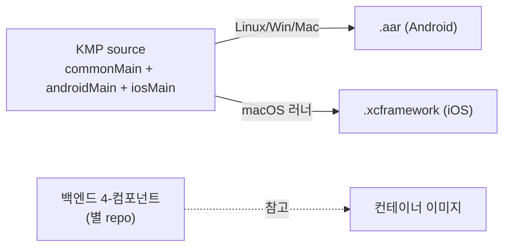
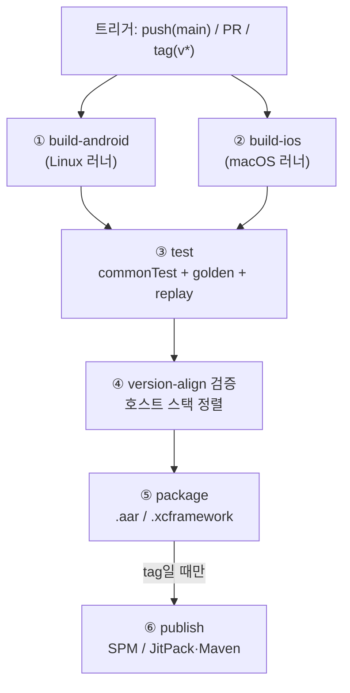

# 빌드·배포(CI) 환경

| 항목 | 내용 |
|---|---|
| 문서명 | 빌드·배포(CI) 환경 |
| 버전 | v1.0 |
| 작성일 | 2026-06-17 |
| 작성 | ㈜파모즈 - 장현빈 |
| 대상 | 스마트병원 동행 AI 앱 |

---

## 1. 개요

### 1.1 목적

측위·AR SDK(파모즈 인도물 = `.aar`/`.xcframework`)를 재현 가능하게 빌드하고, 게이트 통과 시에만 패키징·배포하는 CI/CD 환경을 구축한다.

### 1.2 대상 범위

| 대상 | 소유 | 본 문서 다룸 |
|---|---|---|
| 측위 SDK (KMP, `.aar`/`.xcframework`) | 파모즈 | O 주 대상 |
| AR/VPS SDK | 파모즈 | O 측위와 동일 파이프라인에 편입 |
| (참고) 측위 백엔드 (4-컴포넌트 컨테이너) | 파모즈 | △ 참고 — 컨테이너 빌드 골격 |
| AI 챗봇 엔진 | 전남대 산학 | X SDK 라우팅 경계 외 미포함 |
| 호스트 앱(레몬케어) 빌드·App Store/Play 업로드 | 레몬 | X 레몬 소관(서명=레몬 계정) |

> 범례: O 가능/지원 · △ 조건부 · X 불가/미지원 · — 해당없음

> 백엔드(RAG/MCP)는 SDK와 별 repo·별 파이프라인으로 분리하여 운영한다.

---

## 2. 빌드 대상 산출물

CI 파이프라인이 생성하는 산출물은 다음과 같다.

| 산출물 | 플랫폼 | 빌드 환경 | 비고 |
|---|---|---|---|
| **`.aar`** (Android 라이브러리) | Android | Linux/Windows/Mac 모두 가능 | KMP `androidTarget` 산출, ProGuard/Manifest 명세 동봉 |
| **`.xcframework`** (iOS 프레임워크) | iOS | macOS 러너 필요 | KMP `iosArm64`+`iosX64`+`iosSimulatorArm64` → fat framework |
| (참고) **백엔드 컨테이너 이미지** | 서버 | Linux | 병원 온프레미스/DMZ 배치. `python:3.11-slim` 기반 |

- `.aar`은 KMP `androidTarget`에서 빌드하며 Linux/Windows/Mac 어느 호스트에서도 생성 가능하다.
- `.xcframework`은 macOS 러너에서 `iosArm64`/`iosX64`/`iosSimulatorArm64` 타깃을 컴파일하여 fat framework로 패키징한다. iOS 빌드는 macOS 러너 확보를 전제로 한다.
- 백엔드 컨테이너 이미지는 별 repo·별 파이프라인에서 빌드하며, 본 문서에서는 컨테이너 빌드 골격만 참고로 다룬다.



KMP 코어는 `commonMain`에서 순수 Kotlin으로 공유(Android import 0)하여, 단일 코드베이스로 양 플랫폼을 빌드한다. 빌드 환경은 JDK 경로 하드코딩을 배제(JAVA_HOME/toolchain)하고 Gradle build cache(`org.gradle.caching=true`)를 활성화하여 CI 캐시에 친화적으로 구성한다.

---

## 3. 빌드 파이프라인

빌드 파이프라인은 트리거에 따라 다음 단계로 구성한다.

### 3.1 파이프라인 단계



### 3.2 단계별 구성

| 단계 | 내용 | 러너 |
|---|---|---|
| ① Android 빌드 | `./gradlew :core-positioning:assembleRelease` + `compileDebugKotlinAndroid` | Linux |
| ② iOS 빌드 | macOS에서 `iosArm64`/`iosX64`/`iosSimulatorArm64` 컴파일 → xcframework | macOS |
| ③ 테스트 | §4 참조 | Linux(+ on-device는 별도) |
| ④ 버전 정렬 검증 | §3.4 | Linux |
| ⑤ 패키징 | §5 | 각 OS |
| ⑥ 배포 | §5 (tag 트리거만) | 각 OS |

### 3.3 의존성 캐시

빌드 시간 단축을 위해 다음 캐시를 구성한다.

- **Gradle 캐시** — `~/.gradle/caches`, `~/.gradle/wrapper`. build cache 활성 전제 위에 CI 캐시 키를 설계한다.
- **Konan(K/Native) 캐시** — iOS 빌드 시 `~/.konan` 캐시로 macOS 러너 빌드 시간을 단축한다.
- **Android SDK 캐시** — `setup-android`/`setup-java`(temurin 17) + SDK 컴포넌트 캐시.

### 3.4 버전 정렬 검증 — 압축 일정 핵심 게이트

SDK repo 버전(`libs.versions.toml`)과 호스트 스택을 통합 전에 정렬하도록 CI가 강제한다.

| 항목 | SDK repo | 호스트(레몬, 확정) | 정렬 방향 |
|---|---|---|---|
| Kotlin | 2.0.21 | 2.3.x | ⬆ 상향 |
| AGP | 8.7.0 | 9.x | ⬆ 상향 |
| compileSdk | 35 | 36 | ⬆ 상향 |
| minSdk | 24 | 24 | O 정렬됨 |
| Compose MP | — | 1.10.x | 정렬 |

CI 검증 잡은 `libs.versions.toml`의 핵심 키(kotlin/agp/compileSdk/minSdk)를 호스트 기준 매트릭스와 비교하여 불일치 시 PR을 실패(또는 경고) 처리한다. 또한 minSdk 24 적용에 따른 `HIGH_SAMPLING_RATE_SENSORS`(API 31) 런타임 가드 존재 여부를 정적 점검한다.

---

## 4. 테스트 게이트

게이트 통과 시에만 다음 단계로 진행하도록 다음 테스트 게이트를 둔다.

| 게이트 | 내용 | 임계 |
|---|---|---|
| **단위(commonTest)** | PF·geo·quat·codec·replay·map 결정적 테스트 | 통과(fail/err/skip 0) |
| **golden parity** | Python ↔ 온디바이스(ONNX) 추론 일치 | 1e-4 패리티 |
| **온디바이스 replay** | 실기기 로그 리플레이 스텝 처리시간 | < 50ms/step |
| **커버리지 임계** | Kover/JaCoCo 라인 커버리지 | 코어 ≥70% (제안) |

### 4.1 단위 테스트

`commonTest`(PF·geo·quat·codec·replay·map 결정적 단위 테스트)를 CI 잡 `./gradlew testDebugUnitTest`로 PR마다 자동 실행하여, PR 머지 게이트로 강제한다.

### 4.2 golden parity

Python 학습 모델과 온디바이스 ONNX(EqNIO, 21MB, opset 17) 추론이 1e-4 이내로 일치하는지 검증한다. 모델·실데이터 확보 시 `androidUnitTest`로 활성화하여 CI 게이트로 둔다. 모델 바이너리는 Git LFS 또는 CI 아티팩트로 관리한다.

### 4.3 온디바이스 replay

스텝당 처리시간 < 50ms 성능 게이트를 둔다. 센서·NPU 특성상 에뮬레이터로는 신뢰할 수 없으므로 실기기(검증기기 Galaxy S22 SM-S901N)를 사용한다. 실행 방식은 ① Firebase Test Lab/셀프호스트 디바이스팜 또는 ② 수동 야간 잡 중에서 선택한다. PoC 단계에서는 단일기기 기준으로 게이트를 시작한다.

> 게이트 통과가 production-ready 또는 sub-meter 보장을 의미하지는 않는다. 정확도 KPI는 1차 ±2.5m / 2차 ±1.5m(공인)이며 PoC 한계(단일 venue·단일 기기)는 유지된다.

---

## 5. 패키징·배포

### 5.1 버전 태깅 (SemVer)

- Semantic Versioning을 엄격히 적용한다. `vMAJOR.MINOR.PATCH` git tag가 release 파이프라인을 트리거한다.
- 태그 → ⑤ 패키징 → ⑥ 퍼블리시 순으로 진행하며, SDK 버전과 호스트 호환 범위를 릴리스 노트에 명기한다.

### 5.2 퍼블리시 채널

| 플랫폼 | 채널 | 산출물 |
|---|---|---|
| iOS | **SPM** (Swift Package Manager) | `.xcframework` + `Package.swift` |
| Android | **JitPack 또는 Maven**(사내 Maven / GitHub Packages) | `.aar` + POM |

Android 배포 채널(JitPack vs 사내 Maven vs GitHub Packages)은 컨소시엄과 협의하여 확정한다.

### 5.3 패키징 시 필수 검증

패키징 단계에서 다음을 검증한다.

| 검증 | 내용 |
|---|---|
| **iOS Privacy Manifest** | `PrivacyInfo.xcprivacy` 동봉(iOS 17+ 필수). 권한 키(위치/카메라/블루투스/모션) 명세 |
| **Android Manifest 권한** | SDK 요구 권한 + ProGuard/R8 rules 명세서 동봉 |
| **ProGuard/R8 검증** | consumer ProGuard rules 적용 후 빌드 무손상 확인(난독화로 인한 리플렉션·serialization 깨짐 점검) |
| **산출물 크기** | 측위 ~3–8MB + AR ~5–15MB 추정 → 사이즈 회귀 점검 |

### 5.4 산출물 서명

- iOS 서명·빌드는 레몬 Apple Developer 계정으로 수행하며, 파모즈는 사이닝에 관여하지 않는다. SDK는 미서명 `.xcframework`를 제공하고, 최종 앱 서명은 레몬 CI/빌드가 수행한다.
- Android `.aar`은 라이브러리이므로 앱 서명 대상이 아니며, 최종 APK/AAB 서명은 호스트(레몬) 소관이다.
- SDK 측은 무결성 체크섬(SHA-256)을 첨부한다.

---

## 6. 환경·시크릿

| 항목 | 소유/값 | 비고 |
|---|---|---|
| iOS 서명 키·인증서 | 레몬 Apple Developer 계정 | SDK CI는 서명 미수행 |
| 배포 토큰 (JitPack/Maven/GitHub Packages) | 채널 확정 후 발급 | 컨소시엄 협의 |
| 러너 — Linux | GitHub-hosted `ubuntu-latest` 또는 셀프호스트 | |
| 러너 — macOS | iOS 빌드 필수. GitHub-hosted macOS 또는 Mac 미니 셀프호스트 | 확보 필요 사항 |
| 온디바이스 러너 | 실기기(S22) — Test Lab 또는 셀프호스트 디바이스 | 확보 필요 사항 |
| 모델 바이너리(ONNX 21MB)·실데이터 | golden/replay 게이트용. Git LFS 또는 CI 아티팩트 | |

시크릿은 CI 시크릿 스토어(GitHub Actions Secrets 등)에 배포 토큰을 두고, 서명 키는 SDK CI에 두지 않는다(레몬 소관). 어떤 토큰도 repo에 평문으로 커밋하지 않는다.

---

## 7. CI 스택 (GitHub Actions 잡 예시)

> 아래 YAML은 GitHub Actions 기반 CI 잡의 구축 예시다. 도입 시 버전·캐시 키·러너 라벨은 확정값으로 교체한다.

```yaml
# .github/workflows/sdk-ci.yml
name: Position SDK CI
on:
  push: { branches: [main], tags: ["v*"] }
  pull_request:

jobs:
  # ── ① Android 빌드 + ③ 단위 테스트 (commonTest) ──
  build-test-android:
    runs-on: ubuntu-latest
    steps:
      - uses: actions/checkout@v4
      - uses: actions/setup-java@v4
        with: { distribution: temurin, java-version: "17", cache: gradle }
      - name: Assemble (.aar) + commonTest
        run: ./gradlew :core-positioning:assembleRelease testDebugUnitTest
      # golden parity / replay 는 실데이터·모델 확보 시 활성화
      - uses: actions/upload-artifact@v4
        with: { name: aar, path: "**/build/outputs/aar/*.aar" }

  # ── ② iOS 빌드 (.xcframework) — macOS 러너 ──
  build-ios:
    runs-on: macos-14
    steps:
      - uses: actions/checkout@v4
      - uses: actions/setup-java@v4
        with: { distribution: temurin, java-version: "17", cache: gradle }
      - name: Build iOS targets → xcframework
        run: ./gradlew iosArm64Binaries iosSimulatorArm64Binaries
      # Privacy Manifest(PrivacyInfo.xcprivacy) 동봉 검증
      - uses: actions/upload-artifact@v4
        with: { name: xcframework, path: "**/*.xcframework" }

  # ── ④ 버전 정렬 검증 (호스트 스택 매트릭스) ──
  version-align:
    runs-on: ubuntu-latest
    steps:
      - uses: actions/checkout@v4
      - name: Check libs.versions.toml vs host stack
        run: ./scripts/check_versions.sh   # kotlin 2.3 / agp 9 / compileSdk 36 / minSdk 24

  # ── ⑤⑥ 패키징·배포 (tag일 때만) ──
  publish:
    if: startsWith(github.ref, 'refs/tags/v')
    needs: [build-test-android, build-ios, version-align]
    runs-on: macos-14
    steps:
      - uses: actions/checkout@v4
      - name: Publish Android (JitPack/Maven) + iOS (SPM)
        run: ./gradlew publish     # 채널·토큰 확정 후. 서명=레몬 계정(SDK 미서명 제공)
        env:
          MAVEN_TOKEN: ${{ secrets.MAVEN_TOKEN }}
```

iOS 잡·publish 잡은 macOS 러너 확보 및 배포 채널·토큰 확정을 전제로 활성화한다.

---

## 8. 전제·협의 필요 사항

### 8.1 협의·확보 필요 사항

| # | 항목 | 영향 |
|---|---|---|
| 1 | iOS macOS 러너 확보 | `.xcframework` 빌드·SPM 배포·iOS 게이트 전제(GitHub-hosted vs Mac 미니 셀프호스트 결정 필요) |
| 2 | 레몬 배포 채널 확정 | JitPack vs 사내 Maven vs GitHub Packages 결정 → publish 잡·토큰 발급 |
| 3 | golden/replay 데이터·모델 확보 | 두 게이트의 CI 게이트화 전제 |
| 4 | 서명 키 = 레몬 계정 | SDK CI는 서명 미수행, 미서명 산출물 제공 경계 확정 |
| 5 | 레몬 앱 현행 의존성 리스트 | 버전 충돌 사전 점검 → §3.4 정렬 게이트 입력 |
| 6 | 권한 요청 주체(호스트 vs SDK) | Manifest/Privacy Manifest 명세 범위 결정(§5.3) |

### 8.2 전제

- 측위 코어가 KMP `commonMain`을 공유(순수 Kotlin, Android import 0)하여, 단일 코드베이스로 양 플랫폼을 빌드한다.
- 백엔드(RAG/MCP)는 별 파이프라인으로 운영하며 본 SDK CI 범위 외(참고)다.
- AR/VPS는 측위와 동일 KMP 파이프라인에 편입하여 빌드한다.
- 산출물(.aar/.xcframework)은 KMP에서 동일하게 산출되어 호스트 통합 형식과 호환된다.

### 8.3 구축 순서

1. macOS 러너 확보 방안 결정(GitHub-hosted vs Mac 미니 셀프호스트).
2. `.github/workflows/sdk-ci.yml` 작성 — build-test-android + version-align 잡 우선 구성(commonTest를 CI 게이트로 승격).
3. `scripts/check_versions.sh` 작성(호스트 스택 정렬 자동 검증).
4. 배포 채널·토큰 확정 후 publish 잡 활성화.
5. iOS actual 및 실데이터·모델 확보 시 iOS 빌드·golden·replay 게이트 순차 활성화.

---

관련 산출물: 『SDK 구성 설계서』, 『통합 SDK 인터페이스 요구사항 정의서』, 『데이터흐름·인터페이스 계약서』.
