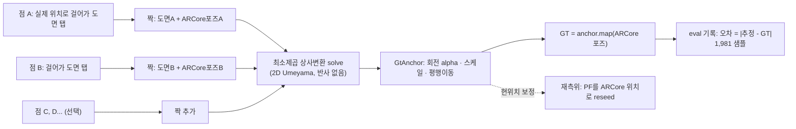
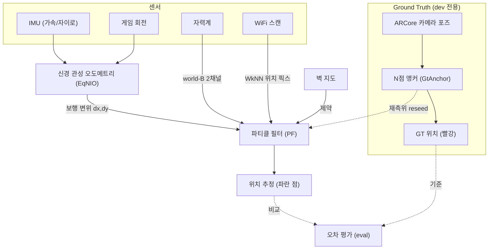

# 실내측위 정확도 측정 결과서

**세션:** `eval-seed-WML-1781771206524.jsonl` · 2026-06-18 17:26
**장비:** Samsung Galaxy S22 (SM-S901N) · **앱:** indoorpos-android (`plan-6-bluedot`)
**구성:** 시드 모드 · 보정 = WiFi + 자기 + 벽(WML) · 1,981 샘플 · 63.6초
**기준(GT):** N점 ARCore 앵커 (PF heading 무관 독립 GT) — 본 측정의 신뢰성 핵심

---

## 1. 요약 (Executive Summary)

본 세션은 **신뢰 가능한 독립 GT(ARCore N점 앵커)**로 측정한 **첫 정확도 결과**다. 핵심 파이프라인 3요소(N점 앵커 / 재측위 / 정량 평가)가 모두 정상 동작했다.

| 지표 (재측위 후) | 값 | 판정 (KPI ±2.5m) |
|---|---|---|
| **중앙값(median)** | **0.92 m** | ✅ 통과 (목표의 1/3) |
| p90 | 3.52 m | ❌ 초과 |
| p95 | 3.96 m | ❌ 초과 |
| 최악(max) | 4.37 m | ❌ 초과 |
| 평균(mean) | 1.35 m | — |

> **한 줄 결론:** *대부분의 시간(절반 이상)은 1m 이내로 정확하나, 가끔(상위 10%) 3.5–4.4m까지 벌어지는 **꼬리 오차**가 존재한다. 꼬리의 주성분은 의외로 **횡(좌우)이 아니라 종(앞뒤·진행방향) 오차**이며, 이는 보행거리(보폭) 추정 드리프트를 시사한다.*

⚠️ **전제:** 이 수치는 **ARCore로 정확히 재측위(t=3.1s)한 직후**의 드리프트다. ARCore는 **dev 전용**(출하 SDK는 카메라 없음)이므로, 이는 *"정확한 출발점에서 1분 보행 시 카메라 없는 PF의 순수 드리프트"* 를 뜻하지 제품 측위 성능 그 자체는 아니다.

---

## 2. 측정 방법론 (Methodology)

기존 GT는 첫 ARCore 포즈에서 PF 추정 heading에 핀을 박아 세션마다 회전 오차가 생겼다(서베이 FP가 실제 동선과 어긋난 근본 원인). 이를 **N점 상사변환 앵커**로 대체했다 — 알려진 도면 점 여러 개에 **실제로 걸어가** 탭하고, 그 순간 ARCore 포즈와 짝지어 회전·스케일·평행이동을 최소제곱으로 푼다. PF heading과 완전히 무관한 독립 기준이다.

**품질 게이트(현장 검증으로 추가):** 점 사이를 실제로 걷지 않으면(ARCore 이동 < 1m) 점을 거부하고, `scale`(=실제PPM/87.3)이 1.0에서 크게 벗어나면 경고한다. 본 세션은 `scale ≈ 1.0`, GT 궤적 step 중앙값 0.018m·점프 0회로 **앵커가 깨끗하게 잡혔음**이 확인된다.

---

## 3. 시스템 구조 (System Structure)

출하 측위(=검증 대상)는 **카메라 없이** 센서(IMU/자기/WiFi/벽)만으로 동작한다. ARCore는 **측정용 기준(GT)과 재측위 시작점**으로만 쓰인다.

---

## 4. 측정 환경 (Setup)

- **도면:** Private Office, 1,280×1,920 px @ 87.3 px/m ⇒ 약 **14.7 m × 22.0 m** (48×72 ft)
- **경로:** 중앙 복도 **왕복** (시작=하단, 끝=상단)
- **재측위:** t=3.1s 1회 — 추정 점프 4.15m 후 오차 **4.15 m → 0.03 m** (사실상 완벽 정렬)

> 빨강(GT)은 복도를 따라 매끄럽게 왕복한다 — 앵커가 정상임을 보여준다. 파랑(추정)은 대체로 같은 복도를 따르나 양 끝에서 진행방향으로 오버슈트하고, 일부 구간에서 옆으로 벗어난다. 검은 원 = 재측위 지점.

---

## 5. 결과 (Results)

### 5.1 오차 시계열

재측위(초록 점선) 직후 ~0.25m로 안정화되어 대부분 0.5–1.5m를 유지하다, **t≈45s에 일시적으로 3.6m까지 스파이크** 후 회복한다. 꾸준한 발산이 아니라 **간헐적 꼬리**가 특징이다.

### 5.2 오차 분포 (CDF · 히스토그램)

| | |
|---|---|
|  |  |

CDF에서 **중앙값(50%) 0.92m, p90 3.5m**를 읽을 수 있다. 분포는 1m 부근에 집중되고 3–4m에 얇은 꼬리가 붙는 형태다.

### 5.3 핵심 분석 — 횡(lateral) vs 종(along-track) 오차 분해

각 시점의 오차 벡터를 **GT 진행방향 기준**으로 분해했다(종=앞뒤, 횡=좌우; 충분히 움직인 1,288 샘플).

|  |  |
|---|---|

| 성분 | 중앙값 | p90 | 최악 |
|---|---|---|---|
| **종(along, 앞뒤)** | **1.00 m** | **3.54 m** | 4.13 m |
| 횡(cross, 좌우) | 0.55 m | 1.96 m | 2.69 m |

> **발견:** 시각적으로는 "옆으로 새는" 인상이었지만, 정량 분해 결과 **종(진행방향) 오차가 횡보다 ~2배 크다.** 즉 추정이 *좌우*보다 *앞뒤(복도 따라 얼마나 갔나)*에서 더 틀린다. 이는 **보행거리(보폭) 추정 드리프트** — 신경 오도메트리의 거리 스케일이 약간 어긋나 진행방향으로 누적되는 현상으로 해석된다.

### 5.4 보정의 기여 (보정 vs DR-only)

| 지표 | 보정(WML) | DR-only(관성만) |
|---|---|---|
| 중앙값 | **1.00 m** | 1.12 m |
| 최악 | **4.37 m** | **11.25 m** |

> **발견:** 중앙값은 보정이 약간 나을 뿐(1.00 vs 1.12)이지만, **최악값은 보정이 압도적으로 좋다(4.4m vs 11.3m).** 즉 자기/WiFi 보정은 *평소엔 거의 일을 안 하지만, 큰 드리프트(꼬리)를 잡아주는 안전망* 역할을 한다. → 보정의 평상시 기여를 키우면(맵 밀도·정렬 개선) 중앙값과 꼬리 모두 추가 개선 여지가 크다.

---

## 6. 종합 분석

1. **파이프라인 검증 완료** — N점 앵커(깨끗한 GT) → 재측위(오차 0.03m 스냅) → 정량 eval이 모두 정상.
2. **정확도:** 신뢰 GT 기준 **중앙값 0.92m**(KPI ±2.5m 대비 우수), 단 **p90 3.5·max 4.4m 꼬리**가 KPI 초과.
3. **꼬리의 주성분 = 종(앞뒤) 오차** → 보폭/오도메트리 거리 스케일 문제로 추정(횡 아님).
4. **보정은 꼬리 안전망** → 평상시 기여 작음, 큰 드리프트 억제엔 큰 기여(11.3→4.4m). 맵 강화 시 평상시 기여 확대 여지.

---

## 7. 한계 (Limitations)

- **단일 세션 · 63.6초** — 통계적 일반화엔 더 많은 세션·경로 필요.
- **"정확한 출발점" 조건** — ARCore 재측위 직후의 드리프트. 출하 콜드스타트(무시드)는 초기 수렴 오차가 추가됨.
- **GT 자체도 ARCore 기반** — ARCore도 미세 드리프트가 있어 GT가 절대 진실은 아님(단 본 세션은 궤적이 매끄러워 단기 신뢰 가능).
- **ARCore dev 전용** — 본 결과는 제품(카메라 없음) 측위가 아니라 *카메라 없는 PF의 순수 실력*을 좋은 조건에서 측정한 것.

---

## 8. 다음 단계 (Next Steps)

1. **통합 재서베이** — 신뢰 GT로 자기+WiFi+BLE 맵을 더 촘촘히 재구성 → 보정의 평상시 기여 확대.
2. **종(보폭) 드리프트 대응** — 신경 오도메트리 거리 스케일 점검/보정.
3. **다중 세션·경로** — 통계 신뢰도 확보, 콜드스타트 조건 포함 측정.
4. **꼬리 추적** — t≈45s 스파이크 구간의 센서/보정 로그 분해.

---

*생성: Claude Code · 차트는 `assets/`(matplotlib), 구조도는 mermaid. 원천 데이터: `eval-seed-WML-1781771206524.jsonl` (S22, 2026-06-18).*
