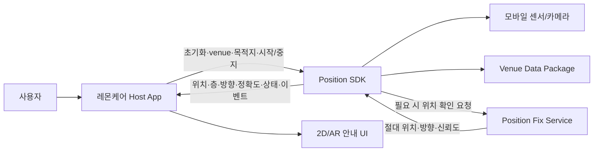
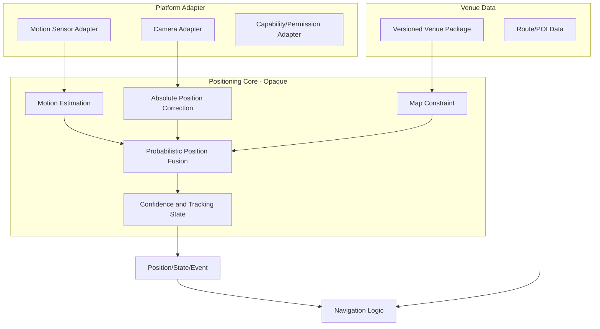
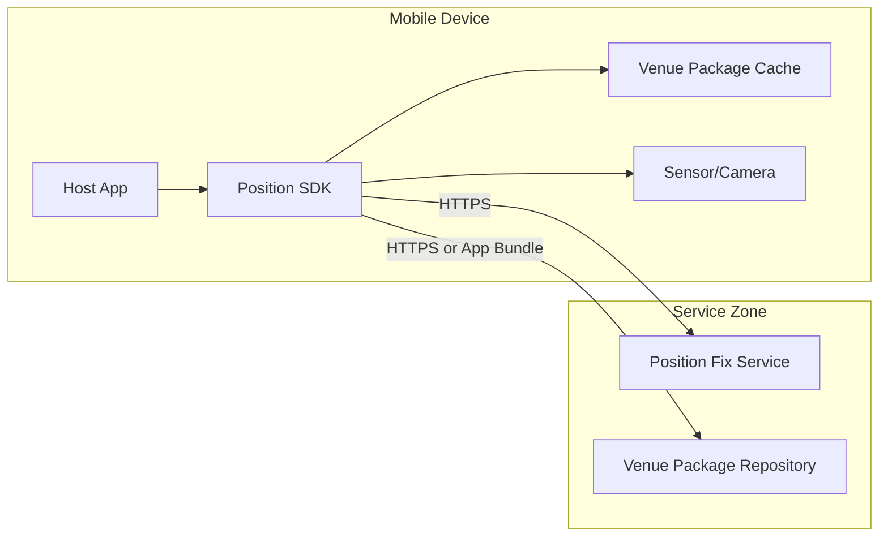

# 측위엔진 구조 설계서

> 문서 등급: CONFIDENTIAL - Integration Partner Use Only
>
> 문서 버전: v0.1-draft
>
> 기준일: 2026-07-13

## 1. 목적

본 문서는 Position SDK의 시스템 경계, 주요 기능 블록, 런타임 상태 및 플랫폼 배치를 설명한다. 호스트 앱이 측위엔진의 동작과 책임 범위를 이해하는 것이 목적이며, 모델 구조, 학습 데이터, 내부 융합 수식, 임계값 및 맵 구축 알고리즘은 범위에서 제외한다.

연동에 필요한 공개 API는 `02-sdk-integration-design.md`, 데이터 형식과 흐름은 `03-data-flow-interface-spec.md`에서 정의한다.

## 2. 상태 표기

| 표기 | 의미 |
|---|---|
| Current PoC | 현재 저장소에서 검증 또는 사용 중인 구조 |
| Integration Target | 제품 SDK 통합 목표 |
| Planned | 목표에는 포함되나 구현·검증이 남은 항목 |
| Decision Required | 참여 조직 간 결정이 필요한 항목 |

## 3. 시스템 범위

### 3.1 포함 범위

- 모바일 센서 기반 연속 위치 추정
- 카메라 기반 초기 위치 확인 및 재획득
- 병원별 공간 데이터 적용
- 위치·층·방향·정확도·추적 상태 제공
- 경로 계산에 필요한 현재 위치 제공
- 추적 신뢰도 저하 및 재확인 필요 상태 제공

### 3.2 제외 범위

- 병원 예약·진료·로그인 업무 흐름
- 최종 화면 디자인과 브랜딩
- 병원 POI 원천정보의 생성·승인
- AI 챗봇
- 호스트 앱의 push notification 정책

## 4. 시스템 컨텍스트

### 4.1 책임 경계

| 구성요소 | 책임 |
|---|---|
| LemonCare Host App | 사용자 진입 흐름, 권한 설명, 목적지 전달, 화면 표시, 앱 lifecycle |
| Position SDK | 센서 수집, 위치 추정, 추적 상태 관리, 공간 데이터 적용, 결과 제공 |
| Position Fix Service | 카메라 기반 초기 위치 확인 및 재획득 결과 제공 |
| Venue Data Package | 병원·건물·층별 런타임 공간 데이터 제공 |
| UI Layer | 2D/AR 화면, 브랜딩, 접근성, 오류·폴백 안내 |

## 5. 논리 아키텍처

### 5.1 기능 블록

| 블록 | 입력 | 출력 | 외부 노출 여부 |
|---|---|---|---|
| Platform Adapter | OS 센서·카메라·권한 상태 | 플랫폼 중립 센서 데이터 | 비노출 |
| Motion Estimation | 모션 센서 스트림 | 상대 이동량 | 비노출 |
| Absolute Position Correction | 카메라 또는 보조 위치 신호 | 절대 위치·방향·신뢰도 | 비노출 |
| Position Fusion | 상대 이동·절대 위치·공간 제약 | 연속 위치 추정 | 비노출 |
| Map Constraint | venue 공간 데이터 | 이동 가능 영역 제약 | 비노출 |
| Confidence Manager | 위치 분포·보정 상태 | 추적 상태·정확도 | 상태만 노출 |
| Navigation Logic | 현재 위치·경로·목적지 | 잔여 경로·도착·이탈 이벤트 | 공개 계약만 노출 |

내부 블록의 구현체, 모델, 파라미터와 교체 전략은 SDK 내부 사항이다. 호스트 앱은 공개 SDK Facade만 사용한다.

## 6. 런타임 동작

### 6.1 기본 흐름

1. 호스트 앱이 `venueId`와 선택적 목적지를 전달한다.
2. SDK가 단말 capability와 venue 데이터 준비 상태를 확인한다.
3. 필요한 경우 카메라 기반 현재 위치 확인을 수행한다.
4. 초기 위치가 확보되면 센서 기반 연속 추적을 시작한다.
5. SDK는 위치와 추적 상태를 지속적으로 제공한다.
6. 신뢰도가 낮아지면 HOLD 또는 RE_ACQUIRE 상태를 제공한다.
7. 위치 재확인이 성공하면 연속 추적으로 복귀한다.
8. 호스트 앱 종료, 사용자 취소 또는 목적지 도착 후 세션을 중지한다.

### 6.2 추적 상태

| 상태 | 의미 | 호스트 앱 권장 동작 |
|---|---|---|
| COLD_START | 초기 절대 위치가 확보되지 않음 | 위치 확인 UI 표시 |
| ALIGNING | 위치는 있으나 방향·추적이 안정화 중 | 이동 안내를 제한하고 대기/보행 안내 |
| TRACKING | 정상 추적 | 위치 및 경로 안내 |
| HOLD | 위치는 있으나 안내 신뢰도가 부족 | 블루닷 고정 또는 안내 일시 중지 |
| RE_ACQUIRE | 위치 재확인이 필요 | 카메라 재확인 또는 폴백 안내 |

제품 SDK에는 session 준비·종료·오류를 표현하는 상위 상태가 추가될 수 있다. 코어 상태와 공개 session 상태의 최종 매핑은 API v0.1 확정 시 고정한다.

## 7. 현재 구조와 제품 목표

| 영역 | Current PoC | Integration Target |
|---|---|---|
| 공통 코어 | KMP 공통 모듈에 측위·경로 핵심 로직 존재 | 공개 Facade 뒤로 내부 구현 캡슐화 |
| Android | 센서·추론 adapter와 PoC host 연결 | Maven artifact만으로 호스트 통합 |
| iOS | KMP framework + Swift PoC host에서 센서/VPS 연결 | XCFramework/SPM 내부 adapter로 캡슐화 |
| 위치 확인 | 개발용 server-assisted 방식 | 인증·TLS가 적용된 운영 서비스 또는 승인된 배치 |
| venue 데이터 | 앱 리소스에 병원별 파생파일 동봉 | 버전·무결성·호환성이 있는 opaque Venue Package |
| UI | 플랫폼별 PoC/참조 화면 | 레몬 최종 UI 또는 별도 선택 UI module |

## 8. 플랫폼 배치

### 8.1 공통 영역

- 위치 추정 상태 관리
- 위치 융합과 공간 제약
- 위치 결과 모델
- 경로·도착·이탈 판단
- venue 데이터의 플랫폼 중립 표현

### 8.2 플랫폼 영역

- Android 센서와 lifecycle 연결
- iOS CoreMotion과 lifecycle 연결
- 카메라 프레임 획득
- 단말 capability 확인
- 플랫폼 추론 runtime
- 권한 상태 확인

플랫폼 구현은 동일한 공개 SDK 계약을 충족해야 하며, 호스트 앱이 엔진 내부 플랫폼 차이를 처리하지 않도록 한다.

## 9. 배포 경계

PoC에서는 venue 데이터를 앱에 동봉하고 개발용 위치 확인 서비스를 사용한다. 운영 배치는 서비스 보안·네트워크·오프라인 요구사항 확정 후 결정한다.

## 10. 품질·안전 원칙

- 위치가 확보되지 않은 상태에서 임의 위치를 정상 위치로 표시하지 않는다.
- 위치 정확도와 추적 상태를 호스트 앱에 제공한다.
- 낮은 신뢰도에서는 안내를 유지하는 대신 HOLD 또는 재확인 상태로 전환한다.
- 다른 venue의 공간 데이터를 대체 적용하지 않는다.
- 카메라는 초기 위치 확인 또는 AR 안내에 필요한 시점에만 사용한다.
- SDK 중지 시 센서·카메라·비동기 작업을 해제한다.
- 운영 네트워크 실패 시 앱이 선택한 폴백 정책을 적용할 수 있도록 오류를 제공한다.

## 11. 보안·노하우 보호 경계

외부 SDK 계약에는 다음을 제공한다.

- 기능 블록과 책임
- 공개 입력·출력
- 상태와 오류 의미
- 좌표·시간·권한 계약
- 데이터 전송 및 보관 정책

다음 항목은 SDK 내부 정보로 관리한다.

- 모델 구조와 가중치
- 센서 전처리와 내부 feature
- 위치 융합 수식과 튜닝값
- 신뢰도 및 재획득 임계값
- 맵 생성·정합·검색 알고리즘
- 원본 survey와 학습 데이터
- 성능 개선 실험과 후보 비교

## 12. 제한 및 결정 필요사항

| 항목 | 상태 |
|---|---|
| 제품 SDK Facade API | Decision Required |
| iOS platform adapter의 SDK 내부 이관 | Planned |
| Maven/SPM 배포 파이프라인 | Planned |
| Venue Package schema와 배포 방식 | Decision Required |
| 운영 Position Fix Service | Decision Required |
| UI module 제공 범위 | Decision Required |
| 공식 단말 tier와 폴백 | Decision Required |
| 제품용 motion estimation backend | 검증 진행 중 |

본 문서는 위 결정에 따라 v0.2에서 갱신한다.
