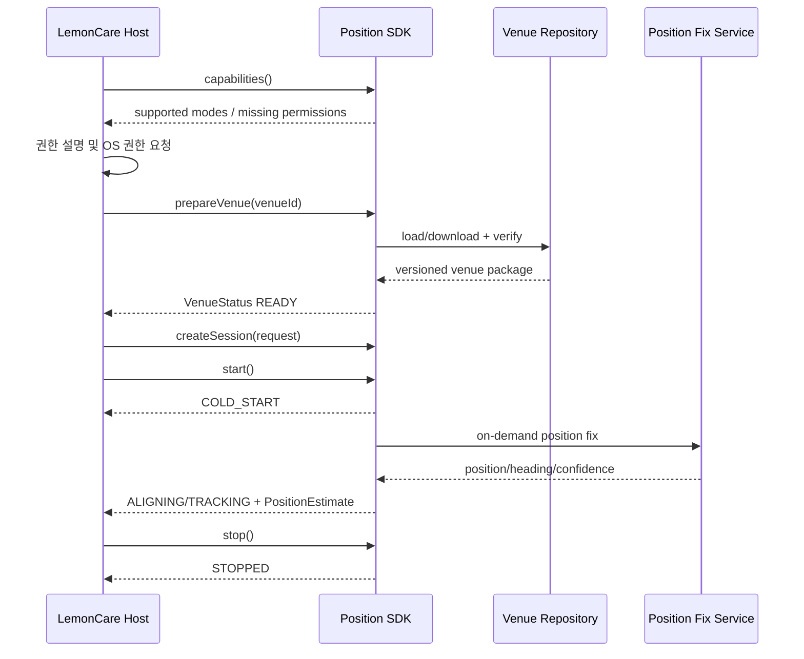

# SDK 구성·연동 설계서

> 문서 등급: CONFIDENTIAL - Integration Partner Use Only
>
> 문서 버전: v0.1-draft
>
> 기준일: 2026-07-13

## 1. 목적

본 문서는 Position SDK의 제공 형태, 호스트 앱 책임, 초기화·실행·종료 lifecycle, 공개 API 초안, 권한, 단말 폴백 및 플랫폼별 연동 요구사항을 정의한다.

본 문서의 API는 제품 Facade v0.1 초안이다. 현재 PoC API와 다른 부분은 `Integration Target`으로 표시하며, 코드와 문서가 함께 확정되기 전까지 호환성 확약으로 사용하지 않는다.

공개 타입, 호출 규칙과 플랫폼별 연동 예시는 `06-sdk-api-spec-draft.md`에서 상세히 관리한다. 본 문서의 API 코드 블록은 SDK 구성과 책임을 설명하기 위한 상위 설계로 사용한다.

## 2. 통합 전제

| 항목 | 레몬 앱 환경 | SDK 현재 상태 | 통합 목표 |
|---|---|---|---|
| 공통 코드 | Kotlin Multiplatform | KMP 공통 코어 존재 | KMP 공개 Facade 제공 |
| Android | minSdk 24, compileSdk 36 목표 | core minSdk 24, PoC 앱 minSdk 26 | API 24 이상 검증 |
| iOS | iOS 15.6 이상 | PoC 앱 iOS 16.0 | iOS 15.6 이상 검증 |
| Android 배포 | Maven/JitPack 검토 | local release AAR 생성 가능 | Maven versioned artifact |
| iOS 배포 | SPM | local KMP static framework | binary XCFramework + SPM |
| UI | Compose Multiplatform | Android Compose/iOS SwiftUI PoC | 레몬 UI 또는 선택 UI module |

## 3. SDK 산출물

### 3.1 목표 산출물

| 산출물 | 형식 | 상태 |
|---|---|---|
| Android SDK | Maven artifact/AAR | Planned |
| iOS SDK | XCFramework + SPM binary target | Planned |
| KMP 공개 API | Kotlin common API + Swift export | Draft |
| Venue Package | 별도 versioned data artifact | Draft |
| 샘플 앱 | Android/iOS 또는 최소 통합 샘플 | PoC 존재, 제품 샘플 Planned |
| API 문서 | 본 문서 + 생성된 API reference | Draft |
| Release notes/NOTICE | 버전별 문서 | Planned |

### 3.2 artifact 식별자 초안

아래 이름은 최종 배포 저장소 확정 전 가안이다.

```text
Android group:    com.rapa.indoorpos
Android artifact: positioning-sdk
iOS product:      PositioningSDK
Version:          SemVer
```

현재 내부 framework 이름과 위 제품 이름의 매핑은 배포 파이프라인 구성 시 확정한다.

## 4. 책임 분담

| 영역 | Position SDK | LemonCare Host App |
|---|---|---|
| 센서·카메라 사용 | lifecycle에 맞춰 시작·중지 | 권한 요청 및 화면 설명 |
| 위치 추정 | 수행 | 결과 소비 |
| venue 데이터 | 검증·로드·호환성 판정 | `venueId` 선택, 필요 시 다운로드 시작 |
| 경로/이벤트 | 계약된 범위 제공 | 최종 화면과 업무 흐름 반영 |
| AR/2D 선택 | capability 제공 | 사용자 화면 및 폴백 선택 |
| 오류 | typed error/state 제공 | 사용자 안내·재시도·설정 이동 |
| 예약·진료 연계 | 미포함 | 소유 |
| 로그·개인정보 동의 | SDK 처리 범위 명시 | 앱 전체 정책과 사용자 동의 |

## 5. 공개 API 원칙

- 호스트 앱은 `PositioningEngine`과 내부 구성요소를 직접 생성하지 않는다.
- 공개 진입점은 SDK Facade와 Session으로 제한한다.
- 내부 모델·맵 레이어·튜닝 파라미터는 공개 설정에 포함하지 않는다.
- 플랫폼별 구현 차이를 동일한 공통 상태·오류 모델로 변환한다.
- API 변경은 SemVer에 따라 관리한다.

## 6. 공개 API v0.1 초안

### 6.1 기본 타입

```kotlin
enum class NavigationMode {
    AUTO,
    MAP_2D,
    AR
}

data class NavigationRequest(
    val venueId: String,
    val destinationId: String? = null,
    val floorId: String? = null,
    val preferredMode: NavigationMode = NavigationMode.AUTO,
)

enum class VenueDataState {
    NOT_AVAILABLE,
    DOWNLOADING,
    VERIFYING,
    READY,
    INCOMPATIBLE,
    CORRUPTED
}

data class VenueStatus(
    val venueId: String,
    val state: VenueDataState,
    val bundleVersion: String?,
    val progress: Float?,
)
```

### 6.2 위치 결과

```kotlin
data class PositionEstimate(
    val venueId: String,
    val floorId: String?,
    val xM: Double,
    val yM: Double,
    val headingRad: Double,
    val accuracyM: Double,
    val timestampNs: Long,
    val state: PositioningState,
)
```

현재 코어 결과에는 `x`, `y`, `thetaRad`, `sigmaM`, `tNs`, `phase`가 존재한다. `venueId`와 `floorId` 결합, 제품 필드명 변환 및 `phase`의 공개 상태 매핑은 Facade에서 수행한다.

### 6.3 Session 상태

```kotlin
enum class PositioningState {
    IDLE,
    PREPARING,
    COLD_START,
    ALIGNING,
    TRACKING,
    HOLD,
    RE_ACQUIRE,
    STOPPED,
    ERROR
}
```

### 6.4 이벤트와 오류

```kotlin
sealed interface PositioningEvent {
    data object RelocalizationRequired : PositioningEvent
    data class FloorChanged(val floorId: String) : PositioningEvent
    data object RouteDeviated : PositioningEvent
    data object DestinationArrived : PositioningEvent
}

enum class PositioningErrorCode {
    PERMISSION_REQUIRED,
    UNSUPPORTED_DEVICE,
    VENUE_DATA_NOT_FOUND,
    VENUE_DATA_INCOMPATIBLE,
    NETWORK_UNAVAILABLE,
    POSITION_FIX_FAILED,
    SESSION_ALREADY_RUNNING,
    SESSION_NOT_RUNNING,
    INTERNAL_ERROR
}
```

이 이벤트·오류 모델은 Integration Target이며 현재 코드에는 문자열 오류와 일부 상태만 존재한다.

### 6.5 Facade와 Session

```kotlin
interface PositioningSdk {
    fun capabilities(): DeviceCapabilities
    suspend fun prepareVenue(venueId: String): VenueStatus
    fun createSession(request: NavigationRequest): PositioningSession
}

interface PositioningSession {
    val positions: Flow<PositionEstimate>
    val states: StateFlow<PositioningState>
    val events: Flow<PositioningEvent>
    val errors: Flow<PositioningError>

    fun start()
    fun stop()
}
```

현재 공개 API는 위치 Flow와 `start/stop/seed` 수준이다. 위 API로 전환할 때 기존 PoC 호스트의 센서·VPS·venue 배선을 SDK 내부로 이동한다.

## 7. 초기화 및 실행 lifecycle



### 7.1 호출 규칙 초안

- `prepareVenue`는 세션 시작 전에 호출한다.
- 동일 venue가 준비되어 있으면 검증 후 캐시를 재사용한다.
- 한 Session 인스턴스의 `start`는 한 번만 허용한다.
- 중복 `start`는 `SESSION_ALREADY_RUNNING`으로 반환한다.
- `stop`은 센서, 카메라, 네트워크 요청 및 내부 작업을 해제한다.
- 앱 background 정책은 제품 요구사항 확정 전까지 `stop 또는 suspend` 중 결정이 필요하다.

## 8. AR 안내 진입 계약

### 8.1 호스트 입력

| 파라미터 | 필수 | 설명 |
|---|---|---|
| `venueId` | Y | 병원·건물·층 데이터 선택 키 |
| `destinationId` | N | 병원 POI 또는 목적지 키 |
| `floorId` | N | 시작층을 알고 있을 때 전달 |
| `preferredMode` | N | AUTO/2D/AR 선호 모드 |

인증 토큰, locale, 접근성 옵션을 SDK 요청에 직접 넣을지는 호스트 공통 인프라 검토 후 확정한다.

### 8.2 SDK 출력

- 위치·층·방향·정확도
- 현재 session 상태
- 재확인 필요 이벤트
- 경로 이탈·층 변경·도착 이벤트
- 권한·단말·venue·네트워크 오류

### 8.3 종료와 복귀

SDK는 호스트 navigation stack을 직접 제어하지 않는다. 사용자가 취소하거나 도착 이벤트가 발생하면 호스트 앱이 Session을 중지하고 레몬 업무 화면으로 복귀한다.

## 9. 권한 계약

### 9.1 원칙

OS 권한 팝업과 사전 설명 UI는 LemonCare Host App이 소유한다. SDK는 필요한 권한과 현재 capability를 반환하며 권한이 없을 때 typed error를 제공한다.

### 9.2 권한별 사용

| 권한 | 요청 시점 | 필수 여부 | 거부 시 동작 |
|---|---|---|---|
| Motion | 측위 시작 전 | 연속 측위에 필수 | 실시간 측위 제한 |
| Camera | 초기 위치 확인 또는 AR 진입 | 모드에 따라 필수 | 2D/정적 안내 또는 기능 제한 |
| Location | BLE/Wi-Fi 등 실제 사용 시 | 구성에 따라 선택 | 해당 보조 기능 비활성화 |
| Bluetooth | BLE 기능 사용 시 | 구성에 따라 선택 | BLE 보조 기능 비활성화 |
| Push | SDK 범위 아님 | N | 레몬 앱 정책 적용 |

권한의 정확한 OS별 목록은 실제 활성 기능과 단말 tier 확정 후 release별 manifest에 고정한다.

## 10. 단말 capability와 폴백

| Tier | 조건 | SDK 기능 | 호스트 UI |
|---|---|---|---|
| A | 지원 OS + motion + camera + AR 가능 | 위치 확인·연속 측위·2D·AR | AR 또는 2D |
| B | 지원 OS + motion + camera, AR 제한 | 위치 확인·연속 측위·2D | 2D |
| C | 실시간 측위 요구조건 일부 미충족 | 제한 또는 정적 데이터 | 정적 도면·텍스트 안내 |
| Unsupported | 최소 OS/필수 센서 미충족 | 세션 시작 불가 | 지원 불가 안내 |

Tier 조건과 공식 단말 목록은 호환성 시험 후 확정한다.

## 11. Threading 및 Flow 계약

### 11.1 SDK 내부

- 센서 입력과 엔진 상태 변경은 SDK가 단일 직렬 실행 컨텍스트에서 처리한다.
- 호스트 앱은 센서 callback을 직접 엔진에 전달하지 않는다.
- SDK는 플랫폼 callback thread 차이를 내부에서 정규화한다.

### 11.2 호스트 출력

- `positions`는 실시간 스트림이며 현재 엔진 기준 약 20Hz이다.
- 호스트는 고정 주기를 전제로 하지 않고 Flow를 수집한다.
- UI 갱신은 호스트가 main/UI dispatcher로 전환한다.
- 느린 consumer가 엔진 입력 처리를 막지 않도록 최신 위치 우선 정책을 사용한다.
- 상태·오류 이벤트의 버퍼·replay 정책은 API 구현 시 테스트로 고정한다.

## 12. Android 연동

### 12.1 목표 설치

```kotlin
dependencies {
    implementation("com.rapa.indoorpos:positioning-sdk:<version>")
}
```

Maven repository 주소와 인증은 배포 환경 결정 후 제공한다.

### 12.2 앱 설정

- minSdk 24 이상 목표
- Java/JVM 17 호환 검토
- 필요한 센서·카메라 permission 선언
- AR 기능은 optional로 선언 가능
- 네트워크 사용 시 INTERNET permission
- SDK dependency와 호스트 Kotlin/coroutines/serialization 버전 호환 검증

현재 개발 조합은 레몬 목표 버전보다 낮으므로 Kotlin 2.3.x/AGP 9.x 조합 검증이 필요하다.

## 13. iOS 연동

### 13.1 목표 설치

```swift
dependencies: [
    .package(url: "<approved-package-url>", from: "<version>")
]
```

SPM package는 versioned XCFramework와 checksum을 제공해야 한다.

### 13.2 앱 설정

- iOS 15.6 이상 목표
- Camera/Motion 사용 설명 문구
- Bluetooth/Location 사용 시 해당 설명 문구
- 네트워크 보안 정책과 허용 domain
- device 및 simulator architecture 지원
- static/dynamic linkage 최종 확정

현재 PoC는 iOS 16.0, CocoaPods ONNX runtime, 로컬 KMP framework를 사용하므로 제품 배포 방식으로 전환이 필요하다.

## 14. Venue Package 연동

- 호스트는 내부 map layer 파일을 직접 파싱하지 않는다.
- SDK는 `venueId`로 package를 준비하고 호환성을 검사한다.
- package가 없거나 손상되면 세션을 시작하지 않고 오류를 반환한다.
- PoC에서는 앱에 동봉할 수 있다.
- 운영에서는 앱 동봉 또는 SDK 다운로드 중 하나를 결정한다.
- SDK 버전과 package schema 호환성을 manifest로 확인한다.

세부 데이터 계약은 `03-data-flow-interface-spec.md`에서 정의한다.

## 15. 버전·호환성 정책 초안

- SDK는 SemVer를 사용한다.
- 공개 API breaking change는 major version에서만 허용한다.
- Venue Package는 `schemaVersion`과 `minSdkVersion`을 가진다.
- SDK와 데이터 package는 독립 배포한다.
- release별 지원 OS, 의존성, 알려진 제한을 release notes에 기록한다.
- 최소 1개 이전 minor 버전의 데이터 호환 여부를 release 전에 검사한다.

## 16. 통합 acceptance 항목

1. Android/iOS에서 artifact 설치 성공
2. 권한 허용·거부·영구거부 흐름 확인
3. venue 준비 성공·실패·버전 불일치 확인
4. 세션 시작·중지·재시작 확인
5. 위치·상태·이벤트 Flow 수신
6. background/foreground 전환 확인
7. AR 가능·불가능 단말 폴백 확인
8. 네트워크 단절과 위치 확인 실패 처리
9. 다른 venue 데이터의 오적용 방지
10. 목적지 도착 후 레몬 화면 복귀

## 17. 미결정 사항

- 최종 artifact 이름과 repository
- UI module 제공 여부
- navigation을 SDK 필수 범위로 포함할지 여부
- 인증 토큰 주입 방식
- venue package 동봉/다운로드 정책
- background tracking 정책
- 공식 capability tier와 단말 목록
- Flow/Swift callback의 최종 노출 형태
- 제품 오류 코드와 재시도 정책
- iOS runtime dependency 배포 방식
