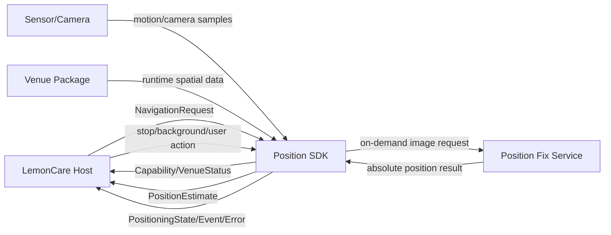
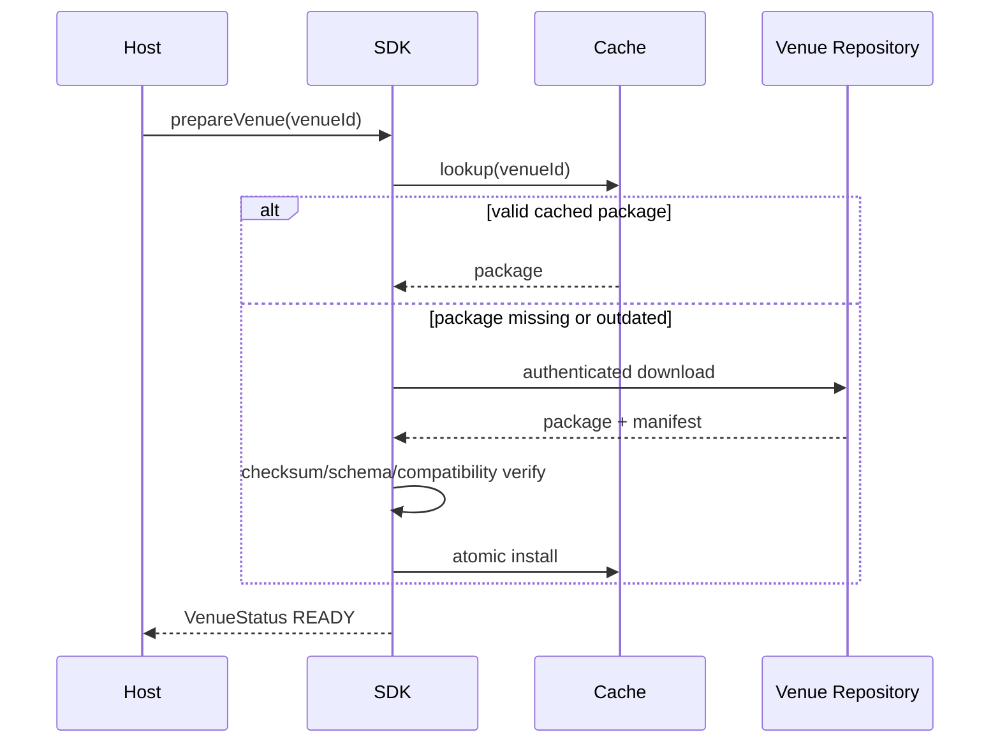
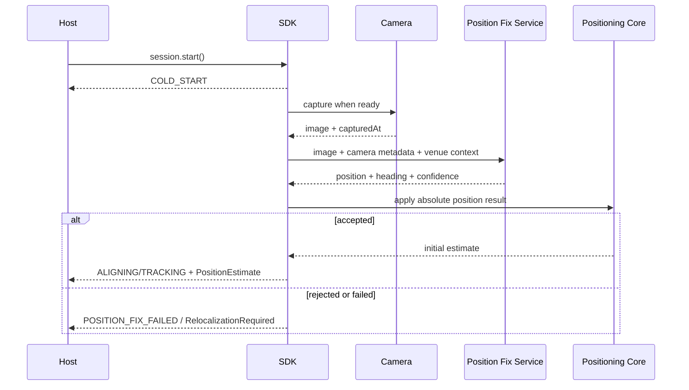
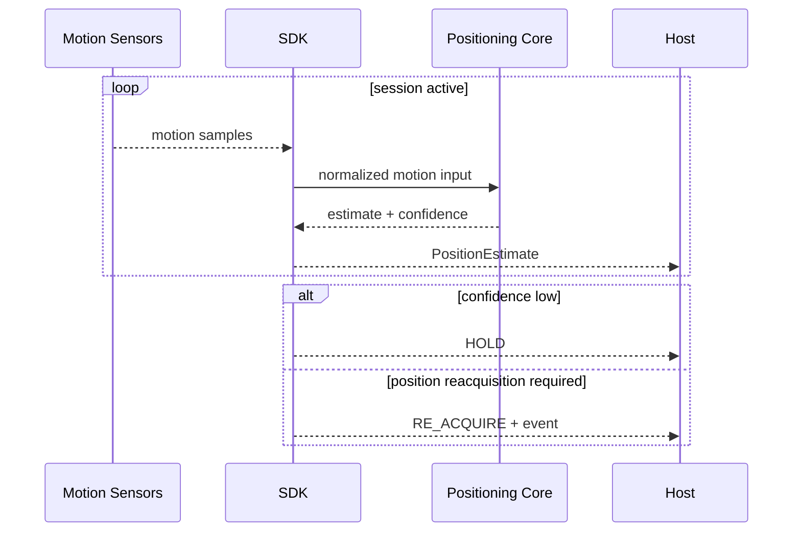
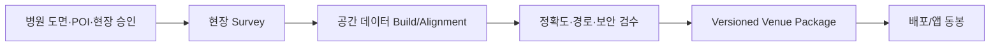

# 데이터 흐름·인터페이스 정의서

> 문서 등급: CONFIDENTIAL - Integration Partner Use Only
>
> 문서 버전: v0.1-draft
>
> 기준일: 2026-07-13

## 1. 목적

본 문서는 LemonCare Host App, Position SDK, 모바일 센서, Position Fix Service 및 Venue Package 사이의 데이터 흐름과 공개 인터페이스 의미를 정의한다.

측위 모델 구조, 내부 feature, 융합 수식, 원본 survey, map build 중간 산출물은 본 문서 범위에서 제외한다.

## 2. 상태와 적용 범위

| 영역 | Current PoC | Integration Target |
|---|---|---|
| 위치 출력 | x/y/heading/accuracy/timestamp/phase | venue/floor가 결합된 공개 결과 |
| 상태·오류 | 코어 phase + 문자열 오류 일부 | typed session state/event/error |
| VPS 통신 | 개발용 JPEG HTTP POST | 인증된 HTTPS SDK 내부 통신 |
| venue 데이터 | 앱 리소스별 JSON/이미지 | opaque versioned Venue Package |
| 데이터 schema | 코드별 parser | 버전된 공개 schema |

본 문서의 target schema는 API v0.1 구현과 함께 고정한다.

## 3. 데이터 주체

| 주체 | 생성 데이터 | 소비 데이터 |
|---|---|---|
| LemonCare Host App | venue·목적지·모드·사용자 명령 | 위치·상태·이벤트·오류 |
| Position SDK | 위치 추정·상태·capability·진단 | 호스트 요청·센서·venue 데이터·절대 위치 결과 |
| Mobile OS | 모션·카메라·권한·lifecycle | SDK 센서 요청 |
| Position Fix Service | 절대 위치·방향·신뢰도 | 카메라 이미지·카메라 정보 |
| Venue Repository | versioned Venue Package | venue 식별자와 인증 정보 |
| Hospital/Lemon Data Owner | 도면·POI·승인정보 | 검수 결과와 갱신 요청 |

## 4. 전체 데이터 흐름



## 5. 좌표 계약

### 5.1 공개 2D venue 좌표

- 단위: meter
- 좌표: venue-local `(x, y)`
- 원점과 축 방향: Venue Package metadata가 정의
- SDK가 반환한 위치·경로·POI는 동일 venue 좌표계를 사용
- 서로 다른 venue 또는 floor의 좌표를 직접 비교하지 않음

### 5.2 heading

```text
headingRad = atan2(directionY, directionX)
```

- 단위: radian
- 범위: `[-pi, pi)` 권장
- `0`: venue `+X` 방향
- 양의 회전: venue 좌표에서 `+X`에서 `+Y`로 향하는 방향
- 화면의 clockwise/counter-clockwise 표시는 도면 좌표 변환 후 UI가 처리

이 정의는 세계 북쪽이나 자북을 의미하지 않는다. 필요 시 Venue Package에 별도 지리 정합 metadata를 둔다.

### 5.3 층

- 외부 계약은 문자열 `floorId`를 사용한다.
- 예: `1F`, `3F`, `B1` 또는 합의된 병원 floor key
- 내부 숫자 인덱스와 호스트 floor key의 매핑은 Venue Package가 소유한다.
- `floorId = null`은 층 미확정 상태를 의미한다.

### 5.4 정확도

- `accuracyM`는 위치 불확실성의 SDK 추정값이며 meter 단위다.
- UI는 이를 품질 상태 표시 또는 accuracy radius에 사용할 수 있다.
- 안전·의료 판단용 측정값으로 사용하지 않는다.

## 6. 시간 계약

| 필드 | 의미 |
|---|---|
| `timestampNs` | 단말 부팅 후 monotonic clock 기반 nanosecond |
| `capturedAt` | 카메라 또는 센서가 실제 수집된 시각 |
| `receivedAt` | 네트워크 결과가 SDK에 도착한 시각 |

위치 추정의 `timestampNs`는 Unix epoch 시간이 아니다. 서버 전송·분석을 위해 wall-clock이 필요하면 호스트 또는 SDK telemetry 계층에서 별도 필드로 추가한다.

카메라 기반 위치 결과는 응답 도착 시각이 아니라 원본 촬영 시각을 참조해야 한다. SDK가 촬영 시각과 모션 시각의 clock domain을 일치시킨다.

## 7. 공개 입력 인터페이스

### 7.1 NavigationRequest

| 필드 | 타입 | 필수 | 의미 |
|---|---|---|---|
| `venueId` | String | Y | 활성 병원·건물·공간 키 |
| `destinationId` | String? | N | 목적지 POI 키 |
| `floorId` | String? | N | 알려진 시작층 또는 선택층 |
| `preferredMode` | Enum | N | AUTO/MAP_2D/AR |

검증 규칙:

- `venueId`는 빈 문자열을 허용하지 않는다.
- destination이 지정되면 해당 Venue Package에 존재해야 한다.
- floor가 지정되면 해당 venue에 포함되어야 한다.
- AR 요청이 단말 capability와 맞지 않으면 오류 또는 AUTO 폴백 정책을 적용한다.

### 7.2 Session 명령

| 명령 | 선행조건 | 결과 |
|---|---|---|
| `prepareVenue` | SDK 초기화 | VenueStatus |
| `createSession` | venue 검증 가능 | Session 생성 또는 오류 |
| `start` | venue READY, 권한 충족 | COLD_START로 전환 |
| `stop` | Session 존재 | 센서·카메라·작업 해제, STOPPED |

## 8. 공개 출력 인터페이스

### 8.1 PositionEstimate

| 필드 | 타입 | 단위/범위 | 설명 |
|---|---|---|---|
| `venueId` | String | - | 결과가 속한 venue |
| `floorId` | String? | - | 현재 층, 미확정 시 null |
| `xM` | Double | meter | venue X 위치 |
| `yM` | Double | meter | venue Y 위치 |
| `headingRad` | Double | `[-pi, pi)` | venue 기준 사용자 방향 |
| `accuracyM` | Double | meter, `>= 0` | 위치 불확실성 |
| `timestampNs` | Long | monotonic ns | 추정 기준 시각 |
| `state` | PositioningState | enum | session 및 측위 상태 |

### 8.2 PositioningState

| 상태 | 위치 출력 | 의미 |
|---|---|---|
| IDLE | N | Session 시작 전 |
| PREPARING | N | capability/venue 준비 중 |
| COLD_START | N 또는 제한 | 초기 위치 확인 중 |
| ALIGNING | Y | 위치·방향 안정화 중 |
| TRACKING | Y | 정상 추적 |
| HOLD | 마지막 위치 제한 사용 | 안내 신뢰도가 낮음 |
| RE_ACQUIRE | 제한 | 위치 재확인 필요 |
| STOPPED | N | 정상 종료 |
| ERROR | N 또는 제한 | 복구 불가 오류 |

HOLD에서 마지막 위치를 화면에 유지할지는 UI 정책이다. 호스트는 HOLD 위치를 정상 TRACKING 위치처럼 표시하지 않는다.

### 8.3 이벤트

| 이벤트 | payload | 호스트 권장 동작 |
|---|---|---|
| `RelocalizationRequired` | reason? | 카메라 재확인 또는 폴백 UI |
| `FloorChanged` | floorId | 층 UI와 도면 갱신 |
| `RouteDeviated` | optional distance | 재경로 상태 표시 |
| `DestinationArrived` | destinationId? | Session 종료 또는 업무 화면 복귀 |

### 8.4 오류

| 코드 | 복구 가능 | 설명 |
|---|---|---|
| PERMISSION_REQUIRED | Y | 필요한 OS 권한 없음 |
| UNSUPPORTED_DEVICE | N | 최소 OS/센서/capability 미충족 |
| VENUE_DATA_NOT_FOUND | Y | package 미설치·다운로드 실패 |
| VENUE_DATA_INCOMPATIBLE | Y | schema/SDK 버전 불일치 |
| NETWORK_UNAVAILABLE | Y | 위치 확인/다운로드 네트워크 실패 |
| POSITION_FIX_FAILED | Y | 카메라 기반 위치 확인 실패 |
| SESSION_ALREADY_RUNNING | Y | 중복 시작 |
| SESSION_NOT_RUNNING | Y | 잘못된 종료/명령 순서 |
| INTERNAL_ERROR | 조건부 | SDK 내부 오류 |

오류 객체에는 최소 `code`, 개발자용 `message`, `recoverable`, 선택적 `cause`를 포함한다. 사용자 표시 문구는 호스트 앱이 소유한다.

## 9. capability 인터페이스

```text
DeviceCapabilities
  supported: Boolean
  supportedModes: Set<NavigationMode>
  missingPermissions: Set<PermissionKind>
  motionAvailable: Boolean
  cameraAvailable: Boolean
  arAvailable: Boolean
```

capability는 기능 선택용이며 단말 모델명을 기반으로 임의 추정하지 않는다. OS API와 실제 센서 가용성을 검사한다.

## 10. Venue Package 계약

### 10.1 원칙

- Venue Package는 병원별 런타임 파생 데이터를 담는 opaque artifact다.
- 호스트 앱은 내부 map layer를 직접 파싱하지 않는다.
- SDK는 package version, checksum 및 schema 호환성을 검증한다.
- 원본 BIM, 원본 survey 영상, 학습 데이터와 map build 중간 산출물은 포함하지 않는다.

### 10.2 공개 manifest 초안

```json
{
  "venueId": "hospital-a",
  "bundleVersion": "2026.07.1",
  "schemaVersion": 1,
  "minSdkVersion": "1.0.0",
  "createdAt": "2026-07-13T00:00:00Z",
  "floors": [
    {"floorId": "1F"},
    {"floorId": "2F"}
  ],
  "checksum": "sha256:<value>"
}
```

최종 manifest에는 package 크기, 선택적 만료일, 서명 정보, 지원 기능을 추가할 수 있다. 내부 파일 목록은 공개 계약에 포함하지 않는다.

### 10.3 VenueStatus

| 상태 | 의미 |
|---|---|
| NOT_AVAILABLE | package 없음 |
| DOWNLOADING | 다운로드 중 |
| VERIFYING | checksum/schema 검증 중 |
| READY | 사용 가능 |
| INCOMPATIBLE | 현재 SDK와 호환 불가 |
| CORRUPTED | 무결성 실패 |

## 11. Venue Package 준비 흐름



PoC 앱 동봉 방식에서는 Repo 호출 없이 앱 bundle에서 읽는다. 운영 방식은 네트워크·오프라인 요구사항에 따라 확정한다.

## 12. 초기 위치 확인 흐름



호스트 앱이 Position Fix Service를 직접 호출하지 않는 것을 목표로 한다. 서비스 URL, 인증, timeout과 retry는 SDK configuration 또는 앱 공통 보안 계층과 합의한다.

## 13. 연속 추적·재획득 흐름



내부 센서 채널, 전처리 feature 및 융합 방식은 공개 인터페이스가 아니다.

## 14. Navigation 데이터 흐름

| 입력 | 출력 |
|---|---|
| 현재 PositionEstimate | 잔여 경로 |
| destinationId | 잔여 거리 |
| Venue Package의 navigation data | route deviation |
| floorId | floor change/arrival |

Navigation을 Position SDK 필수 범위로 포함할지는 최종 결정이 필요하다. 제외되는 경우 SDK는 위치와 상태만 제공하고 호스트 또는 별도 모듈이 경로를 계산한다.

## 15. 서베이·맵 구축 흐름

제3자 공유 수준에서는 다음 기능 흐름만 정의한다.



책임 초안:

| 단계 | 주체 |
|---|---|
| 원본 도면·POI와 현장 접근 | 병원·레몬 |
| survey와 runtime 데이터 생성 | SDK 공급 측 |
| 기술 정확도 검증 | SDK 공급 측 |
| 공간·POI 최종 승인 | 병원·레몬 |
| 배포·갱신 SLA | 공동 결정 |

원본 survey 형식, map build 모델, 특징 DB와 정합 세부는 내부 운영 문서로 관리한다.

## 16. 카메라·네트워크 데이터

### 16.1 Current PoC

- 카메라 이미지를 개발용 Position Fix Service로 전송
- 개발용 LAN HTTP 사용
- venue별 endpoint/port를 앱 설정으로 사용
- 운영 인증·보관정책 미적용

### 16.2 Integration Target

- HTTPS 필수
- 앱 또는 SDK가 제공하는 인증 적용
- 전송 목적과 사용자 안내 확정
- 서버 처리 후 이미지 보관 여부와 삭제 시점 명시
- 요청·응답 로그에서 이미지와 민감정보 분리
- timeout, retry, cancel, rate limit 정의
- 병원 네트워크 allowlist와 proxy 정책 검토

운영 보안 요건이 확정되기 전에는 PoC endpoint를 제품 환경에서 사용하지 않는다.

## 17. 데이터 발생 주기와 backpressure

| 데이터 | 현재 특성 | 소비 원칙 |
|---|---|---|
| Motion input | 고주기 플랫폼 센서 | SDK 내부 전용 |
| PositionEstimate | 현재 엔진 기준 약 20Hz | 최신값 우선, UI는 필요한 주기로 렌더 |
| PositioningState | 상태 변경 시 | 누락 없이 최신 상태 유지 |
| Event/Error | 비정기 | 처리 완료 전 유실되지 않도록 정책 확정 |
| Camera image | 초기 위치·재획득 시 on-demand | 요청 종료 후 메모리 해제 |
| VenueStatus progress | 준비 단계에서 변경 시 | UI progress용 선택 소비 |

정확한 buffer/replay 정책은 Flow 기반 API 테스트로 고정한다.

## 18. lifecycle 데이터 흐름

| 앱 상태 | SDK 권장 동작 |
|---|---|
| Foreground active | 정상 추적 |
| 일시적 interruption | 센서/카메라 상태 확인 후 suspend 또는 제한 추적 |
| Background | 제품 정책에 따라 suspend/stop |
| Foreground 복귀 | capability와 session 상태 재검증 |
| Session stop | 센서·카메라·네트워크·Flow 종료 |
| 앱 종료 | package cache를 제외한 session 자원 해제 |

background 측위를 지원할지 여부는 배터리·OS 정책·제품 필요성을 기준으로 결정한다.

## 19. 개인정보·보안 분류

| 데이터 | 분류 | 처리 원칙 |
|---|---|---|
| 위치·이동경로 | 사용자 관련 데이터 | 최소수집·목적제한·로그정책 합의 |
| 카메라 이미지 | 환경 영상 | 전송 고지·암호화·보관/삭제 명시 |
| venue package | 병원 공간 파생 데이터 | 접근통제·무결성·필요 시 암호화 |
| 원본 도면/BIM | 병원 원천 데이터 | 앱 배포 금지, 별도 저장·승인 |
| SDK 진단로그 | 기술 데이터 | 좌표·이미지·사용자 식별자 기본 제외 |

환자·진료정보는 Position SDK 입력에 포함하지 않는다. 업무상 필요가 생기면 별도 개인정보 영향 검토 후 계약을 변경한다.

## 20. Schema와 버전 관리

- 공개 API와 데이터 schema는 각각 버전을 가진다.
- 알 수 없는 optional 필드는 무시할 수 있도록 설계한다.
- 필수 필드 삭제·의미 변경은 major schema 변경이다.
- Venue Package는 `schemaVersion`과 `minSdkVersion`으로 호환성을 판정한다.
- 설치 중 실패하면 기존 정상 package를 유지한다.
- package 교체는 atomic 방식으로 수행한다.
- rollback 정책과 지원 기간은 운영 협의에서 확정한다.

## 21. 검증 항목

1. 좌표 원점·축·heading round-trip
2. monotonic timestamp 정렬
3. 다른 venue/floor 데이터 혼용 방지
4. Venue Package checksum·schema·호환성 실패
5. 위치 결과 누락·지연·느린 consumer
6. 초기 위치 확인 timeout·취소·재시도
7. HOLD/RE_ACQUIRE 상태에서 잘못된 안내 방지
8. 권한 거부와 capability 변경
9. background/foreground 전환
10. package 업데이트 중 앱 종료와 rollback
11. 카메라 전송 암호화와 로그 비식별화
12. Android/iOS 동일 입력·출력 의미 확인

## 22. 미결정 사항

- venue 좌표 metadata의 최종 schema
- floorId 명명 규칙
- Navigation 포함 범위
- Position Fix Service 인증과 운영 주체
- 카메라 이미지 보관·삭제 정책
- Venue Package 동봉/다운로드/암호화 정책
- Event/Error Flow의 buffer와 replay
- background tracking
- telemetry와 진단로그 범위
- package 서명과 key 관리
