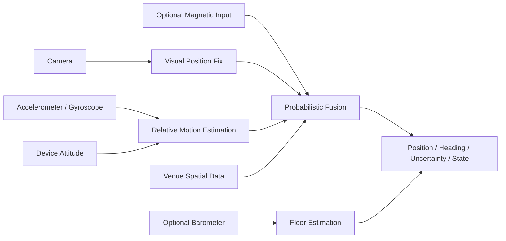

# 측위 엔진 기술 개요

> 문서 등급: CONFIDENTIAL - Integration Partner Use Only
>
> 문서 버전: v0.1-draft
>
> 기준일: 2026-07-13

## 1. 문서 목적

본 문서는 Position SDK 측위 엔진의 사용 센서, 측위 방식, 데이터 처리 위치, 출력 정보 및 현재 구현 상태를 기술 검토에 필요한 수준으로 설명한다.

본 문서는 제품 연동을 위한 기술 개요이며, 모델 구조, 학습 데이터, 센서 특징량, 융합 수식, 임계값 및 공간 데이터 생성 알고리즘은 공개 범위에서 제외한다.

상세 시스템 경계는 `01-positioning-engine-architecture.md`, SDK 구성은 `02-sdk-integration-design.md`, 데이터 계약은 `03-data-flow-interface-spec.md`, 상세 API 초안은 `06-sdk-api-spec-draft.md`, 단말 범위는 `07-device-compatibility-guide.md`에서 별도로 정의한다.

## 2. 상태 표기

| 표기 | 의미 |
|---|---|
| Current PoC | 현재 저장소의 Android 또는 iOS 검증 앱에서 사용 중 |
| Partial | 코어 또는 일부 플랫폼에 구현되어 있으나 제품 공통 기능으로 고정되지 않음 |
| Extension | 확장 인터페이스 또는 실험 경로만 존재 |
| Survey Only | 공간 구축·검증 도구에서만 사용하며 런타임 기본 입력이 아님 |
| Integration Target | 제품 SDK 통합 목표 |
| Decision Required | 제공 범위 또는 운영 정책 결정이 필요함 |

## 3. 기술 요약

Position SDK는 **카메라 기반 절대 위치 확인**과 **모바일 모션 센서 기반 연속 위치 추적**을 결합한 하이브리드 실내측위 엔진이다.

초기 위치 또는 추적 재획득 시 시각 정보를 이용해 병원 공간 좌표계의 기준 위치를 확인한다. 이후 가속도계, 자이로스코프 및 단말 자세 정보를 이용해 상대 이동을 연속 추정하고, 병원별 공간 데이터와 보조 위치 신호를 확률적으로 결합한다.

엔진은 위치만 반환하지 않고 위치 불확실성과 추적 상태를 함께 평가한다. 안내 신뢰도가 낮아지면 정상 위치처럼 계속 표시하지 않고 안내 보류 또는 위치 재확인 상태로 전환할 수 있도록 결과를 제공한다.

## 4. 사용 센서 및 역할

### 4.1 런타임 센서 현황

| 입력 | 주요 역할 | 현재 상태 | 제품 제공 방향 |
|---|---|---|---|
| 가속도계 | 보행 중 단말의 선형 움직임 관측 | Android/iOS Current PoC | 기본 입력 |
| 자이로스코프 | 회전과 방향 변화 관측 | Android/iOS Current PoC | 기본 입력 |
| 단말 자세·회전벡터 | 센서 좌표 정렬 및 진행 방향 기준 제공 | Android/iOS Current PoC | 기본 입력 |
| 카메라 | 초기 절대 위치 확인, 재획득 및 AR 화면 | Android/iOS Current PoC | 사용 모드에 따른 조건부 입력 |
| 자력계 | 공간별 자기 특성을 이용한 위치·방향 보정 | Partial, venue·설정 의존 | 선택적 보조 입력 |
| 기압계 | 기준층 대비 상대고도 변화와 층 전환 보조 | Android/iOS PoC host에서 사용 | 지원 단말의 선택적 보조 입력 |
| BLE | 비콘 기반 거친 위치 또는 층 앵커 확장 | Extension, 공통 런타임 구현 미완성 | 병원 인프라 협의 후 결정 |
| Wi-Fi | fingerprint 수집과 공간 검증 | Survey Only | 기본 런타임 입력에서 제외 |
| GPS | 병원 외부 접근과 실내 진입 전 위치 | 측위 코어 범위 밖 | 호스트 앱 또는 외부 지도 연동 |

### 4.2 기본 입력

#### 가속도계·자이로스코프

- 단말의 이동과 회전 변화를 연속적으로 관측한다.
- 센서 스트림은 플랫폼 adapter에서 공통 형식으로 변환된다.
- 상대 이동을 계산하는 기본 입력이지만, 단독으로는 절대적인 병원 좌표를 결정하지 않는다.
- 장시간 절대 보정 없이 사용할 경우 누적 오차가 증가할 수 있다.

#### 단말 자세·회전벡터

- 단말 좌표계의 센서 관측을 이동 추정용 기준 좌표계에 정렬한다.
- 자북 사용 여부와 관계없이 세션 중 일관된 상대 방향을 유지하는 데 사용한다.
- 플랫폼별 자세 표현 차이는 SDK 내부 adapter에서 처리하는 것을 제품 목표로 한다.

### 4.3 조건부·보조 입력

#### 카메라

- Current PoC에서는 초기 위치 확인 시 정지 이미지 한 장을 촬영하여 시각 위치 확인에 사용한다.
- 추적 신뢰도가 낮아진 경우 같은 방식으로 위치를 재확인할 수 있다.
- AR 안내 모드에서는 카메라 영상 위에 경로와 방향 정보를 표시할 수 있다.
- 2D 안내만 사용하는 동안 카메라를 항상 활성화할 필요는 없다.

#### 자력계

- 병원 공간에서 관측되는 자기 특성을 사전에 구축한 참조 데이터와 비교하여 누적 오차 보정에 활용할 수 있다.
- 금속 구조물, 전기설비, 단말 보정 상태의 영향을 받으므로 정확도 조건을 충족한 관측만 사용해야 한다.
- 현재 코어 보정 경로와 일부 PoC 구현은 존재하지만, 모든 venue와 플랫폼에서 필수 사용되는 기능은 아니다.

#### 기압계

- 초기 확인된 층 또는 사용자가 선택한 기준층을 기준으로 상대고도 변화를 관찰한다.
- 엘리베이터·계단을 통한 층 이동 판단을 보조한다.
- 기압계가 없는 단말에서는 층 정보를 시각 위치 확인, 사용자 선택 또는 다른 앵커로 보완해야 한다.
- 현재 층 추정은 PoC host에 연결되어 있으며 제품 공개 결과 모델로의 통합은 남아 있다.

### 4.4 현재 기본 입력이 아닌 항목

#### BLE

저장소에는 BLE 관측을 거친 절대 위치로 전달하기 위한 확장 개념이 있으나, Android와 iOS 제품 SDK에서 동일하게 제공되는 비콘 스캐너와 운영용 비콘 데이터 계약은 아직 완성되지 않았다.

따라서 현재 기술자료에서는 BLE를 기본 측위 방식으로 표시하지 않는다. 향후 병원 내 비콘 설치 여부, 운영 책임, 배터리 관리 및 개인정보 정책이 확정된 경우 보조 앵커로 검토한다.

#### Wi-Fi

Wi-Fi fingerprint 기록 기능은 공간 조사와 기술 검증 도구에 존재한다. 현재 제품 런타임 엔진이 Wi-Fi AP 정보를 기본 위치 입력으로 소비하는 구조는 아니다.

## 5. 측위 동작 방식

### 5.1 초기 절대 위치 확인

1. 호스트 앱이 대상 `venueId`와 선택적 목적지를 전달한다.
2. SDK가 단말 capability와 대상 공간 데이터 준비 상태를 확인한다.
3. 필요한 경우 카메라 이미지를 이용해 현재 공간의 절대 위치를 확인한다.
4. 위치 확인 결과를 병원 도면 좌표계의 위치, 방향 및 신뢰도 정보로 변환하고, 선택된 venue metadata와 결합해 층을 식별한다.
5. 신뢰도 조건을 충족한 결과만 연속 추적의 기준 위치로 사용한다.

현재 PoC의 시각 위치 확인은 서비스 보조 방식이다. 운영용 서비스의 인증, 전송 암호화, 재시도, 보관 정책 및 SLA는 Integration Target에서 확정해야 한다.

### 5.2 센서 기반 연속 추적

초기 위치를 확보한 이후에는 가속도·자이로·단말 자세 스트림을 이용해 상대 이동량과 진행 방향을 추정한다.

- 이동 추정은 단말에서 실행된다.
- 카메라를 지속해서 촬영하지 않고도 연속 위치를 갱신할 수 있다.
- 연속 추적 결과는 절대 위치가 아니라 직전 기준 위치로부터의 상대 변화이므로 보정 신호가 필요하다.
- 센서 품질, 휴대 자세, 보행 형태 및 장시간 추적은 누적 오차에 영향을 줄 수 있다.

내부 모델 구조, 입력 특징, 추론 주기와 보정 계수는 SDK 내부 구현으로 관리한다.

### 5.3 확률 기반 융합

엔진은 다음 정보를 하나의 위치 상태로 결합한다.

- 센서 기반 상대 이동
- 카메라 기반 절대 위치 확인 결과
- 선택적으로 사용되는 자기장 또는 외부 위치 앵커
- 이동 가능 영역과 벽 등의 공간 제약
- 현재 추정의 위치·방향 불확실성

보조 위치 결과가 기존 추정과 크게 불일치하거나 신뢰 조건을 충족하지 못하면 즉시 적용하지 않을 수 있다. 구체적인 융합 수식, 이상치 판정 기준과 내부 상태 수는 공개 범위에서 제외한다.

### 5.4 공간 제약 적용

병원별 Venue Package는 측위 결과를 실제 공간에 맞게 해석하는 데 사용된다.

| 공간 데이터 | 역할 |
|---|---|
| 도면 및 좌표 metadata | 화면 좌표와 meter 단위 venue 좌표 정합 |
| 벽·이동 가능 영역 | 벽 통과 등 비현실적 이동 제한 |
| 층 metadata | 건물·층 식별과 층 전환 범위 정의 |
| POI | 진료실·접수처·편의시설 목적지 식별 |
| 경로 그래프 | 이동 가능한 안내 경로 계산 |
| 시각·자기 참조 데이터 | 지원 venue의 절대 위치 확인과 보정 |

동일한 SDK라도 Venue Package가 준비되지 않은 병원이나 층에서는 해당 공간의 측위·경로 안내를 제공할 수 없다.

### 5.5 추적 신뢰도와 재획득

엔진은 위치 추정과 함께 불확실성과 추적 단계를 평가한다.

| 추적 단계 | 의미 | 권장 사용자 처리 |
|---|---|---|
| `COLD_START` | 절대 기준 위치가 아직 없음 | 위치 확인 화면 표시 |
| `ALIGNING` | 위치·방향이 안정화되는 중 | 이동 안내 제한 또는 대기 안내 |
| `TRACKING` | 정상 추적 가능 | 2D 또는 AR 안내 제공 |
| `HOLD` | 현재 안내 신뢰도가 부족함 | 블루닷·경로 갱신 일시 중지 |
| `RE_ACQUIRE` | 절대 위치 재확인 필요 | 재촬영 또는 2D 폴백 제공 |

공개 SDK에서는 위 코어 상태를 제품 session 상태 및 typed event로 변환할 수 있다. 최종 상태명과 전환 계약은 API v0.1에서 확정한다.

## 6. 데이터 처리 위치

| 처리 항목 | Current PoC | Integration Target |
|---|---|---|
| 모션 센서 수집 | 단말 | SDK platform adapter 내부 |
| 상대 이동 추정 | 단말 | 단말 |
| 위치 융합·공간 제약 | 단말 | 단말 |
| 카메라 프레임 획득 | PoC host | SDK 또는 선택 UI module |
| 시각 위치 확인 | 개발용 service-assisted 방식 | 승인된 운영 서비스 또는 확정된 배치 방식 |
| Venue Package | 앱 리소스 | 버전된 로컬 패키지 또는 인증된 저장소 |
| 최종 화면 렌더링 | PoC 화면 | 호스트 앱 또는 선택 UI module |

## 7. 엔진 출력

### 7.1 Current PoC

현재 공통 코어의 단일 위치 결과에는 다음 정보가 포함된다.

| 필드 | 의미 |
|---|---|
| `x`, `y` | meter 단위 venue-local 평면 좌표 |
| `thetaRad` | venue 좌표계에서 사용자가 향하는 방향 |
| `sigmaM` | 위치 불확실성 표현 |
| `tNs` | 측위 결과 기준 시각 |
| `phase` | 현재 추적 단계 |

층 추정은 Android/iOS PoC host에서 별도 상태로 관리된다.

### 7.2 Integration Target

제품 공개 결과는 다음 정보를 포함하는 방향으로 설계한다.

- `venueId`
- `floorId`
- `x`, `y`
- `heading`
- `accuracy` 또는 uncertainty
- `timestamp`
- session·tracking state
- 경로 이탈, 층 변경, 도착 및 재확인 이벤트

공개 필드명, 단위, nullable 조건과 갱신 주기는 데이터 흐름·인터페이스 정의서에서 확정한다.

## 8. 플랫폼별 구현 현황

### 8.1 Android

- KMP 공통 코어와 Android `SensorManager` 기반 센서 입력이 연결되어 있다.
- 단말 내 추론 runtime과 카메라 기반 초기 위치 확인 PoC가 존재한다.
- 가속도, 자이로, 회전벡터와 기압계 입력이 PoC host에서 사용된다.
- 병원별 벽·coverage·방향 참조 데이터 일부를 앱 asset으로 로드한다.
- 제품용 SDK Facade와 Maven 배포, capability API는 아직 확정되지 않았다.

### 8.2 iOS

- KMP 공통 코어를 정적 framework로 생성할 수 있다.
- Swift PoC host가 CoreMotion, 단말 내 추론 runtime, 카메라 및 상대고도 입력을 공통 코어에 연결한다.
- 공간 데이터 일부를 iOS 앱 bundle에서 로드한다.
- 센서·카메라 adapter가 완성된 XCFramework/SPM 제품 내부로 캡슐화된 상태는 아니다.
- 목표 최소 버전인 iOS 15.6에 대한 공식 호환성 검증이 남아 있다.

## 9. Current PoC와 제품 목표

| 영역 | Current PoC | Integration Target | 상태 |
|---|---|---|---|
| 연속 위치 추정 | Android/iOS 검증 앱에서 동작 | 공통 공개 session으로 제공 | Partial |
| 카메라 위치 확인 | 개발용 서비스 연동 | 인증된 운영 환경 | Decision Required |
| 층 추정 | PoC host 별도 상태 | 공개 위치 결과에 통합 | Partial |
| 자기장 보정 | 코어·일부 venue 경로 존재 | 지원 venue와 단말 조건 정의 | Decision Required |
| BLE 보정 | 인터페이스·조사 경로 중심 | 선택 기능 여부 결정 | Extension |
| Wi-Fi 측위 | 조사 기록만 존재 | 기본 범위 제외 | Survey Only |
| Venue 데이터 | 앱 asset | versioned Venue Package | Planned |
| 단말 capability | 플랫폼 코드 일부 | 공개 capability와 tier 제공 | Planned |
| Android 배포 | local AAR 생성 가능 | Maven artifact | Planned |
| iOS 배포 | local static framework | XCFramework + SPM | Planned |

## 10. 동작 조건과 제한사항

- 대상 병원과 층의 Venue Package가 준비되어야 한다.
- 초기 위치 확인에 사용할 시각 참조 데이터와 현장 검수가 필요하다.
- 카메라 가림, 조도, 반복 구조, 공간 변경 및 군중 밀집은 시각 위치 확인에 영향을 줄 수 있다.
- 모션 센서 품질, 단말 휴대 자세 및 장시간 무보정 추적은 누적 오차에 영향을 줄 수 있다.
- 자력계와 기압계는 모든 단말에서 동일한 품질로 제공되지 않으며 필수 단독 측위 수단으로 사용하지 않는다.
- AR 안내는 AR capability, 카메라 권한과 안정적인 위치·방향 결과가 모두 필요하다.
- 필수 capability가 부족한 경우 실시간 2D, 정적 2D 또는 안내 불가 화면으로 전환해야 한다.
- 공식 정확도, 초기 위치 확인 시간, 재획득 성공률과 배터리 사용량은 대상 venue와 단말군을 고정한 시험 후 제시한다.

## 11. 권한·보안·개인정보

### 11.1 권한 원칙

- 호스트 앱이 권한 설명 화면과 OS 권한 요청을 소유한다.
- SDK는 현재 모드에 필요한 권한과 capability 상태를 반환한다.
- 카메라는 초기 위치 확인, 재획득 또는 AR 안내가 필요한 시점에만 사용한다.
- 푸시 권한은 측위 엔진 범위에 포함하지 않는다.
- BLE를 제품 기능으로 채택하는 경우 Bluetooth 및 플랫폼별 위치 권한 요구사항을 별도로 확정한다.

### 11.2 운영 전 확정사항

- 카메라 이미지의 전송 여부와 전송 구간 암호화
- 서비스 인증과 요청 무결성
- 이미지·진단 로그의 저장 여부, 보관 기간 및 삭제 정책
- 사용자 위치정보의 저장·추적 여부
- Venue Package 접근 제어와 무결성 검증
- 개인정보 동의 문구와 장애 분석용 로그 범위

Current PoC의 개발용 통신 방식은 운영 보안 수준을 의미하지 않는다. 운영 배포 전 별도 보안 설계와 검토가 필요하다.

## 12. 공개 범위와 노하우 보호

### 12.1 외부 제공 가능 항목

- 사용 센서의 종류와 목적
- 초기 위치 확인·연속 추적·재획득의 상위 흐름
- 온디바이스 처리와 서비스 처리의 구분
- 공개 입력·출력·상태·오류의 의미
- Venue Package의 필요성과 운영 책임
- 단말 조건, 알려진 제한과 폴백 원칙

### 12.2 비공개 내부 항목

- 모델 구조, 가중치, 학습·평가 데이터
- 센서 전처리, 입력 특징과 추론 window
- 위치 융합 수식, 내부 상태 표현과 튜닝값
- 이상치 제거, 신뢰도 및 재획득 임계값
- 자기장 특징 생성과 매칭 알고리즘
- 시각 위치 검색·정합 알고리즘
- 공간 데이터 생성·정합·최적화 알고리즘
- 원본 survey 데이터와 성능 개선 실험

## 13. 결정 필요사항

| 항목 | 필요한 결정 |
|---|---|
| 시각 위치 확인 운영 배치 | 서비스 위치, 인증, SLA, 이미지 처리 정책 |
| 자력계·기압계 제품 범위 | 필수·선택 여부와 미지원 단말 처리 |
| BLE | 제품 포함 여부, 비콘 구축·운영 책임 |
| 공개 위치 결과 | floor·accuracy·state schema 확정 |
| capability tier | AR, 실시간 2D, 정적 2D, 미지원 기준 |
| 성능 기준 | 대표 venue·동선·단말과 합격 기준 |
| 데이터 운영 | Venue Package 생성·검수·배포·갱신 책임 |
