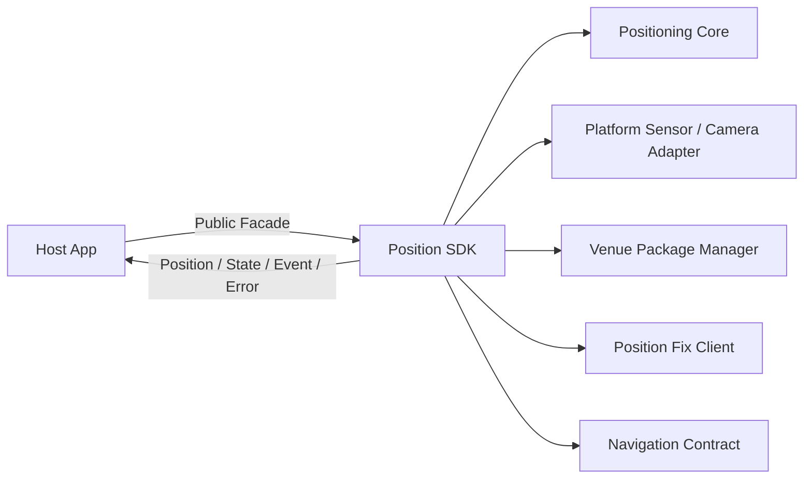
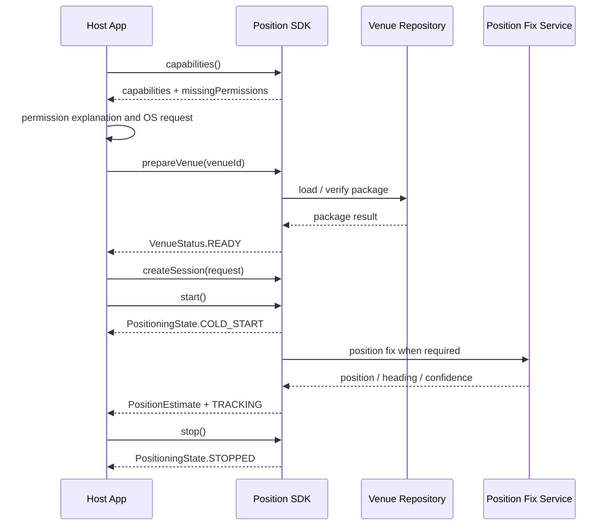

# Position SDK 기술 문서 및 API 명세 초안

> 문서 등급: CONFIDENTIAL - Integration Partner Use Only
>
> 문서 버전: v0.1-draft
>
> 기준일: 2026-07-13

## 1. 목적

본 문서는 Position SDK의 제공 모듈, 공개 API, 호출 순서, 데이터 모델, 상태·이벤트·오류 및 플랫폼별 연동 계약의 초안을 정의한다.

현재 저장소에서 호출 가능한 API와 제품 통합을 위해 제안하는 API가 함께 기재되어 있다. 두 API는 다음 표기로 구분한다.

| 표기 | 의미 |
|---|---|
| Current API | 현재 저장소에 구현되어 실제 컴파일 가능한 API |
| Integration Target | 제품 SDK에서 제공할 제안 API이며 아직 구현·호환성 보장 전 |
| Decision Required | 연동 협의 또는 구현 검증 후 확정할 항목 |

본 문서의 Integration Target 코드는 설계 검토용이며, 배포 artifact와 함께 API v0.1이 고정되기 전까지 실행 가능한 최종 명세로 간주하지 않는다.

## 2. SDK 범위

### 2.1 포함 범위

- 단말 capability 확인
- 대상 venue 공간 데이터 준비·검증
- 측위 session 생성·시작·중지
- 위치·층·방향·불확실성 스트림
- 추적 상태·이벤트·typed error
- 카메라 기반 초기 위치 확인과 재획득
- 경로 이탈·층 변경·도착 이벤트의 공개 계약

### 2.2 제외 범위

- 로그인, 예약, 접수, 진료 업무 흐름
- 앱 navigation stack과 화면 전환
- 최종 브랜딩과 UI/UX
- OS 권한 설명 화면과 권한 팝업 호출
- 병원 POI 원천정보 생성·승인
- 푸시 알림
- AI 챗봇

## 3. 제공 산출물

| 산출물 | Current PoC | Integration Target |
|---|---|---|
| Android | local `core-positioning-release.aar` | Maven artifact/AAR |
| iOS | local KMP static framework | XCFramework + SPM binary target |
| 공개 API | 코어 중심 `PositioningSession` | 제품 Facade + Session |
| 공간 데이터 | 앱 asset·bundle | versioned Venue Package |
| UI | Android Compose/iOS Swift PoC 화면 | 호스트 UI 또는 선택 UI module |
| 문서 | 설계 초안 | versioned API reference·release notes |

SDK 코드와 Venue Package는 독립적인 버전과 배포 생명주기를 가진다.

## 4. 모듈 경계



호스트 앱은 코어 엔진, 센서 source, 모델 runner, 맵 parser 또는 위치 확인 client를 직접 생성하지 않는 것을 제품 API 원칙으로 한다.

## 5. Current API

### 5.1 실제 공개 interface

현재 공통 코어에는 다음 interface가 존재한다.

```kotlin
interface PositioningSession {
    val estimates: Flow<PositionEstimate>

    fun start()
    fun stop()
    fun seed(x: Double, y: Double, thetaRad: Double)
}
```

### 5.2 현재 위치 결과

```kotlin
data class PositionEstimate(
    val x: Double,
    val y: Double,
    val thetaRad: Double,
    val sigmaM: Double,
    val tNs: Long,
    val phase: TrackPhase,
)

enum class TrackPhase {
    COLD_START,
    ALIGNING,
    TRACKING,
    HOLD,
    RE_ACQUIRE,
}
```

| 필드 | 단위 | 의미 |
|---|---|---|
| `x`, `y` | meter | venue-local 평면 좌표 |
| `thetaRad` | radian | venue 좌표계에서 사용자가 향하는 방향 |
| `sigmaM` | meter | 위치 불확실성 표현 |
| `tNs` | nanosecond | 결과 기준 monotonic timestamp |
| `phase` | enum | 코어 추적 단계 |

### 5.3 현재 구현의 제한

- 호스트 또는 PoC glue가 센서 source, 추론 runtime과 공간 데이터를 직접 생성한다.
- `venueId`와 `floorId`가 위치 결과에 포함되지 않는다.
- 층 추정은 Android/iOS PoC host에서 별도로 관리한다.
- 카메라 위치 확인 결과 주입 메서드는 기본 interface가 아니라 구현체에 존재한다.
- 오류는 일부 문자열 callback으로 전달된다.
- capability, Venue Package 준비, typed error와 navigation session API가 없다.
- iOS Swift 소비를 위한 안정된 async/callback wrapper가 없다.
- `seed`는 개발·비상용 도구이며 일반 사용자 흐름에 직접 노출하기 어렵다.

따라서 Current API는 코어 검증용으로는 사용할 수 있지만 외부 호스트 앱에 바로 고정할 제품 계약은 아니다.

## 6. Integration Target API

### 6.1 전체 진입점

```kotlin
interface PositionSdk {
    fun capabilities(): DeviceCapabilities
    suspend fun prepareVenue(venueId: String): VenueStatus
    fun createSession(request: NavigationRequest): PositioningSession
}
```

SDK 생성 방식과 인증 설정은 배포 환경 확정 후 factory 또는 DI-friendly constructor 중 하나로 고정한다.

### 6.2 단말 capability

```kotlin
enum class CapabilityStatus {
    AVAILABLE,
    PERMISSION_REQUIRED,
    UNAVAILABLE,
}

enum class SdkPermission {
    MOTION,
    CAMERA,
    BLUETOOTH,
    LOCATION,
}

data class DeviceCapabilities(
    val livePositioning: CapabilityStatus,
    val cameraPositionFix: CapabilityStatus,
    val arNavigation: CapabilityStatus,
    val floorEstimation: CapabilityStatus,
    val missingPermissions: Set<SdkPermission>,
)
```

`capabilities()`는 OS 권한 팝업을 직접 표시하지 않는다. 호스트 앱이 반환 결과를 바탕으로 설명 화면과 권한 요청을 수행한다.

### 6.3 Venue Package 준비

```kotlin
enum class VenueDataState {
    NOT_AVAILABLE,
    DOWNLOADING,
    VERIFYING,
    READY,
    INCOMPATIBLE,
    CORRUPTED,
}

data class VenueStatus(
    val venueId: String,
    val state: VenueDataState,
    val bundleVersion: String?,
    val progress: Float?,
)
```

`prepareVenue`는 다음 작업을 SDK 내부에서 수행하는 것을 목표로 한다.

- 대상 package 탐색 또는 다운로드
- checksum과 manifest 검증
- schema·SDK 버전 호환성 검사
- 필요한 runtime 데이터 로드
- 동일 venue의 검증된 cache 재사용

### 6.4 Navigation 요청

```kotlin
enum class NavigationMode {
    AUTO,
    MAP_2D,
    AR,
}

data class NavigationRequest(
    val venueId: String,
    val destinationId: String? = null,
    val floorId: String? = null,
    val preferredMode: NavigationMode = NavigationMode.AUTO,
)
```

| 파라미터 | 필수 | 설명 |
|---|---|---|
| `venueId` | Y | Venue Package 선택 키 |
| `destinationId` | N | POI 또는 목적지 식별자. 측위만 사용할 때 생략 가능 |
| `floorId` | N | 시작층을 이미 알고 있을 때 전달 |
| `preferredMode` | N | AUTO, 2D 또는 AR 선호 모드 |

예약번호, 환자정보 또는 화면 식별자는 SDK 요청에 포함하지 않는다. 호스트 앱이 업무 데이터를 `destinationId`로 변환한다.

### 6.5 Positioning Session

```kotlin
interface PositioningSession {
    val positions: Flow<PositionEstimate>
    val states: StateFlow<PositioningState>
    val events: Flow<PositioningEvent>
    val errors: Flow<PositioningError>

    fun start()
    fun stop()
}
```

한 session은 하나의 venue와 선택 목적지를 나타낸다. 목적지 변경을 동일 session에서 허용할지 새 session 생성으로 제한할지는 Decision Required이다.

### 6.6 위치 결과

```kotlin
data class PositionEstimate(
    val venueId: String,
    val floorId: String?,
    val xM: Double,
    val yM: Double,
    val headingRad: Double,
    val accuracyM: Double,
    val timestampNs: Long,
    val state: PositioningState,
)

enum class PositioningState {
    IDLE,
    PREPARING,
    COLD_START,
    ALIGNING,
    TRACKING,
    HOLD,
    RE_ACQUIRE,
    STOPPED,
    ERROR,
}
```

`accuracyM`은 원형 정확도 보장값이 아니라 SDK가 제공하는 위치 불확실성 지표이다. 통계적 의미와 표시 규칙은 성능 검증 후 확정한다.

`PositioningState`는 연동 초안의 단일 공개 상태이다. 구현 단계에서 lifecycle 상태와 tracking 품질을 분리할 필요가 확인되면 API v0.1 확정 전에 변경한다.

### 6.7 이벤트

```kotlin
sealed interface PositioningEvent {
    data object RelocalizationRequired : PositioningEvent
    data class FloorChanged(val fromFloorId: String?, val toFloorId: String) : PositioningEvent
    data object RouteDeviated : PositioningEvent
    data object DestinationArrived : PositioningEvent
}
```

| 이벤트 | 호스트 권장 처리 |
|---|---|
| `RelocalizationRequired` | 카메라 재확인 또는 2D 폴백 진입 |
| `FloorChanged` | 층 도면과 경로 segment 전환 |
| `RouteDeviated` | 재경로 결과 표시 또는 안내 보류 |
| `DestinationArrived` | session 종료 후 업무 화면 복귀 |

### 6.8 오류

```kotlin
enum class PositioningErrorCode {
    PERMISSION_REQUIRED,
    UNSUPPORTED_DEVICE,
    VENUE_DATA_NOT_FOUND,
    VENUE_DATA_INCOMPATIBLE,
    NETWORK_UNAVAILABLE,
    POSITION_FIX_FAILED,
    SESSION_ALREADY_RUNNING,
    SESSION_NOT_RUNNING,
    INTERNAL_ERROR,
}

data class PositioningError(
    val code: PositioningErrorCode,
    val recoverable: Boolean,
    val message: String?,
)
```

`message`는 진단용이며 사용자 노출 문구로 사용하지 않는다. 사용자 문구와 다국어 처리는 호스트 앱이 `code`를 기준으로 결정한다.

## 7. 표준 호출 흐름



### 7.1 Lifecycle 규칙 초안

- `prepareVenue` 성공 후 session을 생성한다.
- 동일 session의 중복 `start`는 오류로 처리한다.
- `stop`은 여러 번 호출해도 안전한 idempotent 동작을 목표로 한다.
- `stop` 시 센서, 카메라, 네트워크 요청과 내부 비동기 작업을 해제한다.
- 앱 background 진입 시 자동 중지 또는 suspend 정책은 Decision Required이다.
- session이 종료된 뒤 도착·위치 이벤트를 추가 방출하지 않는다.

## 8. 권한 계약

| 권한 | 사용 기능 | 기본 여부 | 거부 시 처리 |
|---|---|---|---|
| Motion | 연속 위치 추적 | 필수 | 실시간 측위 시작 불가 |
| Camera | 초기 위치 확인·재획득·AR | 모드에 따라 필수 | 정적 2D 또는 제한 모드 |
| Bluetooth | BLE 보조 위치 | 현재 기본 범위 아님 | BLE 기능 비활성화 |
| Location | BLE/Wi-Fi 또는 플랫폼 정책상 필요 시 | 구성 의존 | 해당 보조 기능 비활성화 |
| Push | 사용하지 않음 | 제외 | 호스트 정책 적용 |

SDK는 권한 팝업을 직접 호출하지 않으며 필요한 권한과 누락 상태만 반환한다.

## 9. Threading과 스트림 계약

### 9.1 SDK 내부

- 센서 입력과 엔진 상태 변경은 SDK가 직렬 실행 컨텍스트에서 처리한다.
- 호스트는 플랫폼 센서 callback을 코어 엔진에 직접 전달하지 않는다.
- 카메라 위치 확인 결과도 SDK 내부에서 동일한 상태 순서로 적용한다.

### 9.2 Android·KMP 소비

- 위치와 이벤트는 Kotlin `Flow` 기반 제공을 목표로 한다.
- UI는 host의 lifecycle에 맞춰 수집하고 UI dispatcher에서 렌더링한다.
- 느린 consumer가 센서 입력 처리를 막지 않도록 최신 위치 우선 정책을 사용한다.
- 정확한 buffer와 replay 정책은 API 구현 테스트에서 고정한다.

### 9.3 Swift 소비

Kotlin `Flow`를 Swift에 그대로 노출하면 사용성과 취소 처리가 불명확할 수 있다. 제품 iOS API는 다음 중 하나를 제공해야 한다.

- Swift `AsyncSequence` adapter
- lifecycle token을 반환하는 callback API
- 공식 KMP Swift export 방식

최종 방식은 XCFramework/SPM 샘플 앱에서 취소, 메모리 해제 및 main actor 동작을 검증한 후 확정한다.

## 10. 연동 예시

다음 코드는 **Integration Target 예시**이며 현재 저장소에서 그대로 컴파일되지 않는다.

### 10.1 Kotlin

```kotlin
val capabilities = sdk.capabilities()
check(capabilities.livePositioning == CapabilityStatus.AVAILABLE)

val venue = sdk.prepareVenue("hospital-main")
check(venue.state == VenueDataState.READY)

val session = sdk.createSession(
    NavigationRequest(
        venueId = "hospital-main",
        destinationId = "clinic-301",
        preferredMode = NavigationMode.AUTO,
    )
)

scope.launch {
    session.positions.collect { position ->
        renderPosition(position)
    }
}

session.start()
```

### 10.2 Swift 개념 예시

```swift
let capabilities = sdk.capabilities()
let venue = try await sdk.prepareVenue(venueId: "hospital-main")
let session = sdk.createSession(
    request: NavigationRequest(
        venueId: "hospital-main",
        destinationId: "clinic-301",
        floorId: nil,
        preferredMode: .auto
    )
)

for await position in session.positions {
    renderPosition(position)
}
```

Swift API 형태는 Decision Required이며 위 예시는 목표 사용성을 설명하기 위한 것이다.

## 11. Android 연동 조건

- 목표 최소 OS: Android API 24
- 현재 core library `minSdk`: 24
- 현재 PoC 앱 `minSdk`: 26
- 현재 개발 조합: Kotlin 2.0.21, AGP 8.7, compileSdk 35
- 목표 호스트 조합: Kotlin 2.3.x, AGP 9.x, compileSdk 36
- Java/JVM 17 사용 여부와 호스트 빌드 설정 검증 필요
- Maven repository, POM, consumer rules 및 dependency 노출 정책 미확정

API 24와 목표 도구체인의 조합은 아직 공식 통합 검증 전이다.

## 12. iOS 연동 조건

- 요청 목표 최소 OS: iOS 15.6
- 현재 PoC deployment target: iOS 16.0
- 현재 local KMP static framework는 device arm64와 simulator arm64 생성 경로가 존재
- XCFramework와 SPM package는 미구성
- 현재 PoC 추론 runtime은 앱 쪽 의존성으로 연결됨
- Camera·Motion 사용 설명 문구 필요
- 개발용 local network 예외는 운영 endpoint 적용 시 제거 필요

iOS 15.6, device/simulator 전체 architecture 및 SPM 소비 검증이 완료되기 전에는 iOS 15.6을 공식 지원 버전으로 확정하지 않는다.

## 13. 버전 정책 초안

- SDK 공개 버전은 SemVer를 사용한다.
- 공개 API breaking change는 major version에서만 수행한다.
- Venue Package는 별도 `schemaVersion`과 SDK 호환 범위를 가진다.
- SDK와 Venue Package는 독립적으로 배포한다.
- release notes에 지원 OS, dependency, 알려진 제한과 migration을 기록한다.
- deprecated API의 유지 기간은 첫 제품 계약에서 확정한다.

## 14. API 확정 전 결정사항

| 항목 | 현재 상태 | 필요한 결정 |
|---|---|---|
| SDK factory·초기화 config | 미정 | endpoint·인증·logging 주입 방식 |
| session 이름과 lifecycle | Draft | 중복 start, restart, background 정책 |
| 목적지 변경 | 미정 | 동일 session 갱신 또는 새 session |
| 위치 정확도 의미 | Draft | 통계적 정의와 UI 표시 기준 |
| Swift stream | 미정 | AsyncSequence, callback 또는 Swift export |
| 오류 payload | Draft | 원인, recoverable, retry 정보 범위 |
| Venue download | 미정 | 앱 동봉, SDK 다운로드 또는 혼합 |
| 선택 UI module | 미정 | 2D·AR 제공 범위와 customization |
| 인증 | 미정 | host token 전달 또는 SDK credential provider |

