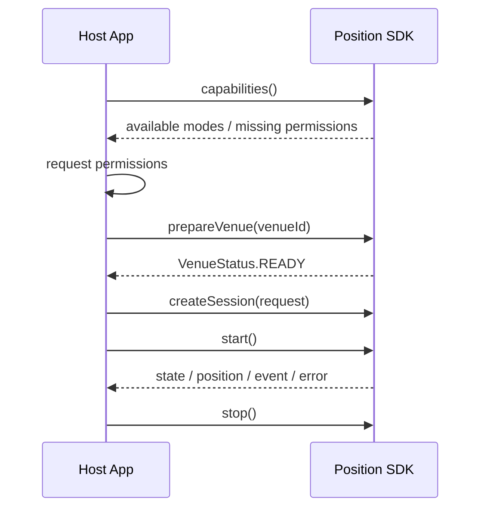

# SDK 통합 사전 확인 및 의사결정서

> 문서 등급: CONFIDENTIAL - Integration Partner Use Only
>
> 문서 버전: v0.1-draft
>
> 기준일: 2026-07-13

## 1. 목적

본 문서는 SDK 포팅과 호스트 앱 통합 설계를 시작하기 전에 다음 5개 항목의 현재 상태, 권장 계약, 책임 범위, 미결정 사항 및 완료 기준을 합의하기 위한 의사결정 자료이다.

1. SDK 제공 형태와 최소 지원 OS
2. AR 안내 진입 파라미터와 callback interface
3. 카메라·위치·모션 센서 권한 요청 주체
4. 병원 공간 데이터의 구축·관리 주체
5. 단말 tier와 AR 미지원 폴백 UI 책임

본 문서는 현재 PoC 상태를 제품 완료 상태로 표현하지 않는다. 목표 제공 형태와 공식 지원 범위는 artifact, API 및 호환성 시험이 완료된 뒤 release별로 확정한다.

## 2. 상태 표기

| 상태 | 의미 |
|---|---|
| Confirmed | 현재 구현과 권장 계약이 일치하여 즉시 확정 가능 |
| Proposed | 권장안이 존재하며 통합 회의에서 승인 필요 |
| Pending Validation | 방향은 정해졌으나 빌드·실기기 검증 필요 |
| Decision Required | 제공 범위·책임·운영 방식 결정 필요 |

## 3. 의사결정 요약

| ID | 항목 | 현재 상태 | 권장 결론 | 결정 상태 |
|---|---|---|---|---|
| D-01 | Android 제공 형태 | local AAR 생성 가능 | private Maven artifact/AAR | Proposed |
| D-02 | iOS 제공 형태 | local static framework | XCFramework + SPM binary target | Proposed |
| D-03 | 최소 OS | Android core 24, PoC 26 / iOS PoC 16.0 | Android API 24 / iOS 15.6 목표 | Pending Validation |
| D-04 | AR 진입 API | 제품 API 없음 | request + session stream | Proposed |
| D-05 | 최종 UI 제공 범위 | PoC 화면만 존재 | 호스트 UI, 선택 SDK UI module | Decision Required |
| D-06 | 권한 요청 주체 | PoC 앱이 요청 | 호스트 앱 요청, SDK 상태 반환 | Confirmed |
| D-07 | 공간 데이터 구축 | 도구·일부 venue 데이터 존재 | 역할 분리 + Venue Package | Decision Required |
| D-08 | 공간 데이터 운영 | 공식 갱신 계약 없음 | versioning·검수·rollback 계약 | Decision Required |
| D-09 | 단말 tier 판정 | 공식 capability API 없음 | SDK가 capability·tier 반환 | Proposed |
| D-10 | 폴백 UI | 2D PoC 존재 | 호스트 앱이 최종 화면 소유 | Decision Required |

## 4. SDK 제공 형태 및 최소 지원 OS

### 4.1 현재 상태

| 플랫폼 | Current PoC | 제한사항 |
|---|---|---|
| Android | `core-positioning-release.aar` local 생성 가능 | Maven repository·POM·배포 절차 미완성 |
| iOS | device arm64·simulator arm64 KMP static framework 경로 존재 | XCFramework·SPM package 미완성 |
| Android OS | core `minSdk 24`, PoC 앱 `minSdk 26` | API 24 실기기 미검증 |
| iOS OS | PoC deployment target iOS 16.0 | 목표 iOS 15.6 미검증 |
| Android 도구체인 | Kotlin 2.0.21, AGP 8.7, compileSdk 35 | 목표 호스트 조합과 차이 |
| iOS 도구체인 | local framework와 앱 의존성 | clean SPM 소비·archive 미검증 |

### 4.2 권장 계약

#### Android

- versioned Maven artifact를 기본 제공 방식으로 한다.
- Maven artifact는 AAR, POM, dependency metadata, consumer rules 및 checksum 정보를 포함한다.
- local AAR 직접 전달은 장애 분석 또는 제한된 PoC 용도로만 사용한다.
- JitPack 사용 여부는 repository 접근 정책과 release 재현성을 검토한 뒤 결정한다.

#### iOS

- device와 simulator slice를 포함한 XCFramework를 생성한다.
- XCFramework를 SPM binary target으로 배포한다.
- package version, binary checksum, supported platform과 dependency를 명시한다.
- Intel simulator 지원이 필요하지 않다면 Apple Silicon simulator만 지원한다고 명확히 고지한다.

#### 최소 OS

- Support Target: Android API 24, iOS 15.6
- Official Support: 최소 OS 실기기와 회귀 시험 완료 후 확정
- 최소 OS 검증에 실패하면 기능 축소가 아니라 지원 OS 조정을 우선 검토한다.

### 4.3 제공 산출물

| 산출물 | Android | iOS |
|---|---|---|
| SDK binary | Maven AAR | XCFramework |
| package metadata | POM·checksum | `Package.swift`·checksum |
| 샘플 | 최소 통합 sample app | 최소 통합 sample app |
| 문서 | API reference·release notes | Swift API reference·release notes |
| 검증 결과 | min/max OS build·device | min/max OS build·device |

Venue Package와 SDK UI module은 SDK binary와 별도 artifact로 관리한다.

### 4.4 회의 결정사항

| 결정 항목 | 선택지 | 권장 기본값 |
|---|---|---|
| Android repository | private Maven / JitPack / 파일 전달 | private Maven |
| repository 인증 | 사내 계정 / token / network 제한 | token 또는 사내 정책 |
| iOS 배포 | SPM binary / CocoaPods / 수동 framework | SPM binary |
| simulator | arm64 only / arm64+x86_64 | 실제 개발환경 확인 후 최소 범위 |
| 최소 OS | API 24·iOS 15.6 유지 / 상향 | 검증 전 목표값 유지 |
| release 정책 | SemVer / 별도 체계 | SemVer |

### 4.5 완료 기준

- clean checkout 환경에서 Android Maven dependency resolve와 release build 성공
- clean checkout 환경에서 SPM resolve, simulator build와 device archive 성공
- Android API 24 실제 단말 기본 session 검증
- iOS 15.6 실제 단말 기본 session 검증
- 목표 호스트 Kotlin·AGP·compileSdk 조합 build 성공
- 공개 dependency와 license·NOTICE 검토 완료

## 5. AR 안내 진입 파라미터 및 Callback Interface

### 5.1 현재 상태

현재 공통 API는 위치 `Flow`와 `start`, `stop`, `seed`를 제공한다. 제품용 AR 안내 진입 API, venue 준비 API, capability, typed event와 typed error는 아직 구현되지 않았다.

AR 안내는 호스트 앱의 화면을 SDK가 직접 여는 방식보다, SDK session을 생성하고 호스트 화면이 결과를 구독하는 방식이 적합하다.

### 5.2 권장 진입 계약

```kotlin
enum class NavigationMode {
    AUTO,
    MAP_2D,
    AR,
}

data class NavigationRequest(
    val venueId: String,
    val destinationId: String? = null,
    val floorId: String? = null,
    val preferredMode: NavigationMode = NavigationMode.AUTO,
)
```

| 파라미터 | 필수 | 책임과 의미 |
|---|---|---|
| `venueId` | Y | 대상 병원·건물·공간 패키지 선택 키 |
| `destinationId` | N | POI·진료실·접수처 등 목적지 키 |
| `floorId` | N | 시작층을 알고 있을 때 사용하는 hint |
| `preferredMode` | N | AUTO, MAP_2D 또는 AR 선호 |

예약번호, 사용자 식별정보, 진료정보는 SDK 입력에 포함하지 않는다. 호스트 앱이 업무 데이터를 SDK의 `destinationId`로 변환한다.

접근성 경로, locale과 경로 옵션을 request에 포함할지는 navigation 요구사항 확정 후 결정한다.

### 5.3 권장 출력 계약

```kotlin
interface PositioningSession {
    val positions: Flow<PositionEstimate>
    val states: StateFlow<PositioningState>
    val events: Flow<PositioningEvent>
    val errors: Flow<PositioningError>

    fun start()
    fun stop()
}
```

| 출력 | 주요 내용 | 호스트 앱 사용 |
|---|---|---|
| `positions` | venue, floor, x/y, heading, uncertainty | 블루닷·AR 방향·경로 갱신 |
| `states` | 준비, 초기 측위, 정렬, 추적, 보류, 재획득, 종료 | 화면 상태 전환 |
| `events` | 층 변경, 경로 이탈, 도착, 재확인 필요 | workflow 처리 |
| `errors` | 권한, 단말, venue, 네트워크, 위치 확인 실패 | 재시도·폴백·설정 안내 |

### 5.4 표준 흐름



SDK는 host navigation stack을 직접 변경하지 않는다. 취소, 도착 또는 오류 후 화면 복귀는 호스트 앱이 수행한다.

### 5.5 UI 제공 선택지

| 선택지 | SDK 제공 범위 | 호스트 앱 범위 | 평가 |
|---|---|---|---|
| Headless only | 위치·상태·이벤트·오류 | 2D·AR 전체 화면 | 결합도 낮음, host 공수 큼 |
| Headless + optional UI | 코어 + 기본 2D/AR component | 최종 flow·branding·customization | 권장 |
| Full screen SDK | 완성 화면과 navigation | 진입·복귀만 처리 | 초기 통합은 빠르나 결합도 큼 |

권장 기본값은 `Headless + optional UI`이다. 선택 UI module 제공 여부와 일정은 별도 계약으로 확정한다.

### 5.6 회의 결정사항

- 최종 AR·2D 화면 소유 주체
- 선택 UI module 제공 여부
- destination 변경 방식
- 접근성 경로 옵션
- 앱 background 시 session 중지·유지 정책
- Swift stream 제공 방식
- 도착·취소 후 화면 복귀 callback 범위

### 5.7 완료 기준

- Android·iOS에서 동일 의미의 request와 결과 제공
- 최소 샘플 앱에서 `capabilities → prepareVenue → createSession → start → stop` 검증
- 중복 시작, 반복 중지, 화면 이탈과 background 동작 테스트
- 위치·상태·이벤트·오류 schema 동결
- AR 미지원 단말의 2D 전환 검증

## 6. 카메라·위치·모션 센서 권한 요청 주체

### 6.1 권장 확정안

> 권한 설명 화면과 OS 권한 요청은 호스트 앱이 담당한다. SDK는 현재 기능에 필요한 권한과 capability 상태를 반환하고, 권한이 부족하면 typed error를 제공한다.

SDK가 임의 시점에 OS 권한 팝업을 직접 표시하지 않는다.

### 6.2 책임 분리

| 항목 | 호스트 앱 | Position SDK |
|---|---|---|
| 권한 사전 설명 | Responsible | 요구 권한 정보 제공 |
| OS 권한 요청 | Responsible | 직접 요청하지 않음 |
| usage description·manifest 문구 | Responsible | 필요한 문구·기능 안내 |
| 현재 권한 확인 | 최종 flow 판단 | capability로 정규화 |
| 거부·영구거부 | 설정 이동·폴백 UI | typed error 반환 |
| 센서·카메라 시작 | 호출하지 않음 | 승인된 권한 안에서 시작 |
| 센서·카메라 종료 | lifecycle 전달 | session 종료 시 해제 |

### 6.3 권한별 정책

| 권한 | 사용 기능 | 요청 시점 | 거부 시 처리 |
|---|---|---|---|
| Motion | 연속 위치 추적 | 안내 시작 전 | 실시간 측위 제한, 정적 2D |
| Camera | 초기 위치 확인·재획득·AR | 해당 기능 진입 전 | 대체 앵커 또는 정적 2D |
| Location | BLE·Wi-Fi 등 활성 구성 | 기능 사용 전 | 해당 보조 기능 비활성화 |
| Bluetooth | BLE 보조 위치 | BLE 적용 시 | BLE 기능 비활성화 |
| Push | SDK 미사용 | 해당 없음 | 호스트 정책 적용 |

Current PoC의 Wi-Fi 조사 권한과 local network 예외는 제품 기본 권한으로 간주하지 않는다.

### 6.4 플랫폼별 유의사항

- Android library manifest에는 실제 제품 기능에 필요한 최소 선언만 포함한다.
- Android runtime permission 요청과 영구거부 판단은 호스트 앱이 담당한다.
- iOS `Info.plist`의 Camera·Motion·Bluetooth·Location 설명 문구는 호스트 앱이 최종 작성한다.
- SDK는 usage description 누락으로 발생하는 crash를 대신 처리할 수 없으므로 통합 checklist에 포함한다.

### 6.5 완료 기준

- 권한별 최초 허용·거부·영구거부·설정 복귀 시나리오 통과
- 권한 팝업이 SDK에서 예고 없이 발생하지 않음
- 거부 상태에서 센서·카메라가 시작되지 않음
- session 종료 시 활성 자원이 해제됨
- AR·실시간 2D·정적 2D 폴백이 합의된 화면으로 연결됨

## 7. 병원 공간 데이터 구축·관리 주체

### 7.1 현재 상태

현재 저장소에는 도면 정합, 벽·coverage·방향·자기 참조, navigation graph 및 시각 위치 지도를 생성·패키징하기 위한 코드와 일부 venue 데이터가 존재한다.

그러나 원천자료 제공, 현장 서베이, 최종 승인, 변경 통보, 운영 갱신과 SLA의 공식 책임 계약은 없다.

### 7.2 권장 데이터 분리

```text
Position SDK
  - 측위·경로 실행 코드
  - 공개 API와 platform adapter

Venue Package
  - 도면과 좌표 metadata
  - floor·POI·route data
  - wall·coverage·anchor data
  - runtime positioning map

Digital Twin Package 또는 선택 layer
  - 3D mesh·model·texture
  - visualization metadata
```

측위 맵과 digital twin은 SDK binary에 고정 포함하지 않는다. venue별로 구축·검수·버전 관리하고 SDK와 독립적으로 갱신한다.

### 7.3 권장 책임표

| 작업 | 공간 데이터 원천 담당 | Position SDK 범위 | 호스트 앱 |
|---|---|---|---|
| 최신 도면·BIM 제공 | Responsible | 형식 검토 | 미관여 |
| POI·실명·출입정책 제공 | Responsible | schema 변환 지원 | destination mapping |
| 현장 접근·서베이 일정 | Responsible | 수행 계획 | 미관여 |
| 현장 서베이 | 현장 협조 | Responsible | 미관여 |
| 좌표 정합·runtime map 생성 | 검토 | Responsible | 미관여 |
| navigation graph 생성 | 경로 정책 제공 | Responsible | 결과 소비 |
| Venue Package 생성 | 승인 입력 제공 | Responsible | 직접 parsing하지 않음 |
| 최종 현장 검수 | Approver | 기술 검증 | 업무 flow 검증 |
| `venueId`·`destinationId` 연결 | ID 원천 제공 | 계약 제공 | Responsible |
| 공간 변경 통보 | Responsible | 영향 분석 | 업무 변경 반영 |
| package 배포·rollback | 정책 공동 결정 | 기술 운영 | 준비 상태 호출 |

`Responsible`과 `Approver`의 실제 조직명은 운영계약에 기록한다.

### 7.4 구축·운영 흐름

```mermaid
flowchart LR
    SOURCE[Floorplan / BIM / POI] --> SURVEY[Site Survey]
    SURVEY --> BUILD[Map Build and Alignment]
    BUILD --> QA[Technical QA]
    QA --> FIELD[Field Validation]
    FIELD --> APPROVAL[Approval]
    APPROVAL --> PACKAGE[Versioned Venue Package]
    PACKAGE --> DEPLOY[Deploy]
    DEPLOY --> MONITOR[Operate and Update]
```



### 7.5 Package 필수 metadata

- `venueId`
- `bundleVersion`
- `schemaVersion`
- SDK 호환 범위
- 건물·층 식별자
- 좌표계와 단위
- 생성·승인 시각
- checksum과 파일 manifest
- 변경 내역
- rollback 가능한 이전 버전

### 7.6 회의 결정사항

- 최초 구축 대상 병원·건물·층
- 제공 가능한 원천 도면·BIM 형식
- POI와 목적지 ID의 기준 시스템
- 서베이 수행·재수행 조건
- 기술 QA와 현장 승인 기준
- 공간 변경 통보 기한
- package 저장소와 접근권한
- 운영 갱신 비용·SLA·rollback 책임
- 3D digital twin을 필수 산출물로 포함할지

### 7.7 완료 기준

- 구축 대상 범위와 원천자료 인수 완료
- 좌표계·층·POI·route schema 승인
- 대표 동선에서 위치·층·경로 acceptance 통과
- package manifest·checksum·호환성 검사 통과
- 최종 승인 기록과 version 부여
- 변경·배포·rollback runbook 확정

## 8. 단말 Tier 및 AR 미지원 폴백 UI 책임

### 8.1 권장 원칙

> SDK는 단말과 현재 권한·데이터 상태를 판정하여 사용 가능한 mode와 오류를 반환한다. 호스트 앱은 반환 결과에 따라 최종 화면과 사용자 flow를 선택한다.

SDK가 단말 모델명만으로 화면을 강제하지 않는다.

### 8.2 Tier 초안

| Tier | 조건 | SDK 기능 | 최종 화면 |
|---|---|---|---|
| A - AR | 지원 OS, Motion, camera, position fix, AR 지원 | 위치·2D·AR | AR 또는 2D |
| B - Live 2D | 지원 OS, Motion, camera, AR 미지원 | 위치·실시간 2D | 지도·블루닷·경로 |
| C - Static 2D | 실시간 측위 조건 일부 부족 | 정적 지도·경로 | QR·지정 출발점 안내 |
| Unsupported | 최소 OS 또는 필수 데이터 미충족 | session 시작 불가 | 지원 불가·대체 안내 |

### 8.3 상태별 폴백

| 상황 | SDK 반환 | 호스트 앱 권장 처리 |
|---|---|---|
| AR framework 미지원 | AR unavailable | Live 2D |
| 카메라 권한 거부 | permission required | 대체 앵커 또는 Static 2D |
| Motion 미지원 | unsupported capability | Static 2D |
| 기압계 미지원 | floor estimation limited | 시작층·시각 위치·사용자 선택 |
| 위치 확인 실패 | recoverable error | 재시도·재촬영·Static 2D |
| 네트워크 장애 | network unavailable | 재시도 또는 cached static route |
| Venue Package 미준비 | venue not ready | 준비·검증 화면 |
| 추적 품질 저하 | HOLD | 블루닷·방향 갱신 일시 중지 |
| 재획득 필요 | RE_ACQUIRE event | 재확인 UI 또는 2D 폴백 |

현재 server-assisted 구조에서는 카메라가 없거나 거부되면 실시간 2D의 초기 절대 위치도 확보하기 어렵다. QR·고정 출발점·수동 위치 선택 같은 대체 앵커가 제공되는 경우에만 제한적 실시간 또는 정적 경로를 제공할 수 있다.

### 8.4 UI 책임 분리

| 영역 | Position SDK | 호스트 앱 |
|---|---|---|
| capability·tier 판정 | Responsible | 결과 소비 |
| tracking state·error | Responsible | 사용자 문구 변환 |
| mode 전환 가능 여부 | 제공 | 최종 선택 |
| 권한·설정 안내 | 상태 제공 | Responsible |
| 업무 flow와 화면 이동 | 미포함 | Responsible |
| branding·접근성·다국어 | 기본 component 제공 시 제한 지원 | 최종 Responsible |
| 폴백 UI | 선택 module 협의 | 기본 Responsible |

### 8.5 회의 결정사항

- SDK가 tier enum을 직접 반환할지 capability 집합만 반환할지
- AR 자동 선택 여부
- 카메라 거부 시 사용할 대체 출발점
- Static 2D 지도·경로를 SDK가 제공할지
- 선택 UI module 제공 여부
- 최종 오류·설정·지원 불가 화면 책임
- 공식 지원 단말 목록과 제외 단말 공지 방식

### 8.6 완료 기준

- Tier A·B·C와 Unsupported 대표 단말 또는 강제 조건 테스트
- 권한 상태별 예상 mode 반환
- AR 실패 후 Live 2D 전환 시 session·경로 유지 여부 검증
- Static 2D의 출발점·목적지 입력 방식 확정
- 최종 폴백 화면 와이어프레임 승인
- SDK와 UI 책임이 acceptance checklist에 반영됨

## 9. 통합 전 결정 기록

회의에서 아래 표의 `결정 결과`와 `완료 조건`을 확정한다.

| ID | 결정 항목 | 권장 기본값 | 결정 결과 | 완료 조건 | 상태 |
|---|---|---|---|---|---|
| D-01 | Android 배포 | private Maven AAR | 미기입 | clean dependency build | Open |
| D-02 | iOS 배포 | XCFramework + SPM | 미기입 | device·simulator build | Open |
| D-03 | 최소 OS | API 24 / iOS 15.6 목표 | 미기입 | 최소 OS 실기기 시험 | Open |
| D-04 | AR 진입 API | request + session stream | 미기입 | API v0.1 sample 통과 | Open |
| D-05 | SDK UI | optional UI module | 미기입 | 범위·일정·customization 합의 | Open |
| D-06 | 권한 | 호스트 요청, SDK 상태 반환 | 미기입 | 권한 시나리오 시험 | Open |
| D-07 | 공간 구축 | 역할 분리 + Venue Package | 미기입 | RACI·대상 범위 승인 | Open |
| D-08 | 데이터 운영 | version·checksum·rollback | 미기입 | 운영 runbook 승인 | Open |
| D-09 | 단말 분기 | capability 기반 | 미기입 | tier API·시험표 승인 | Open |
| D-10 | 폴백 UI | 호스트 최종 책임 | 미기입 | 폴백 와이어프레임 승인 | Open |

## 10. 통합 착수 조건

다음 조건이 충족되어야 제품 SDK 통합 구현을 착수할 수 있다.

1. D-01부터 D-10까지 권장안 또는 대체안 승인
2. SDK v0.1 request·result·state·event·error schema 승인
3. Android·iOS 배포 저장소와 접근 방식 결정
4. 최초 Venue Package 대상 범위와 원천자료 확인
5. 권한·AR·2D·Static 2D 사용자 흐름 초안 승인
6. 최소 OS와 대표 단말 시험 계획 승인
7. 위치 확인 서비스의 개발·검증 endpoint와 보안 방향 합의
8. acceptance 기준과 일정 확정
