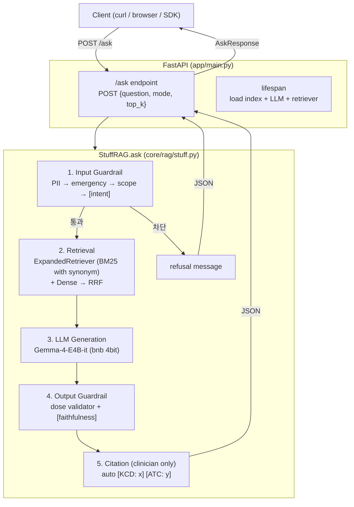
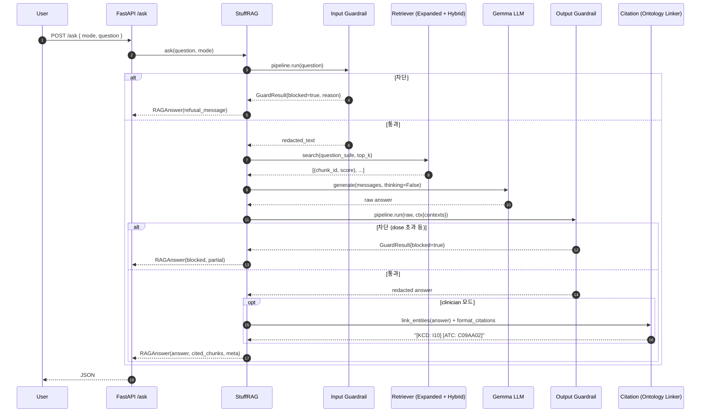
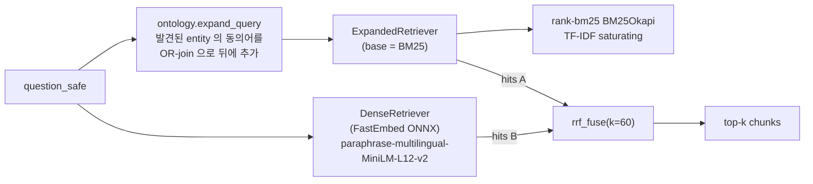
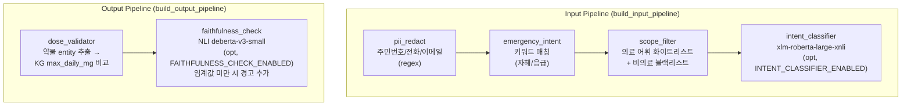
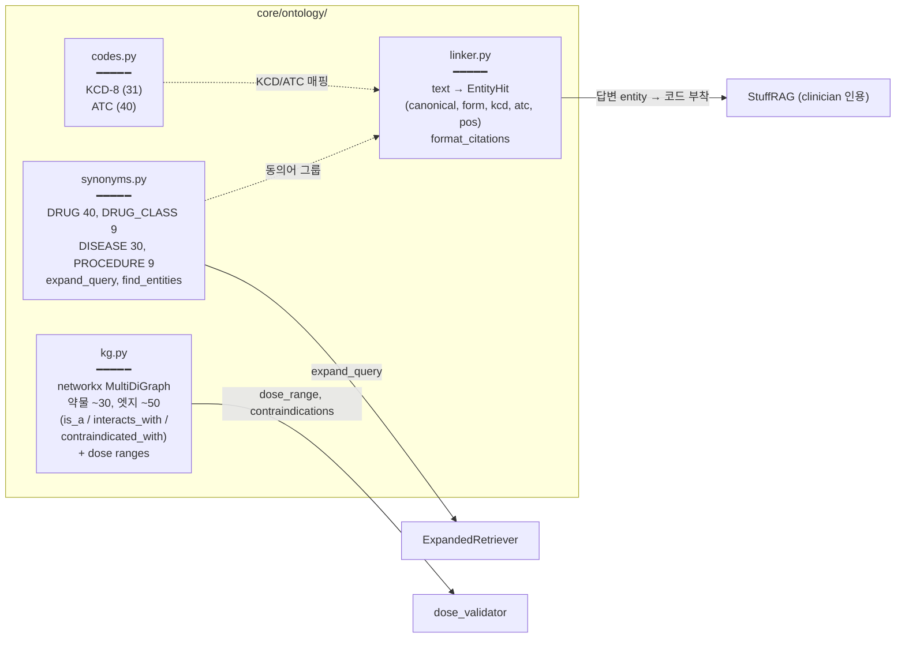
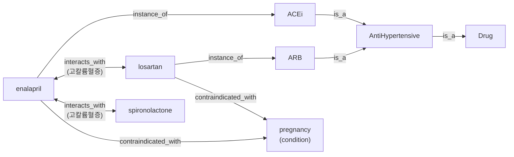
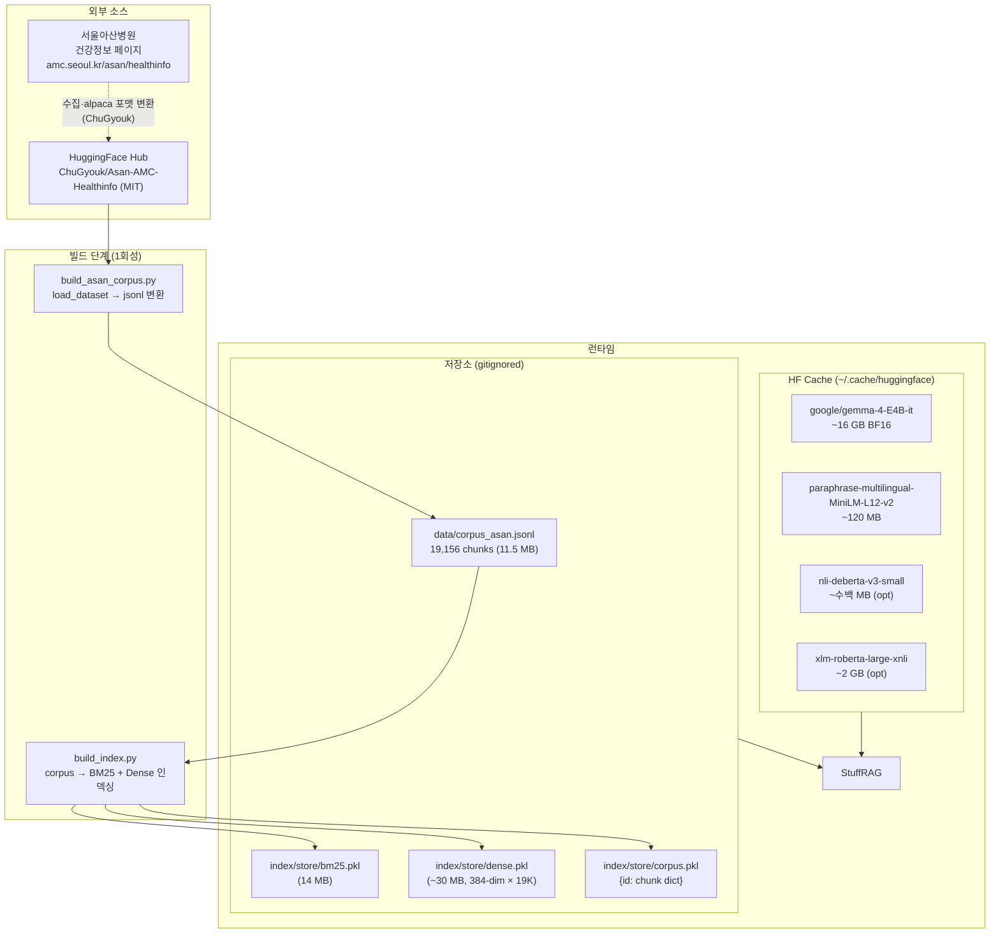

# Domain RAG — v1_minimal Architecture & Build Spec

한국어 의료 RAG 통합본의 구조 명세. 컴포넌트 / 데이터 흐름 / 평가 / 운영 토글 / 한계.

*원본 아카이브: [[_raw/260513_Domain_RAG_ARCHITECTURE]]*

---

# v1_minimal Architecture & Build Spec

한국어 의료 RAG 통합본의 구조 명세서. 컴포넌트 / 데이터 흐름 / 평가 / 운영 토글 / 한계
까지 한 문서에서 추적 가능하도록 정리.

---

## 1. 한눈에 보는 시스템



핵심 책임 분리:
- **app/** — HTTP 표면 (FastAPI), 환경 설정 로딩
- **core/rag/** — 오케스트레이션 (guardrail → retrieval → LLM → guardrail → citation 순서)
- **core/retrieval/** — BM25 / Dense / Hybrid / Expanded
- **core/llm/** — Gemma-4-E4B-it 로더 + 추론 + thinking 채널 정리
- **core/guardrail/** — 다층 안전 검증 (입력 4단, 출력 1~2단)
- **core/ontology/** — 동의어 사전, 표준 코드, 미니 KG, entity linker
- **core/eval/** — RAGAS 4 메트릭 자체 구현
- **index/** — corpus → BM25/Dense 인덱스 빌드·로딩
- **scripts/** — CLI 진입점 (build_index, run_server, eval_toy, eval_ragas)
- **tests/** — 회귀 테스트 (오프라인 + 옵셔널 heavy)

---

## 2. 요청 처리 흐름 (시퀀스)



---

## 3. Retrieval 레이어 상세



설계 메모:
- 처음엔 ExpandedRetriever 를 Hybrid 전체에 wrap 했으나, multi-query × Hybrid 가 RRF
  를 두 번 거치며 *합의 강한 chunk* 가 우대되어 단일 variant 에서만 잡히는 정답이 묻혔다.
  → **synonym expansion 은 BM25 단계에만 적용**, dense 는 원본 query 그대로.
- ExpandedRetriever.search() 는 단일 OR-join expanded query 를 base 에 전달.
  BM25 의 TF-IDF saturating 이 동의어 토큰의 점수를 자연스럽게 합산.
- _build_variants() 는 디버그·시각화용으로 보존.

---

## 4. Guardrail 레이어 상세



설계 메모:
- 입력 순서 `PII → emergency → scope → [intent]` — emergency / self_harm 은 의료 어휘
  없는 평이한 한국어로도 들어오므로 scope 보다 먼저 통과해야 false negative 방지.
- 모드 분기: 의료진은 emergency/drug_recommendation 등을 *권한 내 case* 로 통과시키고
  자해만 차단. 환자는 모든 라벨 적극 차단.
- intent_classifier 의 self_harm 임계값 **0.60** — 한국어 환자 교육 질문이 self_harm
  으로 오분류되는 false positive 를 줄이도록 튜닝 (실측 기반).
- 출력 dose_validator 는 *답변 텍스트에서 약물·용량 추출 후 KG 의 max_daily_mg 와 비교*.

---

## 5. Ontology 레이어 (Phase 6)



미니 KG 구조 예 (실제 데이터):



---

## 6. 데이터 흐름 및 저장소



Corpus 통계 (실측):
- rows: 19,156
- output 길이 chars: min=1, p50=132, p90=436, p99=1188, max=4958
- 각 row 는 `{id, title (질문), text (답변), source}` 구조

---

## 7. 컴포넌트별 파일 명세

| 경로 | 책임 | 핵심 함수/클래스 |
|---|---|---|
| `app/main.py` | FastAPI 진입점, lifespan 로딩 | `lifespan`, `/ask` |
| `app/config.py` | 환경변수·경로 | `LLM_BACKEND`, `SYNONYM_EXPANSION_ENABLED`, ... |
| `app/schemas.py` | 요청·응답 pydantic | `AskRequest`, `AskResponse`, `CitedChunk` |
| `core/rag/stuff.py` | RAG 오케스트레이션 | `StuffRAG.ask`, `_build_messages` |
| `core/retrieval/bm25.py` | BM25 (rank-bm25 wrapper) | `BM25Retriever`, `tokenize` |
| `core/retrieval/dense.py` | Dense (FastEmbed ONNX) | `DenseRetriever`, `_l2_normalize` |
| `core/retrieval/hybrid.py` | BM25+Dense RRF | `HybridRetriever`, `rrf_fuse` |
| `core/retrieval/expanded.py` | Synonym 확장 wrapper | `ExpandedRetriever` |
| `core/llm/gemma.py` | Gemma 4 4bit 로더 + generate | `GemmaLLM`, `GenConfig`, `MockLLM` |
| `core/guardrail/pipeline.py` | step 체이닝 + build_*_pipeline | `Pipeline`, `GuardResult` |
| `core/guardrail/pii.py` | PII 정규식 redact | `pii_redact` |
| `core/guardrail/scope.py` | 의료/비의료 키워드 분류 | `scope_filter` |
| `core/guardrail/emergency.py` | 응급·자해 키워드 차단 | `emergency_intent` |
| `core/guardrail/intent.py` | zero-shot NLI 분류 | `intent_classifier` |
| `core/guardrail/dose_validator.py` | 답변 약물·용량 안전 검증 | `dose_validator` |
| `core/guardrail/faithfulness.py` | NLI entailment 경고 | `faithfulness_check` |
| `core/ontology/synonyms.py` | 동의어 사전·확장 | `expand_query`, `find_entities`, `ALL_SYNONYMS` |
| `core/ontology/codes.py` | KCD-8 + ATC 매핑 | `KCD_MAP`, `ATC_MAP`, `lookup_*` |
| `core/ontology/kg.py` | 미니 의료 KG | `build_drug_kg`, `interactions`, `dose_range` |
| `core/ontology/linker.py` | text → entity + 코드 | `link_entities`, `format_citations`, `EntityHit` |
| `core/eval/ragas_local.py` | RAGAS 4 메트릭 | `faithfulness`, `answer_relevance`, `context_*` |
| `index/build.py` | corpus → 인덱스 빌드/로딩 | `build`, `load_all`, `load_corpus` |
| `scripts/build_asan_corpus.py` | HF dataset → jsonl 변환 | `main` |
| `scripts/build_index.py` | 인덱스 빌드 CLI | `main` |
| `scripts/run_server.py` | uvicorn 기동 | `main` |
| `scripts/eval_toy.py` | TOY_EVAL recall/MRR/refusal | `main`, `TOY_EVAL` |
| `scripts/eval_ragas.py` | RAGAS 4 메트릭 평가 | `main` |
| `tests/test_retrieval.py` | BM25 / RRF / dense smoke | 4+ 테스트 |
| `tests/test_guardrail.py` | input/output guardrail | 13+ 테스트 |
| `tests/test_ontology.py` | synonyms/codes/kg/linker/expanded | 19 테스트 |
| `tests/test_ragas.py` | RAGAS 메트릭 (set 기반 + opt heavy) | 9+ 테스트 |
| `tests/test_e2e.py` | MockLLM 시스템 통합 | 5 테스트 |

---

## 8. 환경변수 (전체 토글)

| 변수 | 기본 | 설명 |
|---|---|---|
| `LLM_BACKEND` | `gemma` | `mock` 으로 두면 LLM 없이 echo 답변 |
| `LLM_MODEL_ID` | `google/gemma-4-E4B-it` | HF 모델 ID |
| `LLM_LOAD_4BIT` | `1` | `0` 이면 BF16 (≈16GB VRAM) |
| `TOP_K` | `5` | retrieval top-k |
| `DENSE_MODEL` | `paraphrase-multilingual-MiniLM-L12-v2` | FastEmbed 모델명 |
| `CORPUS_NAME` | `corpus_asan` | `corpus_toy` 로 디버그용 작은 셋 사용 |
| `DENSE_ENABLED` | `1` | `0` 이면 BM25-only (build_index) |
| `SYNONYM_EXPANSION_ENABLED` | `1` | ExpandedRetriever wrap 토글 |
| `INTENT_CLASSIFIER_ENABLED` | `0` | xlm-roberta-large-xnli 활성. 첫 로드 시 2GB 다운로드 |
| `FAITHFULNESS_CHECK_ENABLED` | `0` | NLI 모델 활성 |
| `RAGAS_SKIP_NLI` | `0` | eval_ragas 에서 NLI metric skip |
| `RAGAS_SKIP_RELEVANCE` | `0` | answer_relevance skip |
| `HOST` / `PORT` | `127.0.0.1` / `8000` | uvicorn 바인딩 |
| `PYTHONIOENCODING` | (없음) | Windows 콘솔 한글 표시: `utf-8` 권장 |

---

## 9. 평가

### 9.1 평가 데이터 (GT)
`scripts/eval_toy.py` 의 `TOY_EVAL` — 10 항목, 사람 손으로 라벨링한 ground truth:
- `gold_chunk_ids`: 검색 평가용 (recall@k, MRR)
- `refuse_expected`: safety 평가용 (refusal_accuracy)
- `mode`: clinician / patient

Asan 코퍼스에 *직접 답이 있는 항목* 만 gold 부착 (q8 ST 상승, q10 디곡신).
나머지는 "근거 없음" 으로 답해야 정답인 *no-gold* 케이스.

### 9.2 메트릭 카테고리

| 카테고리 | 메트릭 | 필요 GT |
|---|---|---|
| **Retrieval** | recall@k | gold_chunk_ids |
| | MRR | gold_chunk_ids |
| | hit_rate@k | gold_chunk_ids |
| | context_precision (RAGAS) | gold_ids |
| | context_recall (RAGAS) | gold_ids |
| **Generation** | faithfulness (RAGAS) | (불필요 — answer + contexts) |
| | answer_relevance (RAGAS) | (불필요 — answer + question) |
| **Safety** | refusal_accuracy | refuse_expected |

### 9.3 실측 점수 (Phase 6/7 완료 후)

mock LLM + 합성 토글:

| 메트릭 | OFF baseline | synonym ON | + intent ON |
|---|---|---|---|
| recall@5 (gold n=2) | 0.250 | **0.750** | 0.750 |
| MRR | 0.500 | **0.750** | 0.750 |
| refusal accuracy (n=4) | 0.500 | 0.500 | **0.750** |

실 Gemma + RAGAS (n=6 answer-필요 항목):
| 메트릭 | 값 | 해석 |
|---|---|---|
| faithfulness | 0.612 | q3 메트포민(0.076) 이 평균 끌어내림 — 정직한 hallucination 신호 |
| answer_relevance | 0.598 | 답변-질문 cosine |
| context_precision | 0.733 | no-gold trivially 1.0 포함 |
| context_recall | 0.917 | Phase 6 동의어 확장 효과 |

---

## 10. 운영

### 10.1 첫 실행

```powershell
# 1) 의존성 (한 번)
pip install -r integrations/v1_minimal/requirements-extra.txt
pip install -U "transformers>=5.5"  # Gemma 4 지원
pip install sentencepiece brotli     # NLI 모델 의존
pip install bitsandbytes              # 4bit 양자화 (CUDA torch 필요)

# 2) Asan corpus 변환 (한 번)
python -m integrations.v1_minimal.scripts.build_asan_corpus

# 3) 인덱스 빌드 (corpus 갱신 시마다)
python -m integrations.v1_minimal.scripts.build_index

# 4) 서버 (Gemma 4 첫 로드 ~5분, 캐시 후 ~20초)
python -m integrations.v1_minimal.scripts.run_server
# → http://localhost:8000/docs

# 5) 평가
$env:LLM_BACKEND = "mock"
python -m integrations.v1_minimal.scripts.eval_toy
python -m integrations.v1_minimal.scripts.eval_ragas

# Gemma 실측
Remove-Item Env:LLM_BACKEND
python -m integrations.v1_minimal.scripts.eval_ragas
```

### 10.2 채팅 예시

```bash
curl.exe -X POST http://localhost:8000/ask `
  -H "Content-Type: application/json" `
  --data-raw '{"mode":"patient","question":"감기에 걸렸는데 어떻게 해야 하나요?"}'
```

브라우저: http://localhost:8000/docs → `/ask` Try it out

### 10.3 회귀 테스트

```powershell
# offline (~1초)
python -m pytest integrations/v1_minimal/tests/ -q

# Dense smoke 포함 (sentence-transformers/FastEmbed 다운로드)
$env:DOMAIN_RAG_TEST_DENSE = "1"
python -m pytest integrations/v1_minimal/tests/ -q

# Heavy 메트릭 smoke (NLI + embedding)
$env:DOMAIN_RAG_TEST_HEAVY = "1"
python -m pytest integrations/v1_minimal/tests/test_ragas.py -v
```

현재 55 테스트 통과 + 2 옵셔널 skip.

---

## 11. 빌드 이력 (세션 단위)

| # | Commit | 단계 |
|---|---|---|
| 1 | `63921a9` | v1_minimal 통합본 초기 (34 파일, MockLLM + toy corpus) |
| 2 | `927cb5e` | guardrail pipeline 순서 fix (emergency 가 scope 전에 옴) |
| 3 | `42917cc` | Gemma 4 출력 정리 (AutoTokenizer 교체, channel-strip, thinking=False) |
| 4 | `8358228` | Asan-AMC-Healthinfo 19K 코퍼스 도입 + BM25-only fallback |
| 5 | `58de53b` | toy_eval gold_chunk_ids 를 asan_* 로 재매핑 |
| 6 | `9db997a` | FastEmbed (ONNX) 로 sentence-transformers 교체 — segfault 회피 |
| 7 | `56fa7eb` | scope_filter 의료 어휘 확장 (감기/독감 등 60+ 어휘) |
| 8 | `eb4fb27` | **Phase 6**: 의료 온톨로지 + RAG 결합 정식 구현 |
| 9 | `8730703` | **Phase 5 보강**: dose_validator + intent + faithfulness wiring |
| 10 | `c4c3da4` | **Phase 7**: RAGAS 미니 구현 + eval_ragas |
| 11 | `d762fc5` | self_harm 임계값 튜닝 (q6 환자 교육 질문 false positive 해결) |

---

## 12. 알려진 한계 및 향후

### 12.1 한계
- **Dense 모델 (multilingual-MiniLM)**: 짧은 한국어 의료 jargon 쿼리에서 구조어
  ('의미는/정의')에 over-weight. 의미 검색 정확도 한계.
- **NLI 모델 (deberta-v3-small)**: 한국어 의료 도메인 학습량 부족 — 같은 의미 문장도
  contradiction 으로 분류하는 false positive 빈번.
- **Zero-shot intent 분류 (xlm-roberta-large-xnli)**: self_harm 라벨이 한국어
  환자 교육 질문에 trigger 되는 false positive (임계값 0.60 로 완화했으나 근본 해결은
  도메인 fine-tuned 모델 필요).
- **Asan 코퍼스 특성**: 환자 교육·검사·시술 정보 위주. *임상 처방 가이드라인* (구체적
  약물 1차 선택, 용량 결정 등) 은 거의 없음. clinician 모드의 약물 처방 질문은
  대부분 "근거 없음" 답변이 정답인 no-gold 케이스.
- **TOY_EVAL n=10**: 통계적 검정력 부족. 메트릭 변동 큼. 실 평가는 100+ 케이스 필요.

### 12.2 향후 후보 (우선순위 X)
- 한국어 특화 임베딩 모델 (KoSimCSE, BGE-multilingual large) 교체
- 한국어 의료 NLI fine-tune 또는 LLM-as-judge 도입
- KCD-8 전체 / 식약처 의약품 DB import → linker·KG 확장
- KDCA / 학회 가이드라인 PDF 직접 청킹 → corpus 다원화
- 평가셋 100+ 확장 (의료진 라벨링)
- 답변 정확도가 낮은 케이스에 *자동 retrieval 보강* (HyDE, query rewriting)
- 학습 노트북 트랙 (Phase 0~7) 사용자 손코딩 진행

### 12.3 의도적 제외 (현재 scope 밖)
- 에이전트·tool use
- multi-modal (이미지·음성)
- EMR/FHIR 통합
- 분산 서빙 인프라

---

## 13. 보안·법적 주의

- **학습/연구 목적.** 실제 임상 사용 금지.
- Asan 데이터: MIT 라이선스 (재배포·상업적 사용 OK)
- Gemma-4 가중치: Apache 2.0
- KCD-8 / ATC: 공공저작물 자유이용 / WHO 공개
- PII 가드레일은 보조 안전장치 — 사용자가 PII 입력하지 않도록 안내 우선
- 의료 자문 책임 한계 명시 필요 (시스템은 정보 제공 보조, 진단 아님)
